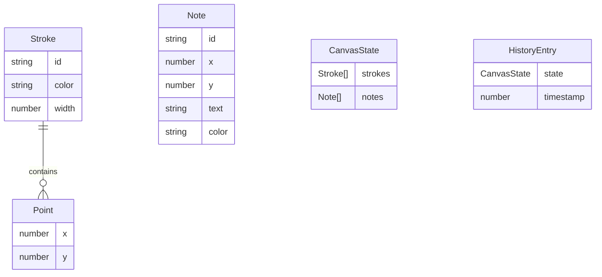

## 1. 架构设计

```mermaid
flowchart TB
    subgraph "前端 (React + Vite)"
        "Whiteboard.tsx" --> "画布SVG层"
        "Whiteboard.tsx" --> "便签DOM层"
        "Toolbar.tsx" --> "Whiteboard.tsx"
        "StickyNote.tsx" --> "Whiteboard.tsx"
        "useWhiteboardStore" --> "Whiteboard.tsx"
        "WebSocket客户端" --> "useWhiteboardStore"
    end
    subgraph "后端 (Express + WebSocket)"
        "Express服务器" --> "WebSocketServer.ts"
        "WebSocketServer.ts" --> "连接管理"
        "WebSocketServer.ts" --> "消息广播"
        "WebSocketServer.ts" --> "状态快照"
    end
    "WebSocket客户端" <--> "WebSocketServer.ts"
```

## 2. 技术说明

- 前端：React@18.2.0 + TypeScript@5.3.3 + Vite@5.0.8
- 状态管理：Zustand
- 后端：Express@4.18.2 + ws@8.16.0
- 通信协议：WebSocket（实时双向通信）
- 初始化工具：vite-init（react-express-ts模板）
- 包管理器：npm

## 3. 路由定义

| 路由 | 用途 |
|------|------|
| / | 白板主页，包含画布、工具栏、顶部栏 |
| /ws | WebSocket连接端点 |

## 4. API定义

### 4.1 WebSocket消息类型

```typescript
type MessageType = 
  | 'draw-start'    // 开始绘制
  | 'draw-move'     // 绘制移动
  | 'draw-end'      // 结束绘制
  | 'stroke-add'    // 完整笔画添加
  | 'note-add'      // 添加便签
  | 'note-move'     // 移动便签
  | 'note-edit'     // 编辑便签
  | 'note-delete'   // 删除便签
  | 'note-color'    // 便签颜色变更
  | 'snapshot'      // 状态快照
  | 'clear'         // 清空画布
  | 'undo'          // 撤销
  | 'redo'          // 重做
  | 'user-count'    // 在线用户数

interface WSMessage {
  type: MessageType
  payload: any
}

interface StrokePayload {
  id: string
  points: {x: number, y: number}[]
  color: string
  width: number
}

interface NotePayload {
  id: string
  x: number
  y: number
  text: string
  color: 'yellow' | 'pink' | 'lightblue'
}

interface SnapshotPayload {
  strokes: StrokePayload[]
  notes: NotePayload[]
}
```

## 5. 服务器架构图

```mermaid
flowchart LR
    "客户端1" <--> "WebSocketServer"
    "客户端2" <--> "WebSocketServer"
    "客户端N" <--> "WebSocketServer"
    "WebSocketServer" --> "状态存储(内存)"
    "新客户端" --> "WebSocketServer"
    "WebSocketServer" --> "发送状态快照"
```

## 6. 数据模型

### 6.1 数据模型定义



### 6.2 数据存储

所有数据存储在服务器内存中，使用Map/Array管理：
- strokes: StrokePayload[] — 所有笔画
- notes: NotePayload[] — 所有便签
- 历史记录在客户端维护（最多50步）
