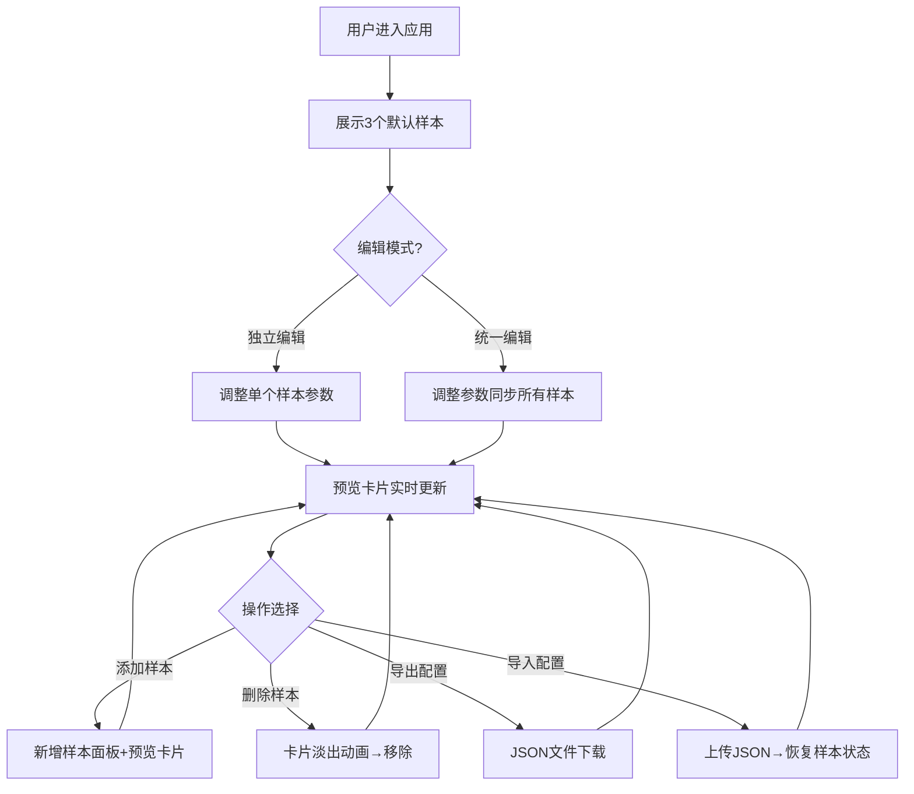

## 1. 产品概述

字体排版预览与对比应用——面向设计团队的实时排版参数调优工具，支持多样本并排对比、统一编辑模式、配置导入导出，解决手动调CSS难以直观对比多方案的痛点。

- 目标用户：UI/UX设计师、前端开发者、排版爱好者
- 核心价值：将"调参-刷新-对比"的循环缩短至毫秒级实时反馈，一键导出配置复用

## 2. 核心功能

### 2.1 用户角色

| 角色 | 注册方式 | 核心权限 |
|------|----------|----------|
| 设计师/开发者 | 无需注册 | 使用全部排版预览与导出功能 |

### 2.2 功能模块

1. **排版工作台页面**：多样本编辑面板、实时预览区域、工具栏

### 2.3 页面详情

| 页面名称 | 模块名称 | 功能描述 |
|----------|----------|----------|
| 排版工作台 | 编辑面板区 | 左侧1/3宽度，滚动显示每个样本的编辑卡片，含字体/字号/行高/字重/颜色控件，debounce节流 |
| 排版工作台 | 预览卡片区 | 右侧2/3宽度，横向排列预览卡片，字号行高变化时背景渐变动画，底部数值标签 |
| 排版工作台 | 顶部工具栏 | 统一编辑开关、添加样本按钮、导入/导出按钮 |
| 排版工作台 | 导入导出 | 导出JSON文件下载，导入JSON文件恢复样本状态 |

## 3. 核心流程

1. 用户进入应用，默认展示3个排版样本
2. 用户在左侧编辑面板调整某样本的字体/字号/行高/字重/颜色 → 右侧预览卡片实时更新（0.2s内）
3. 用户开启"统一编辑"模式 → 修改任一样本参数时所有样本同步变化（文字内容不同步）
4. 用户点击"添加样本" → 新增一个空白样本面板和预览卡片
5. 用户点击样本右上角关闭按钮 → 卡片缩小淡出0.3s后移除
6. 用户点击"导出配置" → 按钮缩放动画0.3s → 生成typography-config.json下载 → 按钮绿色闪烁0.5s
7. 用户点击"导入配置" → 选择JSON文件 → 样本卡片叠入动画逐个出现（间隔0.15s）

## 4. 用户界面设计

### 4.1 设计风格

- 主色：深蓝色 #1a73e8，辅助色：灰色系
- 按钮：圆角8px、无边框、文字粗体，hover背景色深度0.2s过渡
- 编辑面板卡片：白色背景、圆角12px、阴影 0 2px 8px rgba(0,0,0,0.08)
- 预览卡片：白色背景、0.5px浅灰边框、4px圆角
- 字体：选用 DM Sans 作为UI字体（清晰现代），Playfair Display 作为展示字体

### 4.2 页面设计概览

| 页面名称 | 模块名称 | UI元素 |
|----------|----------|--------|
| 排版工作台 | 顶部工具栏 | 深蓝按钮组（统一编辑开关、添加样本、导入、导出），统一编辑开关切换时0.3s背景色渐变 |
| 排版工作台 | 编辑面板区 | 浅灰#f5f5f5背景，白色编辑卡片纵向滚动，样本间2px虚线分隔 |
| 排版工作台 | 预览卡片区 | 纯白背景，300px宽预览卡片横向排列，间距24px，字号行高变化时背景0.2s渐变 |

### 4.3 响应式设计

- 桌面优先：最大宽度1200px居中，左右两栏布局（1/3 + 2/3）
- 移动端（<768px）：编辑区和预览区上下堆叠
- 触控优化：滑块和按钮尺寸适配触摸操作

### 4.4 动画规格

- 参数变更预览更新：0.2s
- 字体切换：旧字体0.15s淡出 + 新字体淡入
- 字号调整：平滑缩放动画
- 删除样本：0.3s缩小淡出
- 导出按钮：0.3s缩放 + 0.5s绿色闪烁
- 统一编辑开关：0.3s背景色渐变（灰→蓝）
- 导入样本：叠入动画逐个出现，间隔0.15s
