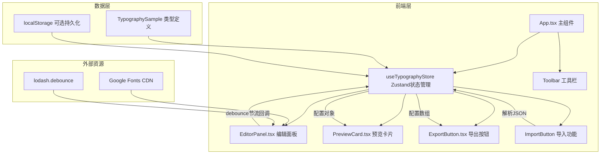

## 1. 架构设计



## 2. 技术说明

- 前端：React 18 + TypeScript + Vite + Tailwind CSS + Zustand
- 初始化工具：vite-init（react-ts模板）
- 后端：无（纯前端应用）
- 数据库：无（状态存储在Zustand，导出为JSON文件）

## 3. 路由定义

| 路由 | 用途 |
|------|------|
| / | 排版工作台主页面（单页应用，无需路由） |

## 4. 数据模型

### 4.1 核心类型定义

```typescript
interface TypographySample {
  id: string;
  text: string;
  fontFamily: string;
  fontSize: number;
  lineHeight: number;
  fontWeight: number;
  color: string;
}

interface TypographyStore {
  samples: TypographySample[];
  unifiedMode: boolean;
  addSample: () => void;
  removeSample: (id: string) => void;
  updateSample: (id: string, updates: Partial<TypographySample>) => void;
  setUnifiedMode: (mode: boolean) => void;
  importSamples: (samples: TypographySample[]) => void;
}
```

### 4.2 默认样本配置

```typescript
const defaultSamples: TypographySample[] = [
  {
    id: "1",
    text: " Typography is the art and technique of arranging type to make written language legible, readable, and appealing.",
    fontFamily: "Roboto",
    fontSize: 16,
    lineHeight: 1.5,
    fontWeight: 400,
    color: "#333333",
  },
  {
    id: "2",
    text: " The quick brown fox jumps over the lazy dog. This sentence contains every letter of the alphabet.",
    fontFamily: "Playfair Display",
    fontSize: 24,
    lineHeight: 1.6,
    fontWeight: 700,
    color: "#1a1a1a",
  },
  {
    id: "3",
    text: " Good typography is invisible. Bad typography is everywhere. Choose wisely and let the words speak.",
    fontFamily: "Source Code Pro",
    fontSize: 14,
    lineHeight: 1.4,
    fontWeight: 300,
    color: "#555555",
  },
];
```

## 5. 文件结构与调用关系

```
├── index.html                  ← 入口页面，加载main.tsx
├── package.json                ← 依赖与脚本
├── vite.config.ts              ← Vite配置(React插件, 端口3000)
├── tsconfig.json               ← TypeScript严格模式
├── src/
│   ├── main.tsx                ← React DOM挂载点
│   ├── App.tsx                 ← 主组件：管理样本状态，组合所有子组件
│   │   ├── ← useTypographyStore (Zustand)
│   │   └── → EditorPanel, PreviewCard, ExportButton, Toolbar
│   ├── store/
│   │   └── typographyStore.ts  ← Zustand状态管理：样本CRUD、统一编辑模式
│   ├── components/
│   │   ├── EditorPanel.tsx     ← 编辑面板：字体/字号/行高/字重/颜色控件
│   │   │   └── → useTypographyStore.updateSample (debounce节流)
│   │   ├── PreviewCard.tsx     ← 预览卡片：排版效果渲染、动画
│   │   │   └── ← TypographySample配置对象
│   │   ├── ExportButton.tsx    ← 导出按钮：JSON文件下载
│   │   │   └── ← useTypographyStore.samples
│   │   └── Toolbar.tsx         ← 工具栏：统一编辑开关、添加/导入/导出
│   │       └── → useTypographyStore (所有方法)
│   ├── types/
│   │   └── index.ts            ← TypeScript类型定义
│   └── index.css               ← 全局样式、动画关键帧、Tailwind指令
```

数据流向：
1. 用户在EditorPanel调整参数 → debounce节流 → 调用store.updateSample()
2. Store状态变更 → App.tsx重新渲染 → PreviewCard接收新配置更新预览
3. 统一编辑模式下：store.updateSample同步更新所有样本的排版参数
4. ExportButton读取store.samples → 生成JSON → 触发文件下载
5. 导入功能：读取JSON文件 → 解析 → 调用store.importSamples() → 批量替换样本
