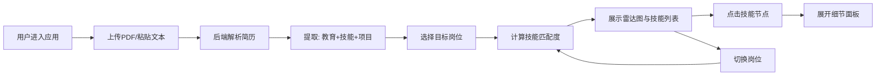

## 1. 产品概述

在线简历解析与技能匹配分析应用，帮助用户快速解析简历内容并与目标岗位进行技能匹配度分析，生成可视化报告。
- 主要目标：自动化简历信息提取，量化技能匹配度，辅助求职和招聘决策
- 目标用户：求职者、HR招聘人员、职业规划咨询师

## 2. 核心功能

### 2.1 用户角色
| 角色 | 注册方式 | 核心权限 |
|------|----------|----------|
| 普通用户 | 无需注册 | 上传简历、选择岗位、查看匹配分析报告 |

### 2.2 功能模块
1. **主页面**：导航栏、左右分栏布局、拖拽分隔条
2. **简历上传模块**：拖拽上传PDF、粘贴文本、进度动画、文件校验
3. **岗位选择模块**：3个预置岗位模板、标签切换动画、下拉菜单
4. **解析结果展示**：技能标签列表（渐变颜色）、教育经历时间线（滑入动画）
5. **技能匹配雷达图**：交互式雷达图、悬停放大、点击展开细节面板
6. **技能细节面板**：出现次数、项目片段、建议关键词（可复制）

### 2.3 页面详情
| 页面名称 | 模块名称 | 功能描述 |
|-----------|-------------|---------------------|
| 主页面 | 导航栏 | 固定定位、滚动阴影、岗位下拉选择、重置按钮 |
| 主页面 | 左侧上传区 | 拖拽上传区域（虚线边框脉动动画）、文本粘贴框、岗位标签选择（下划线滑动动画） |
| 主页面 | 右侧结果区 | 技能标签列表（红到绿渐变）、教育时间线（左侧滑入）、雷达图（旋转过渡） |
| 主页面 | 可拖拽分隔条 | 鼠标拖拽调整左右比例、响应式切换上下布局 |
| 主页面 | 技能细节面板 | 点击雷达节点从底部滑出、复制关键词、toast提示 |

## 3. 核心流程

用户进入应用 → 上传PDF简历或粘贴文本 → 系统解析提取教育/技能/项目 → 选择目标岗位 → 展示匹配度雷达图 → 点击技能节点查看详情 → 可切换岗位重新匹配

## 4. 用户界面设计

### 4.1 设计风格
- 主色调：深蓝 #1E3A5F
- 背景色：浅蓝 #E8F0FE
- 强调色：橙色 #FF6B35
- 卡片阴影：rgba(0,0,0,0.08) 0px 4px 12px，hover时加深 + translateY(-4px)，过渡0.2s
- 按钮风格：圆角8px，主色填充，hover加深
- 字体：现代无衬线字体，层级分明
- 图标：lucide-react图标库
- 动画时长：0.2s-0.4s

### 4.2 页面设计概述
| 页面名称 | 模块名称 | UI元素 |
|-----------|-------------|-------------|
| 主页面 | 导航栏 | 固定顶部、滚动显示阴影(0.2s过渡)、毛玻璃下拉菜单(圆角8px)、重置按钮 |
| 主页面 | 上传卡片 | 虚线边框、拖拽脉动动画(灰→浅蓝过渡)、圆形进度指示器、淡入展示结果 |
| 主页面 | 岗位标签 | 底部下划线滑动动画、激活态高亮 |
| 主页面 | 技能标签 | 按匹配度红→绿渐变颜色、标签样式 |
| 主页面 | 教育时间线 | 垂直时间轴、卡片从左侧滑入(渐入动画) |
| 主页面 | 雷达图 | 浅灰网格线、渐变蓝色填充、悬停放大1.1倍、切换岗位旋转渐变过渡(0.4s) |
| 主页面 | 细节面板 | 从底部滑出(高度0→200px)、蓝色建议标签、点击复制toast |

### 4.3 响应式
- Desktop-first设计
- 768px断点：左右两栏→上下单栏（左侧在上，右侧在下，间距24px）
- 拖拽分隔条在移动端隐藏
- 触控优化：增大点击区域，支持触摸滑动

### 4.4 性能要求
- 简历解析：< 500ms
- 雷达图重绘：< 16ms
- 页面首次加载：< 2s
- 优化策略：memoization、useMemo/useCallback、组件拆分
