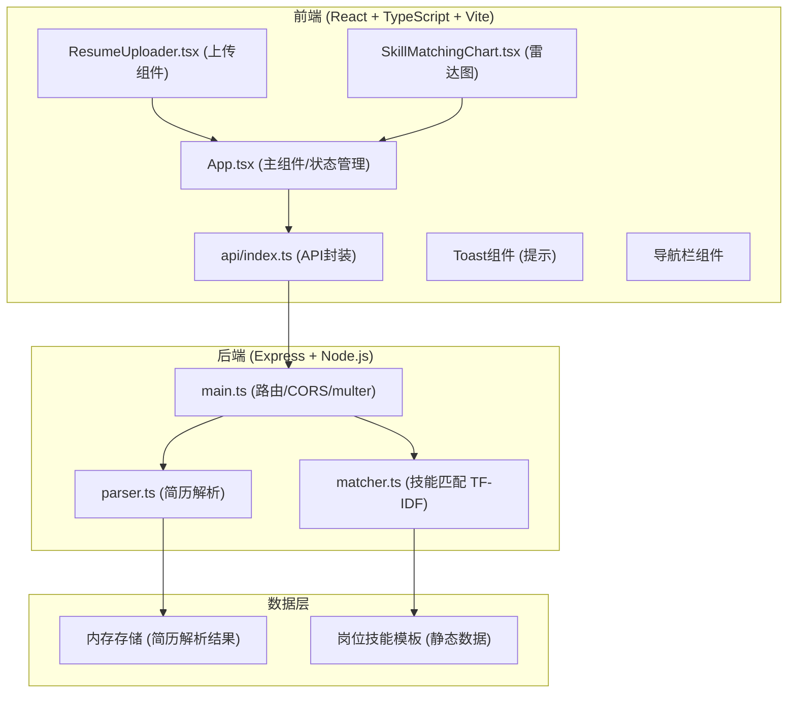
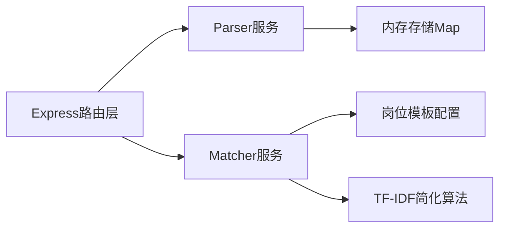
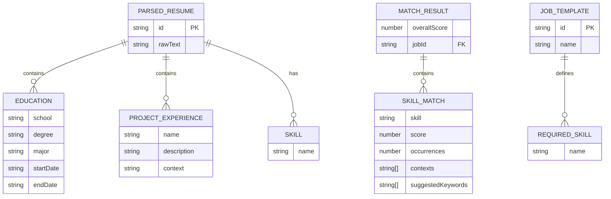

## 1. 架构设计



## 2. 技术描述
- 前端：React@18.2.0 + TypeScript@5.3.3 + Vite@5.0.8 + @vitejs/plugin-react@4.2.0
- 样式：原生CSS + CSS变量（无Tailwind，用户未指定）
- 后端：Express@4.18.2 + TypeScript@5.3.3
- 文件上传：multer@1.4.5-lts.1
- 跨域：cors@2.8.5
- 类型定义：@types/express、@types/cors、@types/multer
- 启动工具：concurrently（同时启动前后端）
- 初始化：vite-init react-express-ts模板

## 3. 路由定义
| 路由 | 用途 |
|-------|---------|
| / | 主页面（Vite SPA入口） |
| POST /api/upload | 上传简历并解析 |
| GET /api/skill-match/:resumeId | 获取指定简历的技能匹配结果 |

## 4. API 定义

### 类型定义
```typescript
// 共享类型
interface Education {
  school: string;
  degree: string;
  major: string;
  startDate: string;
  endDate: string;
}

interface ProjectExperience {
  name: string;
  description: string;
  skills: string[];
  context: string; // 原始上下文片段
}

interface ParsedResume {
  id: string;
  education: Education[];
  skills: string[];
  projects: ProjectExperience[];
  rawText: string;
}

interface SkillMatch {
  skill: string;
  score: number; // 0-100
  occurrences: number;
  contexts: string[]; // 出现上下文片段
  suggestedKeywords: string[];
}

interface JobTemplate {
  id: string;
  name: string;
  requiredSkills: string[];
}

interface MatchResult {
  overallScore: number;
  skills: SkillMatch[];
  jobId: string;
}
```

### POST /api/upload
- 请求：multipart/form-data { file?: File, text?: string }
- 响应：`{ success: true, data: ParsedResume }`

### GET /api/skill-match/:resumeId
- 查询参数：`?jobId=frontend`
- 响应：`{ success: true, data: MatchResult }`

## 5. 服务端架构图



## 6. 数据模型

### 6.1 数据结构定义



### 6.2 岗位模板初始数据
- 前端工程师（10+技能）：React, Vue, TypeScript, JavaScript, HTML5, CSS3, Node.js, Webpack, Git, RESTful API, Redux, Jest
- 数据分析师（10+技能）：Python, SQL, Excel, Tableau, R, Statistics, Machine Learning, Data Visualization, Pandas, NumPy, ETL, A/B Testing
- 产品经理（10+技能）：产品设计, 需求分析, 用户研究, Axure, 竞品分析, 项目管理, 数据分析, 原型设计, 交互设计, 敏捷开发, PRD, 用户体验
