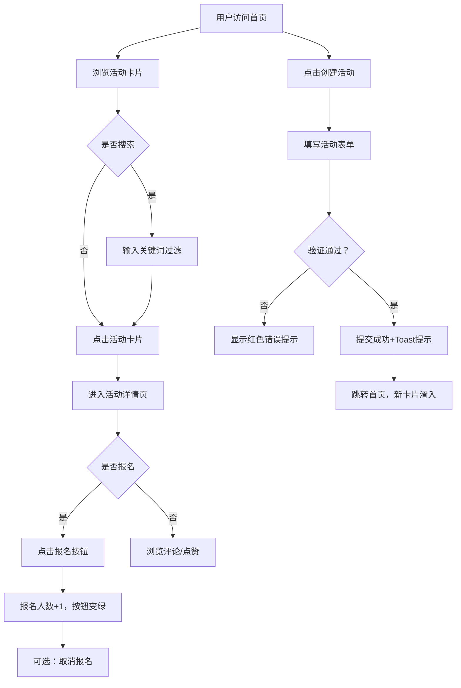

## 1. 产品概述

聚乐（JuLe）是一个基于兴趣爱好的线下活动组织平台MVP，帮助社交创业团队快速验证市场需求。用户无需登录即可创建活动、浏览活动、报名参与，并进行点赞评论等轻量级社交互动。

- 核心目标：降低线下社交门槛，通过兴趣匹配连接志同道合的人
- 目标用户：城市年轻群体（20-35岁），希望拓展社交圈、参与线下兴趣活动

## 2. 核心功能

### 2.1 用户角色

| 角色 | 注册方式 | 核心权限 |
|------|----------|----------|
| 游客用户 | 无需注册 | 创建活动、浏览活动、报名参与、点赞评论、查看个人主页 |

### 2.2 功能模块

1. **首页**：顶部导航栏、搜索框、创建活动按钮、活动卡片网格
2. **活动详情页**：活动完整信息展示、报名/取消报名、已报名用户列表、评论区
3. **创建活动页**：表单填写（标题、描述、时间、地点、人数、类型）、表单验证、提交反馈
4. **个人主页**：用户已报名活动、已创建活动展示

### 2.3 页面详情

| 页面名称 | 模块名称 | 功能描述 |
|----------|----------|----------|
| 首页 | 导航栏 | 固定顶部、毛玻璃效果、Logo、首页链接、我的活动链接、响应式汉堡菜单 |
| 首页 | 搜索区 | 创建活动按钮（珊瑚红渐变）+ 搜索框（关键词实时过滤标题和描述） |
| 首页 | 活动网格 | 响应式卡片网格（手机1列/平板2列/桌面4列）、卡片hover上浮、淡入淡出过滤动画 |
| 首页 | 活动卡片 | 封面色块占位、标题、时间地点、报名进度条（绿→红渐变）、点赞爱心脉冲动画、报名按钮、点击跳转详情 |
| 活动详情页 | 活动信息 | 大幅封面、完整标题、详细描述、时间地点标签、报名人数统计 |
| 活动详情页 | 报名模块 | 报名/取消按钮切换、已满状态（灰色禁用）、已报名用户头像列表 |
| 活动详情页 | 评论区 | 昵称+评论内容输入框、评论列表按时间倒序、新评论底部淡入动画 |
| 创建活动页 | 表单区 | 标题/描述/时间/地点输入框、最大人数滑块(1-50)、类型下拉选择(6种) |
| 创建活动页 | 验证反馈 | 空标题/过时时间红色错误提示、输入框focus珊瑚红边框、提交成功Toast |
| 个人主页 | 活动分组 | 我创建的活动、我报名的活动 |

## 3. 核心流程

用户打开首页 → 浏览活动卡片网格 → 搜索过滤关键词 → 点击卡片进入详情 → 报名参与活动 → 发表评论/点赞 → 返回首页或查看个人主页

用户点击"创建活动" → 填写表单（6项信息） → 实时表单验证 → 提交成功 → 跳转首页，新卡片从顶部滑入

## 4. 用户界面设计

### 4.1 设计风格

- **主色调**：珊瑚红 #FF6B6B（品牌主色，用于按钮、强调元素）
- **强调色**：蒂芙尼蓝 #4ECDC4（辅助色，用于状态成功、进度条起点）
- **背景色**：浅灰 #F7F8FA（页面背景，营造轻松氛围）
- **卡片色**：纯白 #FFFFFF（圆角16px，柔和阴影 0 2px 8px rgba(0,0,0,0.06)）
- **按钮风格**：主按钮珊瑚红渐变圆角8px，次要按钮边框+透明背景
- **字体**：系统默认 sans-serif（Segoe UI / PingFang SC / Microsoft YaHei）
- **布局风格**：卡片式网格布局，顶部固定导航栏
- **图标风格**：简洁线性图标，使用 lucide-react 库

### 4.2 页面设计概述

| 页面名称 | 模块名称 | UI元素细节 |
|----------|----------|------------|
| 首页 | 导航栏 | 高度64px，backdrop-filter: blur(10px)半透明，Logo「聚乐」加粗20px |
| 首页 | 活动卡片 | 圆角16px，hover时transform: translateY(-4px)，阴影加深transition: 0.2s |
| 首页 | 进度条 | 高度8px圆角4px，百分比<60%绿(#4ECDC4)、60-85%黄、>85%红(#FF6B6B) |
| 首页 | 爱心图标 | 未点赞灰色空心，点赞后珊瑚红实心，点击scale(1.2)脉冲0.2s |
| 活动详情页 | 评论输入 | 底部吸附，昵称+评论内容双输入，提交按钮右侧对齐 |
| 活动详情页 | 评论列表 | 头像+昵称+时间戳，最新评论opacity: 0→1 translateY(20px)→0 |
| 创建活动页 | 表单 | 标签左对齐，输入框间距16px，focus边框#FF6B6B + box-shadow过渡0.2s |
| 创建活动页 | 滑块 | 自定义range样式，滑轨蒂芙尼蓝→珊瑚红渐变，滑块圆形珊瑚红 |
| 创建活动页 | Toast | 右上角绿色提示框，3s后自动消失，带滑入滑出动画 |

### 4.3 响应式设计

- **桌面端 (>1024px)**：活动卡片4列网格，导航栏完整展示
- **平板端 (640-1024px)**：活动卡片2列网格，导航栏完整展示
- **手机端 (<640px)**：活动卡片单列，导航栏菜单折叠为汉堡图标，点击展开抽屉

### 4.4 动效设计

| 动效名称 | 触发场景 | 动画参数 |
|----------|----------|----------|
| 卡片滑入 | 新创建活动出现在列表 | translateY(-50px)→0, opacity: 0→1, 0.4s ease |
| 卡片过滤 | 搜索关键词变化 | opacity: 1→0.2→1, 0.2s ease |
| 卡片hover | 鼠标悬停卡片 | translateY(-4px), shadow加深, 0.2s ease |
| 点赞脉冲 | 点击爱心图标 | scale(1→1.2→1), 0.2s ease |
| 评论淡入 | 新评论提交 | translateY(20px)→0, opacity: 0→1, 0.3s ease |
| 页面切换 | 路由跳转 | opacity: 0→1, 0.3s ease |
| Toast提示 | 创建活动成功 | translateX(100%)→0, 3s后反向, 0.3s ease |
