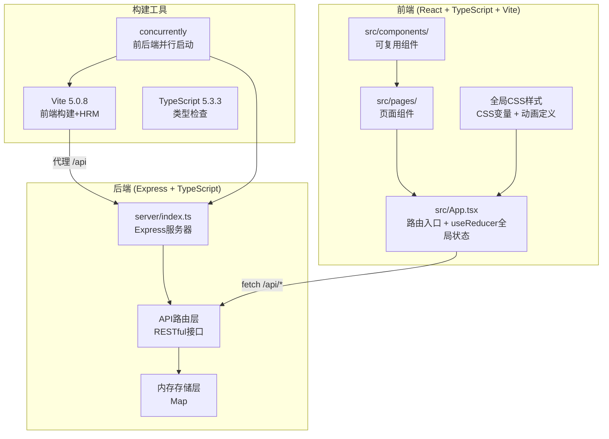
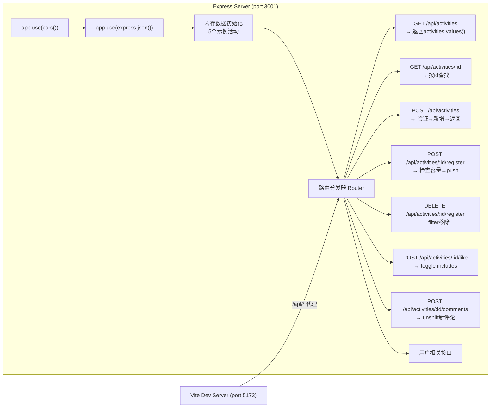
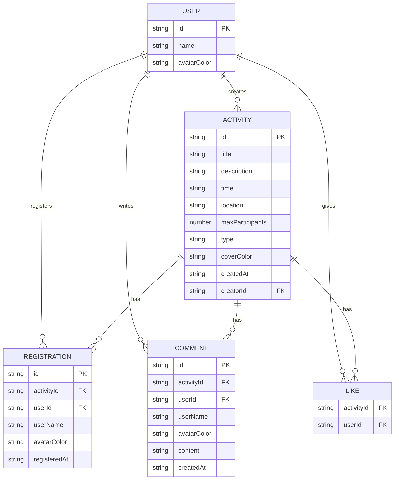

## 1. 架构设计



## 2. 技术描述

- **前端框架**：React@18.2.0 + React-DOM@18.2.0
- **路由管理**：React Router DOM@6.20.0（BrowserRouter + Routes/Route）
- **状态管理**：React useReducer（全局：活动列表、当前用户、Toast状态）
- **样式方案**：原生CSS + CSS变量（非Tailwind，用户明确指定色系和动画）
- **图标库**：lucide-react（SVG图标，按需导入）
- **初始化工具**：vite-init（使用 react-express-ts 模板）
- **后端框架**：Express@4.18.2 + cors@2.8.5
- **后端语言**：TypeScript 5.3.3（通过 ts-node 或 tsc 编译运行）
- **数据存储**：内存 Map（活动/评论/报名/点赞分别存储，不持久化）
- **唯一ID**：uuid@9.0.0
- **构建工具**：Vite@5.0.8 + @vitejs/plugin-react@4.2.0
- **并行启动**：concurrently（同时启动 Vite dev server 和 Express server）

## 3. 路由定义

| 前端路由 | 页面组件 | 用途 |
|----------|----------|------|
| `/` | HomePage | 首页，活动列表+搜索+创建按钮 |
| `/activity/:id` | ActivityDetailPage | 活动详情页，报名+评论 |
| `/create` | CreateActivityPage | 创建活动表单页 |
| `/profile` | ProfilePage | 个人主页，我创建/报名的活动 |

## 4. API 定义

### 4.1 TypeScript 类型定义

```typescript
// 活动类型枚举
type ActivityType = '运动' | '音乐' | '读书' | '桌游' | '户外' | '美食';

// 活动对象
interface Activity {
  id: string;                    // uuid
  title: string;                 // 活动标题
  description: string;           // 活动描述
  time: string;                  // ISO时间字符串
  location: string;              // 活动地点
  maxParticipants: number;       // 最大人数 1-50
  type: ActivityType;            // 活动类型
  coverColor: string;            // 封面占位色(随机生成)
  createdAt: string;             // 创建时间
  registrations: Registration[]; // 报名列表
  likes: string[];               // 点赞用户ID列表（游客用临时ID）
  comments: Comment[];           // 评论列表
  creatorId: string;             // 创建者临时ID
}

// 报名记录
interface Registration {
  id: string;
  userId: string;
  userName: string;
  avatarColor: string;           // 头像占位色
  registeredAt: string;
}

// 评论对象
interface Comment {
  id: string;
  activityId: string;
  userId: string;
  userName: string;
  avatarColor: string;
  content: string;
  createdAt: string;
}

// 用户（游客，临时生成）
interface User {
  id: string;
  name: string;
  avatarColor: string;
}

// API响应包装
interface ApiResponse<T> {
  success: boolean;
  data?: T;
  message?: string;
}
```

### 4.2 RESTful 接口列表

| Method | 路径 | 请求体 | 响应 | 用途 |
|--------|------|--------|------|------|
| GET | `/api/activities` | - | `Activity[]` | 获取全部活动列表 |
| GET | `/api/activities/:id` | - | `Activity` | 获取单个活动详情 |
| POST | `/api/activities` | `{title, description, time, location, maxParticipants, type, creatorId}` | `Activity` | 创建新活动 |
| POST | `/api/activities/:id/register` | `{userId, userName}` | `Activity` | 报名活动 |
| DELETE | `/api/activities/:id/register` | `{userId}` | `Activity` | 取消报名 |
| POST | `/api/activities/:id/like` | `{userId}` | `Activity` | 点赞/取消点赞 |
| POST | `/api/activities/:id/comments` | `{userId, userName, content}` | `Comment[]` | 添加评论 |
| GET | `/api/users/:id` | - | `User & {createdActivities, registeredActivities}` | 获取用户信息及活动 |
| POST | `/api/users` | `{name}` | `User` | 生成/获取临时用户 |

## 5. 服务器架构图



## 6. 数据模型

### 6.1 ER 关系图



### 6.2 内存存储结构

```typescript
// server/index.ts 中的数据结构
const activities: Map<string, Activity> = new Map();
const users: Map<string, User> = new Map();

// 预置5个示例活动（启动时初始化）
// 类型覆盖：运动、音乐、读书、桌游、户外、美食 中的5种
// 时间设置为未来1-14天内
// 报名人数随机 0~maxParticipants
```

## 7. 文件结构与调用关系

```
项目根目录/
├── package.json              # 依赖+脚本(npm run dev → concurrently)
├── tsconfig.json             # TS严格模式+ESNext+react-jsx
├── vite.config.js            # React插件+/api代理到3001端口
├── index.html                # 入口HTML，div#root，引入全局CSS
├── server/
│   └── index.ts              # Express服务器(3001端口)
│       ↑ 被 concurrently 启动
│       ↑ Vite 代理 /api → http://localhost:3001
│
└── src/
    ├── main.tsx              # ReactDOM.createRoot + BrowserRouter
    │   ↑ 由 index.html 引入
    │
    ├── App.tsx               # 路由配置 + useReducer + 全局状态
    │   ├── 定义 Routes: /, /activity/:id, /create, /profile
    │   ├── useReducer(actions: FETCH/CREATE/REGISTER/LIKE/COMMENT)
    │   ├── 页面路由变化动画
    │   └── Toast 全局提示组件
    │
    ├── index.css             # 全局样式
    │   ├── CSS变量(色系/圆角/阴影)
    │   ├── @keyframes 动画定义
    │   ├── 响应式断点
    │   └── 基础reset样式
    │
    ├── components/
    │   ├── ActivityCard.tsx      # 活动卡片
    │   │   ← 接收 activity, currentUser
    │   │   → dispatch LIKE / REGISTER action
    │   │   → navigate /activity/:id
    │   │
    │   ├── Navbar.tsx            # 导航栏（毛玻璃+响应式）
    │   │   ← 接收当前路由path
    │   │   → Link to /, /create, /profile
    │   │
    │   └── Toast.tsx             # Toast提示组件
    │
    └── pages/
        ├── HomePage.tsx              # 首页
        │   ← 从App接收 activities, dispatch
        │   → useMemo过滤(useDebounce 300ms)
        │   → 渲染 ActivityCard 网格
        │   → 搜索框onChange
        │
        ├── CreateActivityPage.tsx    # 创建活动页
        │   ← 接收 dispatch, navigate
        │   → 表单state + 实时验证
        │   → dispatch CREATE_ACTIVITY
        │   → 成功后 showToast + navigate('/')
        │
        ├── ActivityDetailPage.tsx    # 活动详情页
        │   ← useParams(id), activities, dispatch
        │   → 渲染活动详情
        │   → dispatch REGISTER/UNREGISTER
        │   → dispatch LIKE
        │   → dispatch ADD_COMMENT
        │   → 评论列表(倒序+动画)
        │
        └── ProfilePage.tsx           # 个人主页
            ← 接收 activities, currentUser
            → filter 我创建的/我报名的
            → 渲染两个分组列表
```
