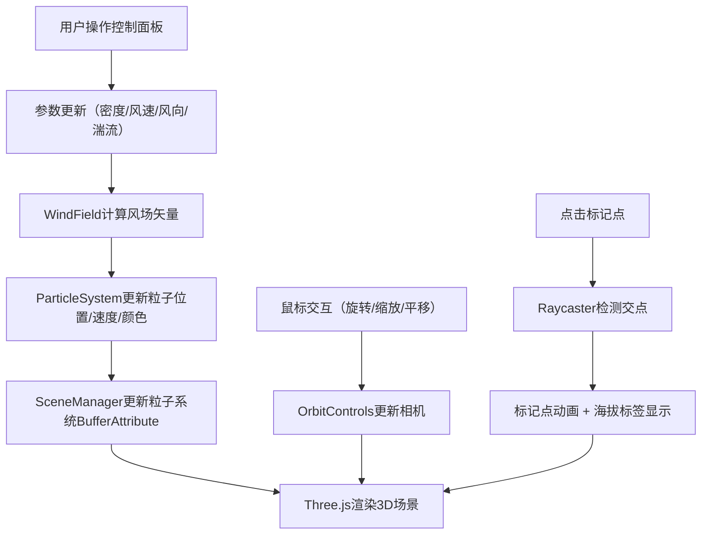

## 1. 产品概述

3D沙尘暴天气模拟与粒子交互探索应用，通过Three.js实现真实的沙尘粒子物理模拟，用户可实时调整气象参数观察沙尘在三维地形上的流动与堆积效果，支持交互式视角控制和海拔标记查询。

- 主要用途：气象可视化教学、自然现象模拟演示、交互式3D粒子系统展示
- 目标用户：教育工作者、气象爱好者、3D可视化开发者
- 产品价值：通过直观的3D交互方式展示沙尘暴的形成与运动规律，提供沉浸式的自然现象探索体验

## 2. 核心功能

### 2.1 功能模块

1. **3D场景渲染模块**：Three.js场景、相机、光源、轨道控制器、地形网格、标记点系统
2. **粒子系统模块**：30000-60000个沙尘粒子的物理模拟、生命周期管理、动态数量调整
3. **风场模拟模块**：三维Perlin噪声风场、风向风速控制、湍流效果模拟
4. **控制面板模块**：dat.GUI参数调节、密度/风速/风向/湍流滑块、暂停/重置按钮
5. **交互系统模块**：鼠标视角控制、标记点点击查询、信息标签展示

### 2.2 功能详情

| 模块名称 | 功能点 | 功能描述 |
|----------|--------|----------|
| 粒子系统 | 沙尘粒子渲染 | 半透明黄色到橙色渐变，大小2-4像素随机，分布在80x20x80空间 |
| 粒子系统 | 物理运动模拟 | 上下浮动（0.5-1.5单位）、水平漂移、边界反弹、随机扰动 |
| 粒子系统 | 动态数量调整 | 密度0.5-2.0对应10000-60000粒子，0.5秒平滑过渡 |
| 粒子系统 | 堆积效果 | 风速<3时低洼区密度+30%，颜色变为土红色 |
| 粒子系统 | 扬起效果 | 风速>15时粒子抬升，颜色变亮为白色 |
| 风场模块 | 噪声风场 | 三维Perlin噪声生成自然风场效果 |
| 风场模块 | 参数控制 | 风向0-360度旋转、风速0-20、湍流0-1 |
| 地形渲染 | 地形网格 | 20x20网格，高度0-5随机起伏，沙漠色渐变 |
| 地形渲染 | 标记点系统 | 10个红色发光标记点，旋转动画 |
| 交互系统 | 视角控制 | 左键旋转、滚轮缩放（3-50）、右键平移 |
| 交互系统 | 标记点查询 | 点击标记点放大闪烁，显示海拔信息标签 |
| 控制面板 | 参数调节 | 四个滑块实时控制粒子和风场参数 |
| 控制面板 | 全局控制 | 重置视角、暂停/继续模拟 |
| 响应式布局 | 移动端适配 | 768px以下控制面板折叠为图标按钮 |

## 3. 核心流程

## 4. 用户界面设计

### 4.1 设计风格

- **配色方案**：暗色军事风格
  - 背景渐变：#2F2F2F → #0A0A0A（从上到下）
  - 粒子渐变：黄色(#FFD700) → 橙色(#FF8C00) → 土红色(#CD853F) → 白色(#FFFFFF)
  - 控制面板：rgba(30,30,30,0.8)半透明，毛玻璃效果
  - 交互反馈：悬停橙色(#FFA500)，点击白色
  - 地形：沙漠色#D2B48C → #8B4513渐变

- **视觉效果**：
  - 毛玻璃：backdrop-filter: blur(8px)
  - 边框：1px solid rgba(255,255,255,0.1)
  - 圆角：8px
  - 阴影：柔和阴影增强层次感

- **字体**：简洁无衬线字体，白色文字，清晰易读

### 4.2 界面布局

| 区域 | 模块 | UI元素 |
|------|------|--------|
| 全屏 | 3D场景 | Canvas渲染区域，沙尘粒子、地形、标记点 |
| 左侧悬浮 | 控制面板 | 标题、四个参数滑块、两个功能按钮 |
| 标记点上方 | 信息标签 | 白色圆角矩形，显示海拔高度 |
| 移动端 | 折叠面板 | 右下角图标按钮，点击展开全屏面板 |

### 4.3 动画与交互

- **滑块反馈**：手柄悬停变橙色，点击短暂变白（0.1秒）
- **信息标签**：0.2秒淡入淡出动画
- **标记点点击**：放大1.5倍，闪烁两次（每次0.2秒），缓出函数
- **Tooltip**：悬停0.3秒后显示，浅灰背景白色文字
- **粒子数量变化**：0.5秒平滑渐变

### 4.4 响应式设计

- **桌面端（>768px）**：左侧悬浮半透明控制面板
- **移动端（≤768px）**：右下角折叠图标按钮，点击展开全屏覆盖式面板
- **触摸优化**：支持触摸手势旋转/缩放，按钮触控区域≥44x44px

### 4.5 3D场景设计

- **环境**：深灰到黑色渐变背景，营造沙尘天气氛围
- **光照**：环境光 + 方向光，照亮粒子和地形
- **相机**：PerspectiveCamera，初始位置可环绕场景观察
- **轨道控制**：围绕原点旋转，限制缩放和平移范围
- **后处理**：粒子使用AdditiveBlending增强通透感
- **性能预算**：60000粒子时保持30FPS以上，使用BufferGeometry和双缓冲优化

## 5. 性能要求

- 粒子数60000时帧率≥30FPS
- 参数调整响应延迟≤0.5秒
- 粒子位置更新使用BufferAttribute + 双缓冲
- 使用requestAnimationFrame统一管理渲染循环
- 避免频繁创建新数组，重用TypedArray
