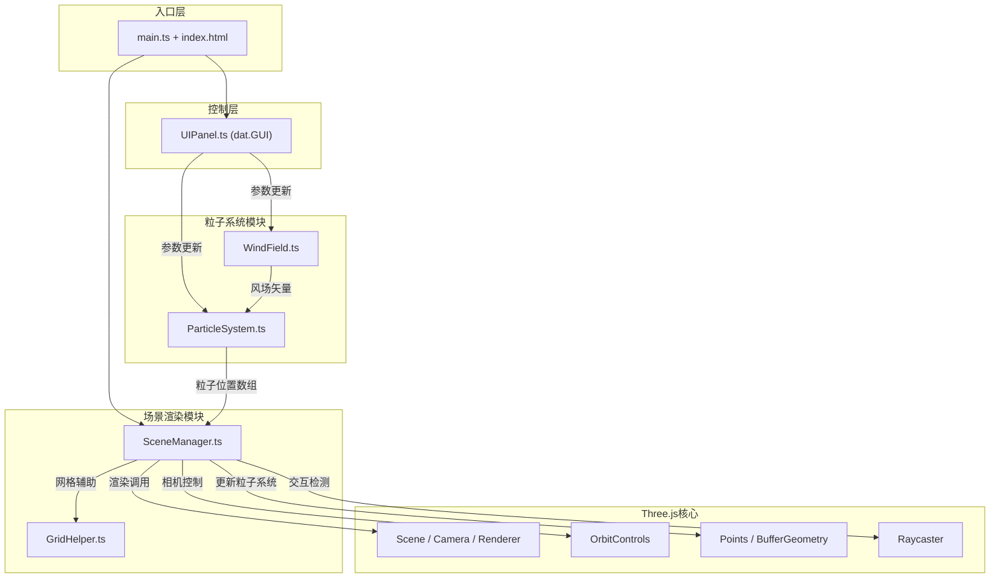

## 1. 架构设计



## 2. 技术栈说明

- **前端框架**：纯TypeScript（无React/Vue，用户明确要求）
- **3D渲染**：Three.js@0.160.0
- **类型定义**：@types/three@0.160.0
- **UI控制面板**：dat.GUI@0.7.9 + @types/dat.gui@0.7.9
- **构建工具**：Vite@5.0.8
- **语言**：TypeScript@5.3.3（严格模式）
- **模块系统**：ESNext

## 3. 文件结构与调用关系

```
project/
├── package.json              # 依赖配置与启动脚本
├── index.html                # 入口页面，全屏Canvas
├── tsconfig.json             # TypeScript严格模式配置
├── vite.config.js            # Vite构建配置
└── src/
    ├── main.ts               # 应用入口，初始化各模块
    ├── style.css             # 全局样式
    ├── scene/
    │   ├── SceneManager.ts   # 场景管理：创建场景、相机、渲染循环
    │   └── GridHelper.ts     # 辅助网格：地形网格、中心标记
    ├── particle/
    │   ├── ParticleSystem.ts # 粒子系统：物理模拟、生命周期
    │   └── WindField.ts      # 风场：Perlin噪声风场计算
    └── controls/
        └── UIPanel.ts        # 控制面板：dat.GUI参数调节
```

### 调用关系与数据流

| 模块 | 输入 | 输出 | 依赖 |
|------|------|------|------|
| **UIPanel** | 用户交互（滑块、按钮） | 控制参数（density, windSpeed, windDirection, turbulence） | dat.GUI |
| **WindField** | windSpeed, windDirection, turbulence, 时间 | 三维风速矢量数组 | Three.js (Vector3) |
| **ParticleSystem** | 控制参数 + WindField输出 | 粒子位置数组、颜色数组、大小数组 | WindField |
| **SceneManager** | 粒子数据 + 相机控制输入 | Three.js渲染画面 | ParticleSystem, GridHelper, Three.js |
| **GridHelper** | 无 | 网格参考线、标记点几何体 | Three.js |
| **main.ts** | 无 | 初始化并连接所有模块 | 所有模块 |

### 数据流向图

```
UIPanel (用户操作)
    │
    ├─→ density ──────────┐
    ├─→ windSpeed ────────┤
    ├─→ windDirection ────┼─→ WindField.getWindAt(x,y,z) ─→ 风速矢量
    └─→ turbulence ───────┘       │
                                   ↓
                          ParticleSystem.update(deltaTime)
                                   │
                                   ├─→ 计算粒子位置/速度/颜色
                                   └─→ 双缓冲Float32Array
                                          │
                                          ↓
                          SceneManager.updateParticlePositions()
                                   │
                                   ├─→ BufferAttribute.needsUpdate = true
                                   └─→ Three.js渲染
```

## 4. 核心数据结构

### 4.1 粒子数据

```typescript
interface ParticleData {
    positions: Float32Array;    // [x1,y1,z1, x2,y2,z2, ...] 双缓冲
    velocities: Float32Array;   // [vx1,vy1,vz1, ...]
    colors: Float32Array;       // [r1,g1,b1, ...]
    sizes: Float32Array;        // [s1, s2, ...]
    lifetimes: Float32Array;    // [life1, life2, ...]
    floatOffsets: Float32Array; // 浮动相位偏移
}
```

### 4.2 控制参数

```typescript
interface ControlParams {
    density: number;           // 0.5 - 2.0
    windSpeed: number;         // 0 - 20
    windDirection: number;     // 0 - 360度
    turbulence: number;        // 0 - 1
    isPaused: boolean;
}
```

### 4.3 标记点数据

```typescript
interface MarkerPoint {
    mesh: THREE.Mesh;
    elevation: number;
    label: HTMLElement;
    isActive: boolean;
}
```

## 5. 关键算法与优化策略

### 5.1 Perlin噪声风场

- 使用改进的Perlin噪声算法生成三维风场
- 多频率叠加（FBM）产生自然湍流效果
- 时间维度动画使风场随时间变化

### 5.2 双缓冲粒子更新

```typescript
// 双缓冲避免频繁创建数组
private bufferA: Float32Array;
private bufferB: Float32Array;
private readBuffer: Float32Array;
private writeBuffer: Float32Array;

update() {
    // 从readBuffer读取，写入writeBuffer
    for (let i = 0; i < count; i++) {
        writeBuffer[i] = readBuffer[i] + velocity * delta;
    }
    // 交换缓冲区
    [this.readBuffer, this.writeBuffer] = [this.writeBuffer, this.readBuffer];
}
```

### 5.3 粒子数量平滑过渡

- 目标粒子数 = map(density, 0.5, 2.0, 10000, 60000)
- 使用lerp插值在0.5秒内平滑过渡
- 超出范围的粒子标记为不可见（alpha=0）

### 5.4 性能优化

- 使用BufferGeometry而非Geometry
- 粒子着色器（PointsMaterial）减少Draw Call
- 每帧只更新必要的BufferAttribute
- 地形使用PlaneGeometry + vertexColors实现渐变
- Raycaster只在点击时检测，不每帧检测

## 6. 地形生成算法

```typescript
// 20x20网格，高度0-5随机起伏
const geometry = new THREE.PlaneGeometry(80, 80, 19, 19);
const positions = geometry.attributes.position;
const colors = new Float32Array(positions.count * 3);

for (let i = 0; i < positions.count; i++) {
    const height = Math.random() * 5;
    positions.setY(i, height);
    
    // 沙漠色渐变：高度越高颜色越深
    const t = height / 5;
    colors[i*3] = lerp(0xD2/255, 0x8B/255, t);     // R
    colors[i*3+1] = lerp(0xB4/255, 0x45/255, t);   // G
    colors[i*3+2] = lerp(0x8C/255, 0x13/255, t);   // B
}
```

## 7. 交互处理流程

### 7.1 标记点点击检测

```
鼠标点击 → Raycaster.setFromCamera() 
        → intersectObjects(markers)
        → 有交点？→ 触发标记点动画
                    → 放大1.5倍 (scale.lerp)
                    → 闪烁两次 (opacity 0→1→0→1)
                    → 显示海拔标签 (fade-in 0.2s)
```

### 7.2 轨道控制器参数

- 旋转速度：0.003 rad/px
- 缩放范围：3 - 50单位
- 缩放速度：0.1
- 平移范围：±20单位
- 启用阻尼效果：dampingFactor = 0.05

## 8. 着色器配置（PointsMaterial）

```typescript
const material = new THREE.PointsMaterial({
    size: 3,
    vertexColors: true,
    transparent: true,
    opacity: 0.8,
    blending: THREE.AdditiveBlending,
    depthWrite: false,
    sizeAttenuation: true
});
```

## 9. 响应式布局实现

```css
/* 桌面端 */
.control-panel {
    position: fixed;
    left: 20px;
    top: 50%;
    transform: translateY(-50%);
}

/* 移动端 */
@media (max-width: 768px) {
    .control-panel {
        display: none;
    }
    .mobile-toggle {
        display: block;
    }
    .mobile-panel {
        position: fixed;
        inset: 0;
        background: rgba(0,0,0,0.95);
    }
}
```

## 10. 动画循环管理

```typescript
// 统一使用requestAnimationFrame
private lastTime: number = 0;
private frameCount: number = 0;
private fps: number = 0;

animate = (time: number) => {
    requestAnimationFrame(this.animate);
    
    const deltaTime = Math.min((time - this.lastTime) / 1000, 0.1);
    this.lastTime = time;
    
    if (!this.isPaused) {
        this.particleSystem.update(deltaTime);
        this.sceneManager.updateParticlePositions();
    }
    
    this.updateMarkerAnimations(deltaTime);
    this.sceneManager.render();
    
    // FPS统计
    this.frameCount++;
    // ...
}
```
