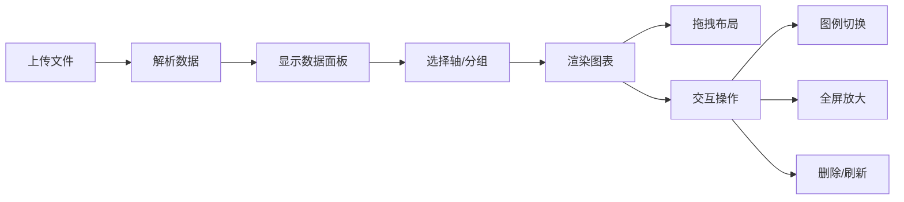

## 1. 产品概述

动态数据可视化仪表盘，帮助产品经理和数据分析师快速将CSV或JSON数据拖拽上传，自动生成多种交互式图表，支持拖拽布局和实时筛选。

- 核心价值：降低数据可视化门槛，快速生成可交互的数据仪表盘
- 目标用户：产品经理、数据分析师、运营人员

## 2. 核心功能

### 2.1 功能模块

1. **数据上传模块**：文件拖拽上传、CSV/JSON解析、数据预览
2. **数据配置模块**：列选择（X轴/Y轴/颜色分组）、数据筛选
3. **图表渲染模块**：折线图、柱状图、饼图、散点图
4. **布局管理模块**：网格拖拽布局、图表卡片管理
5. **交互模块**：悬停提示、图例切换、全屏放大、删除刷新

### 2.2 页面详情

| 页面名称 | 模块名称 | 功能描述 |
|-----------|-------------|---------------------|
| 主页面 | 上传区域 | 支持文件拖拽，拖入时边框虚线闪烁、背景浅蓝渐变 |
| 主页面 | 数据面板 | 显示列名、前5行预览、统计信息，支持X/Y/颜色分组勾选 |
| 主页面 | 图表画布 | 12列响应式网格，图表卡片可拖拽调整位置 |
| 主页面 | 图表卡片 | 左上角图表类型图标，右上角删除/刷新按钮，支持双击放大 |

## 3. 核心流程

用户拖拽CSV/JSON文件到上传区域 → 系统解析数据并在左侧面板显示列名和预览 → 用户勾选X轴/Y轴/颜色分组 → 右侧画布自动渲染多种图表 → 用户可拖拽调整图表位置、点击图例切换系列、双击放大查看 → 可删除或刷新单个图表

## 4. 用户界面设计

### 4.1 设计风格

- **主色调**：蓝色系 (#3B82F6) 作为主色，代表数据和科技感
- **辅助色**：绿色 (#10B981)、橙色 (#F59E0B)、紫色 (#8B5CF6) 用于图表系列区分
- **中性色**：浅灰背景 (#F9FAFB)，深灰文字 (#1F2937)，边框灰 (#E5E7EB)
- **卡片风格**：圆角12px，白色背景，阴影柔和
- **字体**：Inter 字体，字重400/500/600/700
- **动画**：
  - 文件拖入：0.2秒边框虚线闪烁、背景从浅灰变浅蓝
  - 图表出现：0.4秒从底部淡入上升
  - 拖拽布局：卡片半透明跟随，松开后平滑滑入新位置
  - 图例切换：0.3秒过渡动画
  - 全屏放大：从原始位置缩放展开，遮罩淡入

### 4.2 页面设计概述

| 页面名称 | 模块名称 | UI元素 |
|-----------|-------------|-------------|
| 主页面 | 上传区域 | 虚线边框、拖拽提示文字、图标 |
| 主页面 | 数据面板 | 列名列表、复选框、统计信息、数据预览表格 |
| 主页面 | 图表画布 | 网格背景、拖拽占位符、多个图表卡片 |
| 主页面 | 图表卡片 | 图表类型图标、标题、删除按钮、刷新按钮、Recharts图表 |

### 4.3 响应式

- 桌面端：左侧280px数据面板 + 右侧自适应画布区域
- 平板端：数据面板可折叠，画布区域占满宽度
- 移动端：数据面板置于底部，采用抽屉式交互

## 5. 性能要求

- 图表更新响应时间：≤ 200ms
- 拖拽操作流畅度：60fps
- 支持数据量：至少1000行数据流畅渲染
