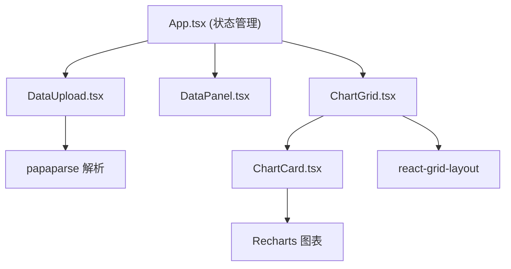

## 1. 架构设计



## 2. 技术描述

- **前端框架**：React@18.2.0 + TypeScript@5.3.3
- **构建工具**：Vite@5.0.8 + @vitejs/plugin-react@4.2.0
- **图表库**：Recharts@2.12.0
- **拖拽布局**：react-grid-layout@1.4.4
- **数据解析**：papaparse@5.4.1
- **类型定义**：@types/react、@types/react-dom、@types/react-grid-layout、@types/papaparse

## 3. 类型定义

```typescript
// 数据列类型
interface Column {
  name: string;
  type: 'number' | 'string' | 'date';
  uniqueValues?: number;
  min?: number;
  max?: number;
}

// 数据行类型
type DataRow = Record<string, any>;

// 图表配置类型
interface ChartConfig {
  id: string;
  type: 'line' | 'bar' | 'pie' | 'scatter';
  xAxis: string;
  yAxis: string[];
  colorBy?: string;
}

// 布局项类型
interface LayoutItem {
  i: string;
  x: number;
  y: number;
  w: number;
  h: number;
}

// 筛选配置类型
interface FilterConfig {
  xAxis: string | null;
  yAxis: string[];
  colorBy: string | null;
}
```

## 4. 组件划分

### 4.1 DataUpload.tsx
- 职责：处理文件拖拽上传、解析CSV/JSON数据
- Props：`onDataParsed: (columns: Column[], data: DataRow[]) => void`
- 状态：拖拽状态、解析进度

### 4.2 DataPanel.tsx
- 职责：显示数据列、统计信息、轴选择
- Props：`columns: Column[]`, `previewData: DataRow[]`, `onFilterChange: (config: FilterConfig) => void`
- 状态：已选X轴、已选Y轴、颜色分组列

### 4.3 ChartCard.tsx
- 职责：单个图表渲染、交互处理（删除、刷新、放大）
- Props：`chartType: string`, `config: ChartConfig`, `data: DataRow[]`, `onDelete: () => void`, `onRefresh: () => void`
- 状态：是否全屏、刷新动画状态

### 4.4 ChartGrid.tsx
- 职责：网格布局管理、图表渲染、拖拽处理
- Props：`charts: ChartConfig[]`, `data: DataRow[]`, `onLayoutChange: (layout: LayoutItem[]) => void`, `onDeleteChart: (id: string) => void`
- 状态：布局配置、拖拽状态

### 4.5 App.tsx
- 职责：全局状态管理、组件协调
- 状态：`columns`, `data`, `filterConfig`, `charts`, `layout`

## 5. 核心算法

### 5.1 数据类型推断
- 遍历列数据，判断是否为数字（可转换为number）
- 判断是否为日期（Date.parse成功）
- 否则为字符串类型

### 5.2 图表类型自动生成
- 根据X轴和Y轴类型，生成适合的图表类型：
  - 时间/数字X轴 + 数字Y轴 → 折线图、柱状图
  - 分类X轴 + 数字Y轴 → 柱状图、饼图
  - 两个数字轴 → 散点图
  - 有颜色分组 → 多系列图表

### 5.3 布局初始化
- 每个图表默认宽度6列，高度280px（对应h=7，假设行高40px）
- 按顺序排列，自动换行

## 6. 性能优化

- 使用React.memo包装图表组件，避免不必要的重渲染
- 数据解析使用Web Worker（可选，根据数据量）
- 图表更新使用requestAnimationFrame平滑过渡
- 使用useMemo缓存计算结果（筛选后的数据、统计信息）
