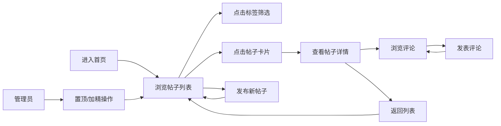

## 1. 产品概述

面向中小型创业团队的内部员工论坛，让成员能够发布技术分享帖、参与话题讨论，并有效管理热门内容和违规信息。提升团队知识沉淀效率，促进跨部门技术交流。

## 2. 核心功能

### 2.1 用户角色
| 角色 | 注册方式 | 核心权限 |
|------|---------|----------|
| 普通用户 | 内部账号 | 浏览帖子、发布帖子、发表评论、按标签筛选 |
| 管理员 | 内部账号 | 全部普通用户权限 + 置顶帖子 + 加精帖子 |

### 2.2 功能模块
1. **首页主内容区**：帖子发布表单、标签导航栏、帖子列表（虚拟滚动）
2. **帖子详情区**：帖子完整内容、评论列表、评论发表表单
3. **右侧边栏**：热门话题词云、最近一周活跃用户排行
4. **帖子管理**：置顶功能、加精功能（管理员可见）

### 2.3 页面详情
| 页面名称 | 模块名称 | 功能描述 |
|---------|---------|----------|
| 首页 | 发布表单 | 顶部输入标题和内容（支持Markdown），选择标签后提交 |
| 首页 | 标签导航栏 | 5个预设标签，点击筛选，下划线动画切换 |
| 首页 | 帖子列表 | 卡片式展示，置顶帖子在前，超过30条启用虚拟滚动 |
| 首页 | 帖子卡片 | 显示标题、摘要（100字）、标签、作者头像、置顶/加精标志 |
| 详情 | 帖子内容 | 完整Markdown内容渲染 |
| 详情 | 评论列表 | 按时间正序，首字母彩色头像，新评论淡入动画 |
| 详情 | 评论表单 | 底部输入框，提交后即时追加并滚动到底部 |
| 侧边栏 | 热门话题 | 标签词云展示，按帖子数量排序 |
| 侧边栏 | 活跃用户 | 最近一周发帖/评论数排行Top10 |

## 3. 核心流程

用户进入论坛首页 → 浏览帖子列表或按标签筛选 → 点击帖子卡片查看详情 → 阅读内容并浏览评论 → 发表评论 → 返回列表继续浏览或发布新帖子

## 4. 用户界面设计

### 4.1 设计风格
- **主色调**：深蓝 #1a1a2e、亮蓝 #16213e、金色 #e8b923
- **卡片风格**：白色背景、8px圆角、细微阴影、悬停上移3px并扩大阴影
- **字体**：使用现代无衬线字体，标题加粗，正文清晰易读
- **布局风格**：左右双栏（左60%主内容，右40%侧边栏），移动端垂直堆叠
- **图标风格**：简洁线性图标，配合金色点缀

### 4.2 页面设计概述
| 页面名称 | 模块名称 | UI元素 |
|---------|---------|--------|
| 首页 | 顶部导航 | 深色渐变背景，论坛标题，用户头像 |
| 首页 | 发布表单 | 标题输入框、内容文本域、标签选择器、提交按钮 |
| 首页 | 标签导航 | 横向排列，选中状态下划线动画，金色高亮 |
| 首页 | 帖子列表 | 垂直排列卡片，置顶带角标，加精带金色徽章 |
| 首页 | 帖子卡片 | 左侧头像，中间标题+摘要+标签，右侧管理按钮 |
| 详情 | 内容区 | Markdown渲染，标题、标签、作者信息、发布时间 |
| 详情 | 评论区 | 评论列表+输入框，首字母彩色圆点头像 |
| 侧边栏 | 热门话题 | 标签词云，不同字号代表热度 |
| 侧边栏 | 活跃用户 | 排行列表，头像+用户名+活跃度 |

### 4.3 响应式
- 桌面端（>768px）：左右双栏布局，左60%右40%
- 移动端（≤768px）：隐藏右侧边栏，所有内容垂直堆叠，卡片宽度自适应
- 触控优化：增大可点击区域，保证移动端操作流畅

### 4.4 动效设计
- 标签切换：下划线0.3s平滑过渡动画
- 卡片悬停：阴影扩大 + 上移3px，0.2s过渡
- 新评论：淡入效果（opacity 0→1）
- 页面加载：内容渐入，骨架屏占位
