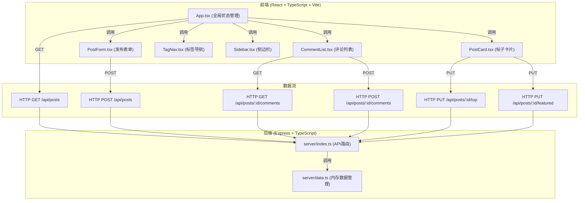

## 1. 架构设计



## 2. 技术描述

- **前端**：React 18 + TypeScript + Vite
- **后端**：Express 4 + TypeScript
- **构建工具**：Vite（前端开发服务器 + 构建）
- **数据存储**：内存存储（server/data.ts）
- **开发工具**：concurrently（前后端并发启动）
- **状态管理**：React useState/useEffect（组件级状态）
- **HTTP通信**：fetch API

## 3. 项目结构

```
auto9/
├── package.json          # 项目配置与依赖
├── vite.config.js        # Vite配置（代理/api到3001端口）
├── tsconfig.json         # TypeScript配置（严格模式 + ES Module）
├── index.html            # 入口HTML页面
├── client/               # 前端源码
│   ├── App.tsx           # 主组件，全局状态管理
│   ├── PostCard.tsx      # 帖子卡片组件
│   ├── CommentList.tsx   # 评论列表组件
│   ├── TagNav.tsx        # 标签导航组件
│   ├── PostForm.tsx      # 发布表单组件
│   └── Sidebar.tsx       # 侧边栏组件
└── server/               # 后端源码
    ├── index.ts          # Express服务入口，API路由
    └── data.ts           # 内存数据管理模块
```

## 4. API 定义

### 4.1 数据类型

```typescript
interface Post {
  id: string;
  title: string;
  content: string;
  tag: string;
  author: string;
  authorAvatar: string;
  createdAt: number;
  isTop: boolean;
  isFeatured: boolean;
}

interface Comment {
  id: string;
  postId: string;
  author: string;
  content: string;
  createdAt: number;
}

interface Tag {
  id: string;
  name: string;
  color: string;
}
```

### 4.2 接口列表

| 方法 | 路径 | 描述 | 请求体 | 响应 |
|------|------|------|--------|------|
| GET | /api/posts | 获取帖子列表（支持标签筛选） | - | Post[] |
| POST | /api/posts | 创建新帖子 | { title, content, tag, author } | Post |
| GET | /api/posts/:id | 获取单个帖子详情 | - | Post |
| GET | /api/posts/:id/comments | 获取帖子评论列表 | - | Comment[] |
| POST | /api/posts/:id/comments | 发表评论 | { author, content } | Comment |
| PUT | /api/posts/:id/top | 切换置顶状态 | - | Post |
| PUT | /api/posts/:id/featured | 切换加精状态 | - | Post |
| GET | /api/tags | 获取所有标签 | - | Tag[] |
| GET | /api/stats | 获取统计数据（热门话题、活跃用户） | - | Stats |

## 5. 数据流向

### 5.1 帖子列表加载流程
1. App.tsx 组件挂载 → useEffect 调用 fetch('/api/posts')
2. server/index.ts 接收 GET /api/posts 请求
3. 调用 data.ts 中的 getPosts(tag?) 方法
4. data.ts 从内存数组中筛选并排序（置顶优先，再按时间倒序）
5. 返回 JSON 数据给前端
6. App.tsx 更新 posts 状态 → 渲染 PostCard 列表

### 5.2 发表评论流程
1. CommentList.tsx 用户填写内容 → 提交
2. 调用 fetch('/api/posts/:id/comments', { method: 'POST', body: ... })
3. server/index.ts 接收 POST 请求
4. 调用 data.ts 中的 addComment(postId, author, content) 方法
5. data.ts 创建新 Comment 对象并加入内存数组
6. 返回新创建的评论 JSON
7. CommentList.tsx 更新评论列表 → 追加新评论 → 滚动到底部

### 5.3 置顶/加精流程
1. PostCard.tsx 管理员点击操作按钮
2. 调用 fetch('/api/posts/:id/top' 或 '/featured', { method: 'PUT' })
3. server/index.ts 接收请求
4. 调用 data.ts 中的 toggleTop(id) 或 toggleFeatured(id) 方法
5. data.ts 切换对应帖子的 isTop/isFeatured 状态
6. 返回更新后的帖子 JSON
7. App.tsx 更新帖子列表 → 重新排序渲染

## 6. 性能优化

### 6.1 虚拟滚动
- 帖子列表超过30条时启用虚拟滚动
- 只渲染可视区域内的约10条帖子
- 通过监听滚动事件计算可视范围
- 使用固定行高 + transform 定位

### 6.2 首屏优化
- Vite 构建优化，代码分割
- 关键路径CSS内联
- 首屏数据预加载

### 6.3 评论性能
- 评论提交后2秒内刷新显示
- 新评论淡入动画
- 列表自动滚动到底部
