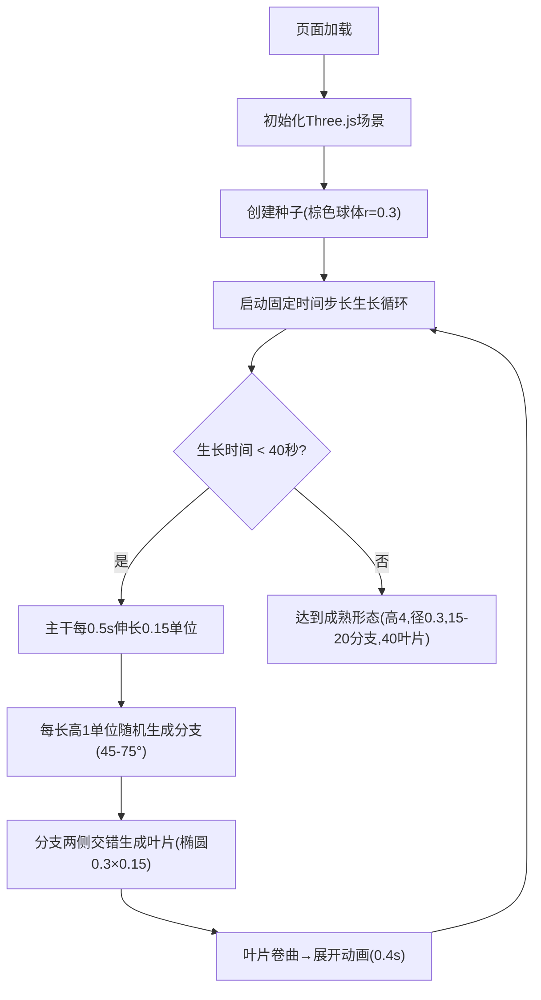
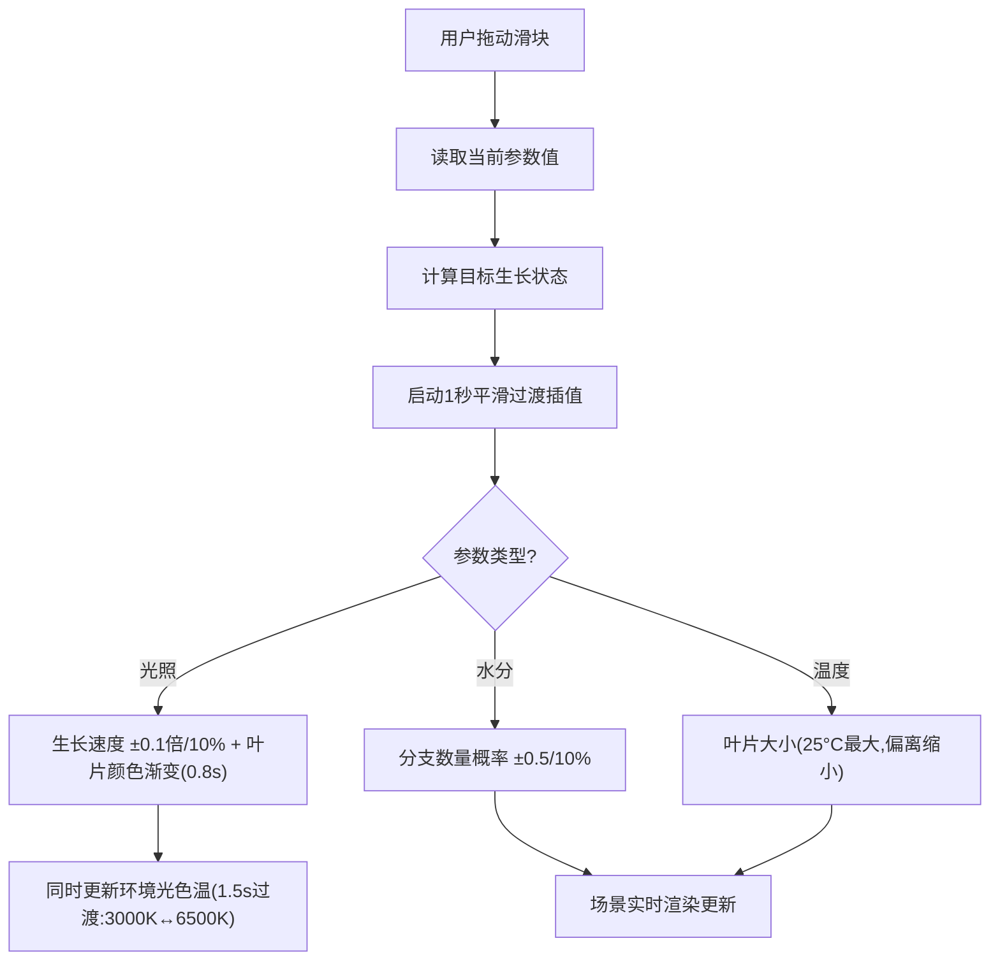
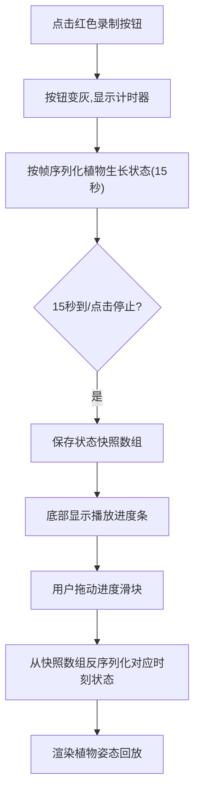

## 1. 产品概述

三维植物生长模拟与交互可视化应用，通过实时调节环境参数（光照、水分、温度）动态观察植物从种子到成熟的完整生长过程，提供沉浸式科学教育与艺术展示体验。

- **核心目标**：以直观可视化方式呈现环境因素对植物生长的影响，结合高质量3D渲染与流畅交互体验
- **目标用户**：教育工作者、学生、植物爱好者、设计从业者
- **市场价值**：兼具科普教育意义与艺术美感的交互展示工具，可扩展至自然模拟、游戏场景、园林设计等领域

## 2. 核心功能

### 2.1 功能模块

1. **植物生长系统**：L系统算法生成枝干与叶片，固定时间步长模拟生长，种子→幼苗→成熟完整生命周期
2. **环境参数控制**：光照强度、水分含量、温度三参数实时调节，1秒平滑过渡响应
3. **视角交互与回放**：轨道控制器自由漫游，4个预设视角一键切换，15秒生长录制与进度条回放
4. **视觉效果系统**：花瓣飘落粒子、叶片微动、环境光色温过渡、季节色变化
5. **UI交互面板**：毛玻璃风格控制面板、录制按钮、视角切换圆点、响应式适配

### 2.2 页面详情

| 页面名称 | 模块名称 | 功能描述 |
|-----------|-------------|---------------------|
| 主场景页 | 3D渲染区域 | 全屏Three.js画布，深蓝径向渐变背景，半透明绿色地面，植物主体居中展示 |
| 主场景页 | 左侧控制面板 | 毛玻璃浮动面板（280px宽），包含光照/水分/温度三个自定义滑块，值变化实时联动 |
| 主场景页 | 底部录制区 | 居中红色录制按钮，点击后变灰显示计时，录制完成显示可拖放进度条 |
| 主场景页 | 右侧视角切换 | 垂直排列4个彩色圆点（黄/蓝/绿/紫），点击切换预设视角，选中放大闪烁 |
| 主场景页 | 响应式适配 | <768px时隐藏面板，圆形展开按钮滑入，移动端触控优化 |

## 3. 核心流程

### 3.1 生长模拟流程

### 3.2 参数调节响应流程

### 3.3 录制回放流程

## 4. 用户界面设计

### 4.1 设计风格

- **主色调**：深灰背景 `#1a1a2e`，深蓝→浅蓝径向渐变背景，毛玻璃面板 `rgba(255,255,255,0.08)`
- **强调色**：滑块填充蓝→橙渐变，录制按钮红色 `#e74c3c`，视角圆点黄 `#f1c40f` / 蓝 `#3498db` / 绿 `#2ecc71` / 紫 `#9b59b6`
- **按钮风格**：圆角矩形录制按钮(8px圆角)，圆形滑块手柄(18px直径)+ 5px灰色阴影，视角切换圆点(选中1.2x放大闪烁)
- **字体**：无衬线字体14px白色标签文字
- **动效**：悬停0.1s放大1.05倍+亮度提升10%，点击0.15s弹性回缩(0.95→1.05→1.0)

### 4.2 页面设计概览

| 区域 | 模块 | UI元素 | 动画/交互 |
|-----------|-------------|-------------|-------------|
| 全屏背景 | 3D场景 | 径向渐变画布+半透明地面 | 植物生长动画、粒子飘落 |
| 左侧 | 控制面板 | 毛玻璃面板+圆角16px+白色半透明边框+3个自定义滑块 | 滑块值变化圆形渐变填充，过渡动画 |
| 底部居中 | 录制控制 | 红色圆角按钮→灰色+计时器，进度条 | 按钮弹性动画，进度条拖放 |
| 右侧垂直 | 视角切换 | 4个彩色圆点 | 悬停放大，选中闪烁1.2x |
| 叶片/枝干 | 材质效果 | 枝干光泽反射，叶片次表面散射半透明 | 叶片微动浮动0.01单位0.5Hz |

### 4.3 响应式设计

- **桌面优先**：<768px宽度时，隐藏左侧面板，显示左上角圆形展开按钮
- **移动端**：点击展开按钮，面板从左侧滑入(0.3s动画)
- **触控优化**：滑块拖拽区域扩大，按钮最小触控面积44×44px

### 4.4 3D场景设计指引

- **环境氛围**：深蓝径向渐变营造宁静夜晚感，半透绿地面象征生命萌芽
- **光照方案**：环境光色温联动光照参数(3000K暖黄↔6500K冷白)，方向光+半球光模拟自然光
- **相机设置**：OrbitControls，旋转阻尼0.1，缩放范围2-15单位
- **视角预设**：俯视45°(黄)、正面平视(蓝)、侧视90°(绿)、近景微距(紫)
- **后期处理**：FXAA抗锯齿，Bloom轻微泛光增强植物通透感
- **粒子系统**：粉色椭圆花瓣粒子(上限150)，每1.5s生成5-8个，从植物上方1.5单位下落，旋转0.2rad/s，下落0.05单位/s，4s后渐隐
- **性能预算**：场景帧率≥55FPS，粒子上限150，状态计算≤2ms
