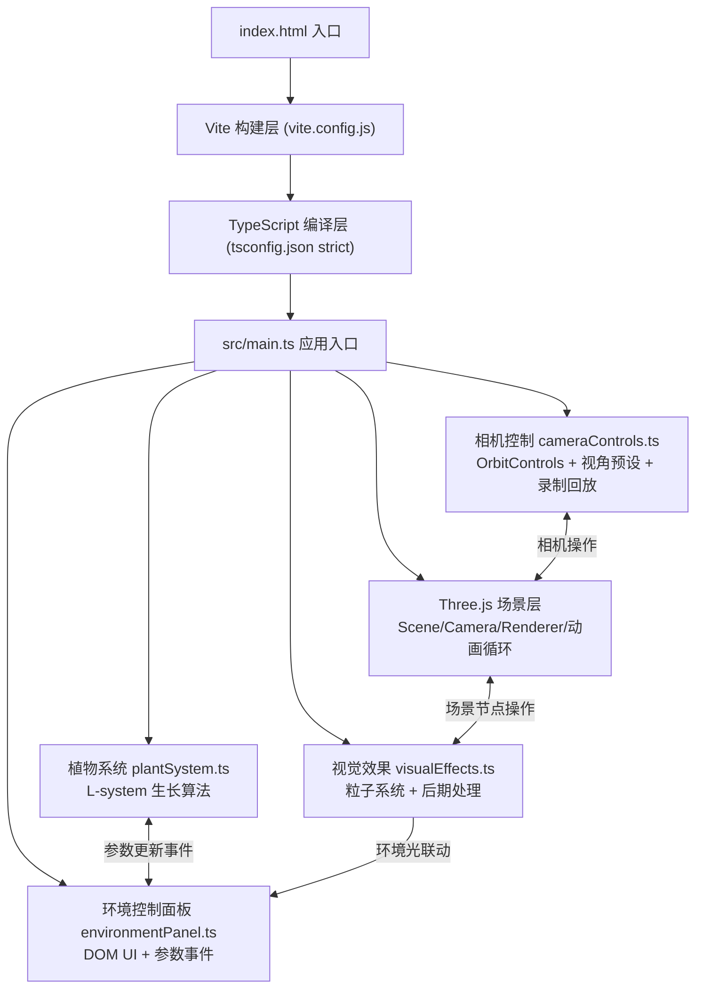

## 1. 架构设计



## 2. 技术说明

- **前端框架**: 原生 TypeScript + Three.js（无React/Vue，按用户指定）
- **构建工具**: Vite@5.0.8（轻量快速HMR）
- **3D引擎**: Three.js@0.160.0
- **类型定义**: @types/three@0.160.0
- **编程语言**: TypeScript@5.3.3（严格模式 strict: true）
- **CSS方案**: 原生内联CSS + 动态样式注入（无需Tailwind，按用户指定文件结构）
- **初始化方式**: 手动创建文件结构（不使用 vite-create 模板，因为用户指定了明确的文件清单与纯Three.js方案）

## 3. 模块职责

### 3.1 文件结构

| 文件路径 | 职责描述 | 关键类/函数 |
|-----------|-------------|-------------|
| `package.json` | 项目依赖与启动脚本 | `npm run dev` 启动Vite开发服务器 |
| `vite.config.js` | Vite构建配置（默认） | 配置端口、别名、sourcemap |
| `tsconfig.json` | TypeScript严格模式配置 | `strict:true`, `target:ES2020`, `module:ESNext` |
| `index.html` | 入口HTML | 全屏黑色背景画布容器，加载 `src/main.ts` |
| `src/main.ts` | 应用主入口 | 初始化Scene、Camera、WebGLRenderer、启动requestAnimationFrame循环、组装各模块 |
| `src/plantSystem.ts` | 植物生长系统 | `PlantSystem`类：L-system迭代、主干/分支/叶片生成、固定步长生长(16.67ms)、参数平滑过渡 |
| `src/environmentPanel.ts` | 环境参数控制面板 | `EnvironmentPanel`类：DOM面板创建、3个range滑块、值变化emit事件、交互动效(hover/click弹性) |
| `src/visualEffects.ts` | 粒子与后期效果 | `VisualEffects`类：花瓣粒子池(上限150)、对象池回收、叶片微动、环境光色温插值过渡 |
| `src/cameraControls.ts` | 相机与录制回放 | `CameraManager`类：OrbitControls封装(阻尼0.1,缩放2-15)、4个预设视角、15秒状态录制、进度条回放 |

### 3.2 核心数据结构

```typescript
// 环境参数
interface EnvironmentParams {
  light: number;      // 0-100, 默认60
  moisture: number;   // 0-100, 默认70
  temperature: number;// 10-40, 默认25
}

// 植物节点
interface PlantNode {
  id: string;
  parentId: string | null;
  position: THREE.Vector3;
  rotation: THREE.Euler;
  length: number;       // 当前长度
  targetLength: number; // 目标长度
  thickness: number;    // 直径
  type: 'trunk' | 'branch' | 'leaf' | 'seed';
  growthProgress: number; // 0-1 生长完成度
  children: string[];
  leafUnfoldProgress?: number; // 叶片展开进度0-1
  branchAngle?: number;
}

// 录制帧快照
interface GrowthSnapshot {
  timestamp: number;
  nodes: Array<{
    id: string;
    position: [number, number, number];
    rotation: [number, number, number];
    scale: [number, number, number];
    growthProgress: number;
    leafUnfoldProgress?: number;
  }>;
  params: EnvironmentParams;
}

// 粒子对象
interface PetalParticle {
  mesh: THREE.Mesh;
  velocity: THREE.Vector3;
  rotationSpeed: THREE.Vector3;
  life: number;     // 0-4秒
  maxLife: number;  // 4秒
}
```

## 4. 关键算法

### 4.1 L-system 植物生长

```
公理: F
规则: F → F[+F]F[-F]F  (随机概率触发)
角度: 45°~75° 随机
步长: 每0.5s主干伸长0.15单位
迭代深度: 与生长时间成正比(0~40秒)
叶片生成: 沿分支两侧，每0.2单位交错生成
```

### 4.2 固定步长生长模拟（解耦帧率）

```typescript
const FIXED_TIMESTEP = 1000 / 60; // 16.67ms
let accumulator = 0;

function animate(deltaTime) {
  accumulator += deltaTime;
  while (accumulator >= FIXED_TIMESTEP) {
    plantSystem.update(FIXED_TIMESTEP); // 物理/生长逻辑
    accumulator -= FIXED_TIMESTEP;
  }
  renderer.render(scene, camera); // 渲染跟随帧率
}
```

### 4.3 参数平滑过渡

```typescript
// 1秒内线性插值
function lerp(current: number, target: number, t: number): number {
  return current + (target - current) * Math.min(1, t / 1000);
}

// 叶片颜色HSV渐变(0.8秒)
// 低光照: HSL(120, 50%, 25%) 暗绿 → 高光照: HSL(75, 70%, 55%) 黄绿
```

### 4.4 对象池粒子系统

```typescript
const MAX_PARTICLES = 150;
const particlePool: PetalParticle[] = [];

function spawnPetals(): void {
  const count = 5 + Math.floor(Math.random() * 4); // 5-8
  for (let i = 0; i < count; i++) {
    if (particlePool.length >= MAX_PARTICLES) {
      // 回收最旧粒子
      recycleOldestParticle();
    }
    createParticle();
  }
}
```

## 5. 性能优化策略

| 优化项 | 方案 |
|-----------|-------------|
| **帧率保证** | 生长逻辑固定步长(16.67ms)，渲染跟随帧率，解耦 |
| **粒子数量** | 上限150，超出FIFO回收，复用Mesh对象池 |
| **状态计算** | 参数变化计算≤2ms，使用预计算插值表，避免逐帧复杂数学 |
| **材质复用** | 所有枝干共享MeshStandardMaterial实例，叶片共享半透明材质 |
| **几何体复用** | 枝干使用CylinderGeometry复用，叶片使用PlaneGeometry复用 |
| **阴影优化** | 仅地面接收阴影，植物不投射(关闭castShadow降低开销) |
| **GPU负担** | 避免后期处理过重，仅使用FXAA，Bloom阈值调至0.8降低采样 |
| **DOM交互** | 参数滑块使用requestAnimationFrame节流事件触发 |

## 6. 事件通信机制

模块间通过自定义EventEmitter模式解耦：

```
EnvironmentPanel --参数变化事件(event: 'paramsChange')--> main.ts
main.ts --参数转发--> PlantSystem / VisualEffects
PlantSystem --生长完成事件(event: 'growthComplete')--> main.ts
CameraManager --视角切换事件(event: 'viewChange')--> main.ts
CameraManager --录制完成(event: 'recordComplete')--> main.ts 显示进度条
```
