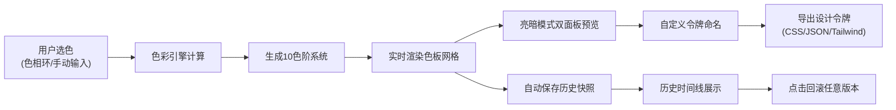

## 1. 产品概述

色彩系统与设计令牌生成工具，为前端开发团队解决设计师与开发者之间色彩规范传递不一致、手动维护CSS变量容易出错的问题。通过可视化界面生成专业级色阶系统，一键导出多种格式的设计令牌，支持亮暗模式实时预览与历史版本回滚。

- 目标用户：前端开发者、UI设计师、产品团队
- 核心价值：提升设计系统一致性，减少色彩沟通成本，自动化设计令牌生成流程

## 2. 核心功能

### 2.1 用户角色

| 角色 | 注册方式 | 核心权限 |
|------|----------|----------|
| 普通用户 | 无需注册，本地使用 | 完整使用所有功能，数据本地存储 |

### 2.2 功能模块

1. **色彩系统生成模块**：色相环选色器、色值输入、10色阶自动生成、WCAG对比度计算
2. **设计令牌导出模块**：令牌自定义命名、CSS变量复制、JSON导出、Tailwind配置导出
3. **亮暗模式预览模块**：双面板对比预览、亮暗切换动画、组件实时预览
4. **历史版本管理模块**：自动快照存储、时间线展示、一键回滚、交错动画切换

### 2.3 页面详情

| 页面名称 | 模块名称 | 功能描述 |
|----------|----------|----------|
| 主应用页 | 色值输入区 | 色相环拖拽选色（0.1秒响应动画）、主/辅色手动输入 |
| 主应用页 | 色板展示区 | 3列等宽色块网格、点击脉冲放大动画、悬停效果、HEX值与对比度显示 |
| 主应用页 | 令牌导出区 | 自定义令牌名称、一键复制CSS变量、JSON/Tailwind导出 |
| 主应用页 | 双面板预览区 | 亮色/暗色卡片对比预览、圆角16px、柔和内阴影 |
| 主应用页 | 历史记录侧边栏 | 时间线形式展示10条历史、点击回滚、交错飞入动画 |

## 3. 核心流程

用户选择主色和辅色 → 系统自动生成10个色阶 → 用户可自定义令牌名称 → 实时预览亮暗模式效果 → 导出CSS/JSON/Tailwind格式 → 每次调整自动保存历史快照 → 可随时回滚到任意历史版本

## 4. 用户界面设计

### 4.1 设计风格

**设计方向：科技感毛玻璃美学**
- 背景：多层渐变叠加 + 细微噪点纹理，营造深度感
- 毛玻璃：半透明卡片（rgba(255,255,255,0.08)），backdrop-filter: blur(12px)
- 主色调：由用户选择的主色动态驱动界面高亮色
- 圆角：所有卡片、按钮、面板统一圆角16px
- 字体组合：
  - 标题：'Space Grotesk' - 现代几何感无衬线字体
  - 正文：'Inter' - 清晰易读的专业字体
  - 备用：system-ui, -apple-system, sans-serif

**动画系统**：
- 色块点击：脉冲放大1.2倍，持续0.3秒
- 色值变化：数值滚动动画，0.1秒响应
- 模式切换：全局色彩平滑过渡0.4秒
- 历史回滚：色块交错飞入动画，0.3秒延迟
- Toast提示：右侧滑入，3秒淡出

### 4.2 页面设计概述

| 页面名称 | 模块名称 | UI元素 |
|----------|----------|--------|
| 主应用页 | 色值输入区 | 色相环（渐变环形）、色值输入框、实时数值动画、主/辅色标签 |
| 主应用页 | 色板展示区 | 3列网格、色块卡片、HEX值标签、WCAG等级徽章、脉冲动画 |
| 主应用页 | 令牌导出区 | 名称输入框、导出按钮组、复制成功Toast |
| 主应用页 | 双面板预览区 | 左右分栏、卡片组件（标题/正文/按钮）、亮暗模式切换 |
| 主应用页 | 历史侧边栏 | 时间线竖线、色板缩略预览、时间戳、回滚按钮 |

### 4.3 响应式设计

- **桌面端（>1200px）**：色板4列布局，侧边栏320px宽度
- **平板端（768px-1200px）**：色板3列布局，侧边栏280px宽度
- **移动端（<768px）**：色板2列布局，侧边栏改为底部抽屉
- 触控优化：所有交互元素最小44x44px触控区域

### 4.4 性能指标

- 色板生成响应时间：≤800ms
- 动画帧率：≥55FPS
- 首屏加载：≤2s
- 内存占用：≤100MB

## 5. 视觉细节规范

**色彩层次**：
- 背景：深色渐变底（#0a0a0f 到 #1a1a2e），营造沉浸式体验
- 卡片：半透明白色（rgba(255,255,255,0.06)）+ 1px边框（rgba(255,255,255,0.1)）
- 高光：用户主色作为强调色，统一应用于按钮、选中态、链接

**微交互**：
- 按钮悬停：背景色渐变0.2s + 缩放1.02倍
- 色块悬停：阴影加深 + 轻微上浮
- 输入聚焦：边框发光效果（用户主色）
- 滚动：自定义滚动条，半透明风格

**深度系统**：
- z-index分层：背景(-1) → 内容(1) → 卡片(10) → 侧边栏(100) → Toast(1000)
- 阴影系统：多层box-shadow模拟真实光影
