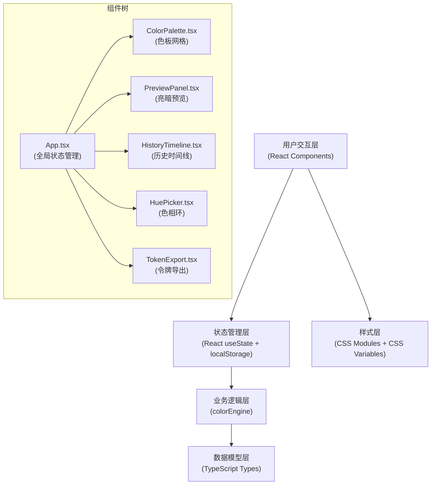

## 1. 架构设计



## 2. 技术描述

- **前端框架**：React@18.2.0 + TypeScript@5.3.3
- **构建工具**：Vite@5.0.8 + @vitejs/plugin-react@4.2.0
- **类型定义**：@types/react@18.2.0、@types/react-dom@18.2.0
- **状态管理**：React Hooks (useState, useEffect, useCallback) + localStorage 持久化
- **样式方案**：纯CSS + CSS Variables（不使用Tailwind，按用户指定文件组织）
- **动画方案**：CSS Transitions + CSS Keyframes + requestAnimationFrame
- **初始化方式**：按用户指定手动创建文件结构，不使用脚手架模板

## 3. 项目文件结构

```
e:\solo\SoloAutoDemo\tasks\auto17\
├── package.json              # 项目依赖与脚本
├── index.html                # 入口HTML
├── tsconfig.json             # TypeScript配置
├── vite.config.js            # Vite配置
└── src/
    ├── colorSystem/
    │   ├── colorTypes.ts     # 类型定义
    │   └── colorEngine.ts    # 色彩计算引擎
    ├── components/
    │   ├── ColorPalette.tsx  # 色板网格组件
    │   ├── PreviewPanel.tsx  # 亮暗预览面板
    │   └── HistoryTimeline.tsx # 历史时间线
    ├── App.tsx               # 主应用组件
    ├── App.css               # 全局样式
    └── main.tsx              # 应用入口
```

## 4. 核心模块设计

### 4.1 色彩计算引擎 (colorEngine.ts)

**核心函数**：
- `hexToHsl(hex: string): HSL` - HEX转HSL
- `hslToHex(h: number, s: number, l: number): string` - HSL转HEX
- `generateColorScale(baseColor: string, count: number): ColorSwatch[]` - 生成色阶
- `calculateContrast(color1: string, color2: string): number` - 计算对比度
- `getWCAGLevel(contrast: number): WCAGLevel` - 获取WCAG等级

**色阶生成算法**：
- 输入基础色，固定色相H和饱和度S
- 亮度L从95%到5%均匀分布，生成10个色阶
- 50: 95%L, 100: 85%L, 200: 75%L, 300: 65%L, 400: 55%L
- 500: 45%L, 600: 35%L, 700: 25%L, 800: 15%L, 900: 5%L

### 4.2 类型定义 (colorTypes.ts)

```typescript
interface HSL {
  h: number;
  s: number;
  l: number;
}

interface ColorSwatch {
  name: string;
  hex: string;
  hsl: HSL;
  level: number; // 50, 100, ... 900
  contrast: number;
  wcagLevel: 'AAA' | 'AA' | 'Fail';
}

interface ColorToken {
  swatch: ColorSwatch;
  customName: string;
  cssVariable: string;
}

interface HistorySnapshot {
  id: string;
  timestamp: number;
  primaryColor: string;
  secondaryColor: string;
  primaryScale: ColorSwatch[];
  secondaryScale: ColorSwatch[];
  tokenNames: Record<string, string>;
}

type ThemeMode = 'light' | 'dark';
```

### 4.3 状态管理 (App.tsx)

**全局状态**：
- `primaryColor: string` - 当前主色
- `secondaryColor: string` - 当前辅色
- `primaryScale: ColorSwatch[]` - 主色色阶
- `secondaryScale: ColorSwatch[]` - 辅色色阶
- `tokenNames: Record<string, string>` - 自定义令牌名称
- `history: HistorySnapshot[]` - 历史记录（最多10条）
- `themeMode: ThemeMode` - 亮暗模式
- `isAnimating: boolean` - 动画状态标记

**状态流转**：
1. 用户选色 → 触发 `useEffect` → 调用 `generateColorScale` → 更新色阶
2. 色阶更新 → 触发 `useEffect` → 自动保存历史快照
3. 点击历史 → 恢复快照状态 → 触发交错动画

## 5. 动画性能优化

### 5.1 色块脉冲动画
```css
@keyframes pulse-scale {
  0% { transform: scale(1); }
  50% { transform: scale(1.2); }
  100% { transform: scale(1); }
}

.color-swatch:active {
  animation: pulse-scale 0.3s ease-out;
  will-change: transform;
}
```

### 5.2 交错飞入动画
```typescript
// 使用 CSS variable 控制动画延迟
swatches.forEach((swatch, index) => {
  element.style.setProperty('--delay', `${index * 0.05}s`);
});
```

### 5.3 性能优化策略
- 使用 `will-change` 提示浏览器优化
- 动画属性仅限 `transform` 和 `opacity`
- 色块使用 `contain: layout paint` 隔离渲染
- 频繁更新使用 `requestAnimationFrame` 批量处理

## 6. 导出功能实现

### 6.1 CSS变量导出
```typescript
function exportCSSVariables(tokens: ColorToken[]): string {
  return tokens.map(t => 
    `${t.customName}: ${t.swatch.hex};`
  ).join('\n');
}
```

### 6.2 JSON导出
```typescript
function exportJSON(tokens: ColorToken[]): string {
  const result = tokens.reduce((acc, t) => {
    acc[t.customName.replace('--', '')] = t.swatch.hex;
    return acc;
  }, {} as Record<string, string>);
  return JSON.stringify({ colors: result }, null, 2);
}
```

### 6.3 Tailwind配置导出
```typescript
function exportTailwindConfig(primary: ColorSwatch[], secondary: ColorSwatch[]): string {
  const formatScale = (scale: ColorSwatch[]) => 
    scale.reduce((acc, s) => {
      acc[s.level] = s.hex;
      return acc;
    }, {} as Record<number, string>);
  
  return JSON.stringify({
    theme: {
      extend: {
        colors: {
          primary: formatScale(primary),
          secondary: formatScale(secondary)
        }
      }
    }
  }, null, 2);
}
```

## 7. 本地存储策略

**存储键名**：`color-system-history`
**存储内容**：`HistorySnapshot[]` 数组
**存储时机**：每次主色或辅色变化后500ms防抖保存
**历史上限**：最多保留10条，超出删除最早记录
**初始化**：应用启动时从localStorage加载历史

## 8. 无障碍设计

- 所有交互元素支持键盘导航（Tab/Enter/Space）
- 色块包含aria-label描述色值和对比度等级
- 色彩对比度符合WCAG AA标准
- 支持 `prefers-reduced-motion` 减少动画
- 语义化HTML结构

## 9. 性能监控指标

- **色板生成时间**：从输入变化到DOM更新完成，使用 `performance.now()` 测量
- **动画帧率**：使用 `requestAnimationFrame` 监控，目标60FPS
- **内存占用**：定期清理不再使用的事件监听器和定时器
