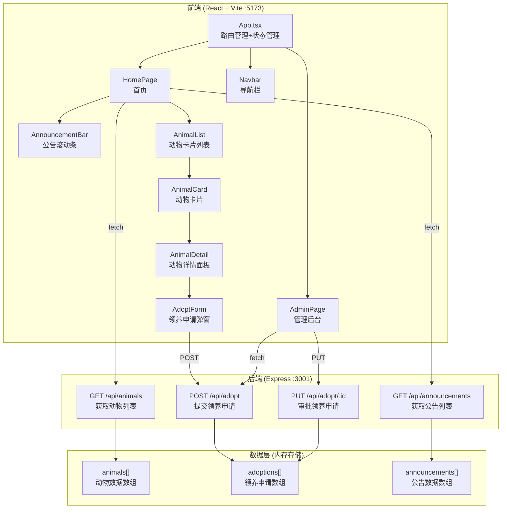
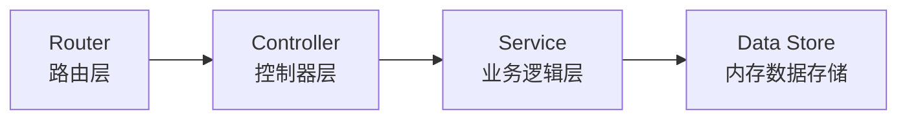
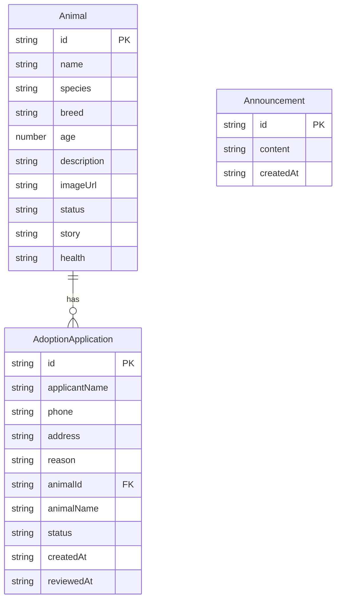

## 1. 架构设计



## 2. 技术说明

- **前端**：React@18.2.0 + TypeScript@5.3.3 + Vite@5.0.8 + react-router-dom@6.21.1
- **样式方案**：CSS Modules + CSS 变量（温暖配色主题）
- **状态管理**：Zustand（管理动物列表、申请列表、公告、UI状态）
- **初始化工具**：vite-init（react-express-ts 模板）
- **后端**：Express@4.18.2 + TypeScript + cors@2.8.5 + uuid@9.0.0
- **数据库**：内存数组（无需外部数据库）
- **构建工具**：Vite@5.0.8 + @vitejs/plugin-react@4.2.0
- **图标**：lucide-react

## 3. 路由定义

| 路由 | 用途 |
|------|------|
| / | 首页，展示公告滚动条和动物卡片列表 |
| /admin | 管理后台，展示领养申请列表和审批操作 |

## 4. API 定义

### 4.1 数据类型

```typescript
interface Animal {
  id: string;
  name: string;
  species: string;
  breed: string;
  age: number;
  description: string;
  imageUrl: string;
  status: 'available' | 'adopted' | 'pending';
  personality: string[];
  story: string;
  health: string;
}

interface AdoptionApplication {
  id: string;
  applicantName: string;
  phone: string;
  address: string;
  reason: string;
  animalId: string;
  animalName: string;
  status: 'pending' | 'approved' | 'rejected';
  createdAt: string;
  reviewedAt?: string;
}

interface Announcement {
  id: string;
  content: string;
  createdAt: string;
}
```

### 4.2 API 端点

| 方法 | 路径 | 请求体 | 响应 | 说明 |
|------|------|--------|------|------|
| GET | /api/animals | - | Animal[] | 获取所有可领养动物列表 |
| GET | /api/announcements | - | Announcement[] | 获取公告列表 |
| POST | /api/adopt | { applicantName, phone, address, reason, animalId } | AdoptionApplication | 提交领养申请 |
| PUT | /api/adopt/:id | { status: 'approved' \| 'rejected' } | AdoptionApplication | 审批领养申请 |
| GET | /api/adoptions | - | AdoptionApplication[] | 获取所有领养申请 |

## 5. 服务器架构图



## 6. 数据模型

### 6.1 数据模型定义



### 6.2 初始数据

后端启动时预填充 8-10 只动物数据（包含猫、狗等不同品种）、3-5 条公告数据，确保首页有内容展示。
