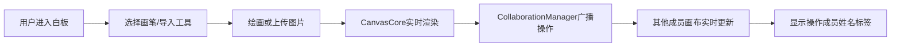

## 1. 产品概述
实时协作白板涂鸦应用，让团队成员在同一虚拟白板上自由绘画、添加便签和图片，并实时同步彼此的操作。
- 面向远程协作团队，提供可视化创意讨论和头脑风暴工具
- 主打流畅的绘画体验、实时协作同步和精美的深色霓虹UI

## 2. 核心功能

### 2.1 用户角色
| 角色 | 注册方式 | 核心权限 |
|------|----------|----------|
| 协作用户 | 自动加入（模拟数据） | 绘画、导入图片、编辑图片文字、查看其他成员操作 |

### 2.2 功能模块
1. **白板画布**：无限平移缩放、画笔绘制、墨水扩散动画
2. **协作面板**：在线成员列表、成员操作实时提示
3. **文件导入**：拖拽/点击上传图片、图片缩放拖拽、图片文字编辑

### 2.3 页面详情
| 页面名称 | 模块名称 | 功能描述 |
|----------|----------|----------|
| 主界面 | 工具栏 | 画笔工具选择、颜色/粗细/透明度调节 |
| 主界面 | 白板画布 | 无限平移（空格+拖拽）、滚轮缩放（0.25x-4x）、画笔绘制（墨水扩散动画+流动光效） |
| 主界面 | 成员面板 | 在线成员头像列表（圆形裁剪+绿点指示器）、操作时姓名标签悬浮显示（2秒后0.8秒淡出） |
| 主界面 | 文件导入 | 左下角导入按钮、拖拽/点击上传PNG/JPG/SVG、半透明缩略图悬浮、四角缩放手柄、双击编辑文字说明 |

## 3. 核心流程
用户进入白板 → 选择画笔工具并调节参数 → 在画布上绘画（实时墨水效果）/导入图片 → 操作实时同步给其他成员 → 成员操作显示姓名标签提示

## 4. 用户界面设计

### 4.1 设计风格
- 主色：深色背景 #1a1a2e，工具栏 #16213e，卡片 #0f3460
- 强调色：霓虹蓝 #0ea5e9，按钮带发光效果 box-shadow: 0 0 10px #0ea5e9
- 字体：现代无衬线字体，清晰易读
- 布局：全屏画布，工具栏顶部悬浮，成员面板右侧浮动，导入按钮左下角
- 动画：面板切换0.3秒淡入，姓名标签2秒后0.8秒淡出，绘画墨水扩散效果，路径完成0.2秒流动光效

### 4.2 页面设计概述
| 页面名称 | 模块名称 | UI元素 |
|----------|----------|--------|
| 主界面 | 工具栏 | 画笔按钮、颜色选择器、粗细滑块、透明度滑块、霓虹蓝发光、悬停过渡 |
| 主界面 | 白板画布 | 深色网格背景、Canvas 2D渲染、平滑缩放动画 |
| 主界面 | 成员面板 | 半透明深色卡片、圆形头像、绿色在线状态点、姓名标签淡入淡出 |
| 主界面 | 文件导入 | 浮动按钮、发光边框、拖放区域高亮、图片缩放手柄、白色圆角标签条 |

### 4.3 响应式
- Desktop-first设计，全屏画布优先
- 面板在小屏幕上可折叠
- 触摸操作优化（单指绘画、双指缩放平移）

### 4.4 性能要求
- 绘画操作60fps以上
- 缩放平移响应延迟低于50ms
- 并发5个用户操作无明显卡顿
