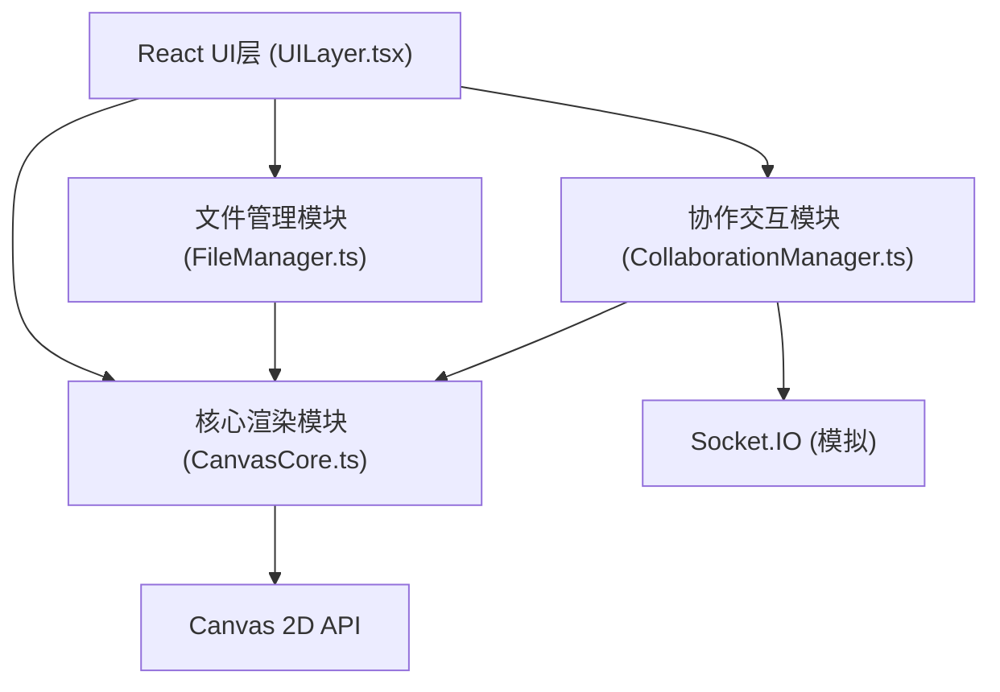

## 1. 架构设计



## 2. 技术描述
- 前端：React@18.2.0 + TypeScript@5.3.3 + Vite@5.0.8
- 初始化工具：Vite脚手架
- 后端：无（Socket.IO客户端模拟，本地广播协作事件）
- 数据存储：内存状态管理，mock数据

## 3. 模块职责

### 3.1 CanvasCore.ts（核心渲染引擎）
- 负责白板无限平移、缩放坐标变换
- 画笔路径的矢量数据管理与Canvas 2D渲染
- 墨水扩散动画和流动光效
- 数据流向：用户输入事件 → 坐标变换 → 更新画布状态 → requestAnimationFrame重绘

### 3.2 CollaborationManager.ts（协作用户管理）
- 管理在线成员列表（mock数据：5个模拟用户）
- 模拟Socket.IO广播/接收成员操作事件
- 成员操作状态跟踪，姓名标签显示/淡出逻辑
- 数据流向：成员行为事件 → 更新成员状态 → 通过回调通知UI

### 3.3 FileManager.ts（文件导入与编辑）
- 处理拖拽/点击上传PNG/JPG/SVG
- 图片缩略图生成、坐标/缩放状态管理
- 图片缩放拖拽交互、双击文字编辑
- 数据流向：文件输入 → 生成缩略图 → 传递坐标给CanvasCore → 管理文字标签数据

### 3.4 UILayer.tsx（React UI层）
- 工具栏组件（画笔按钮、颜色/粗细/透明度控制）
- 成员面板组件（头像列表、姓名标签）
- 文件导入按钮组件
- 调用CanvasCore、FileManager、CollaborationManager接口
- 监听状态变化更新UI

### 3.5 main.tsx（应用入口）
- 初始化模拟Socket连接
- 挂载UILayer组件
- 设置全局CSS样式（深色主题、霓虹发光效果）

## 4. 文件结构
```
package.json
index.html
tsconfig.json
vite.config.js
src/
  CanvasCore.ts
  CollaborationManager.ts
  FileManager.ts
  UILayer.tsx
  main.tsx
```

## 5. 核心数据模型

### 5.1 画笔路径
```typescript
interface BrushPath {
  id: string;
  points: { x: number; y: number; pressure?: number }[];
  color: string;
  thickness: number;
  opacity: number;
  createdAt: number;
  animationProgress: number;
}
```

### 5.2 成员
```typescript
interface Member {
  id: string;
  name: string;
  avatar: string;
  color: string;
  isOnline: boolean;
  lastActionAt: number;
  cursorPos?: { x: number; y: number };
  isActing: boolean;
}
```

### 5.3 图片元素
```typescript
interface ImageElement {
  id: string;
  src: string;
  x: number;
  y: number;
  width: number;
  height: number;
  caption: string;
  createdAt: number;
}
```

## 6. 性能优化策略
- Canvas 2D分层渲染（静态路径层 + 动画层）
- requestAnimationFrame驱动渲染循环
- 路径点简化（距离阈值采样）
- 图片缩略图预生成与缓存
- React组件memo避免不必要重渲染
