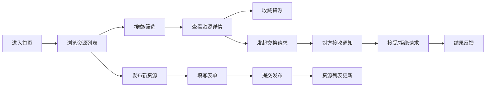

## 1. 产品概述
本产品是一个轻量级学习资源交换与共享平台，解决学生群体在学习过程中资源分散、查找困难的痛点。通过集中式的资源发布、搜索、收藏和交换功能，帮助学生高效获取和分享笔记、习题、课件等学习资料。

- 核心价值：打破信息孤岛，建立学习资源共享生态
- 目标用户：在校学生、备考人群、学习爱好者
- 市场定位：专注于学习资源垂直领域的轻量共享社区

## 2. 核心功能

### 2.1 用户角色
| 角色 | 注册方式 | 核心权限 |
|------|----------|----------|
| 普通用户 | 无需注册（模拟环境） | 发布资源、浏览搜索、收藏资源、发起/响应交换请求 |

### 2.2 功能模块
1. **首页（主界面）**：资源卡片网格展示、搜索筛选、侧边栏收藏列表
2. **资源发布**：弹窗表单提交新资源
3. **资源收藏**：星形按钮收藏/取消收藏、侧边栏收藏列表
4. **资源交换**：交换请求发送、通知提示、请求管理面板

### 2.3 页面详情
| 页面名称 | 模块名称 | 功能描述 |
|---------|---------|----------|
| 主界面 | 顶部搜索区 | 关键词搜索（防抖300ms）、类型筛选按钮组 |
| 主界面 | 左侧边栏 | 收藏资源列表、响应式折叠为汉堡菜单 |
| 主界面 | 主内容区 | 资源卡片网格展示、发布按钮悬浮入口 |
| 发布弹窗 | 资源表单 | 标题、类型、描述输入，中心放大动画（0.2s） |
| 交换确认框 | 确认弹窗 | 从顶部滑入动画、确认/取消操作 |
| 通知区域 | 交换通知 | 右上角淡入提示（0.3s）、自动消失 |
| 交换面板 | 请求管理 | 接收的请求列表、接受（绿色脉冲）/拒绝（红色晃动）操作 |

## 3. 核心流程

### 主要用户流程：
用户进入首页 → 浏览资源卡片 → 通过搜索/筛选定位目标资源 → 可选择收藏、发起交换或发布自有资源 → 交换请求发送后对方收到通知 → 对方在交换面板接受或拒绝请求。

## 4. 用户界面设计

### 4.1 设计风格
- **设计理念**：极简扁平设计，清爽专业的学习氛围
- **主色调**：淡蓝色(#E8F4FD)作为背景主色调
- **强调色**：深蓝色(#1A365D)用于文字和按钮
- **辅助色**：浅灰色(#F7FAFC)用于搜索和筛选区域
- **卡片样式**：白色背景、圆角12px、带阴影、悬停阴影加深并上浮0.2s
- **按钮反馈**：点击缩放至0.95倍，持续0.1s
- **字体**：采用现代无衬线字体，清晰易读

### 4.2 页面设计概述
| 页面名称 | 模块名称 | UI元素 |
|---------|---------|--------|
| 主界面 | 顶部搜索区 | 搜索框（圆角、浅灰背景）、类型筛选按钮组（下划线动画0.2s）、发布按钮 |
| 主界面 | 左侧边栏 | 固定宽度、浅蓝色分隔线、收藏列表、滑入动画0.3s |
| 主界面 | 资源卡片网格 | 响应式网格布局、卡片悬停效果、星形收藏按钮（旋转动画0.3s） |
| 发布弹窗 | 表单弹窗 | 中心放大动画0.2s、半透明遮罩、表单输入框、提交/取消按钮 |
| 交换面板 | 请求列表 | 请求卡片、接受按钮（绿色脉冲动画）、拒绝按钮（红色晃动动画） |
| 通知区 | 通知提示 | 右上角定位、淡入动画0.3s、自动消失 |

### 4.3 响应式设计
- **桌面端（≥768px）**：左侧固定边栏 + 右侧主内容区，卡片网格自适应列数
- **移动端（<768px）**：侧边栏折叠为顶部汉堡菜单，展开时遮罩层覆盖主内容区，卡片单列布局
- **触摸优化**：按钮最小点击区域44x44px，卡片间距适配触摸操作

### 4.4 动画与交互
- 弹窗从中心放大出现：scale(0) → scale(1)，0.2s ease-out
- 侧边栏滑入：transform: translateX(-100%) → translateX(0)，0.3s ease-out
- 收藏按钮：星星填充金色 + rotate(360deg)，0.3s ease-in-out
- 通知淡入：opacity: 0 → opacity: 1，0.3s ease-in
- 接受请求：绿色脉冲动画（scale + box-shadow）
- 拒绝请求：红色晃动动画（translateX 左右摇摆）
- 按钮点击：scale(1) → scale(0.95) → scale(1)，0.1s ease-in-out

## 5. 性能约束
- 资源列表渲染响应时间 ≤ 200ms（100条数据时）
- 搜索防抖触发后列表更新 ≤ 100ms
- 交互动画帧率 ≥ 50fps
- 首次加载时间 ≤ 2s
