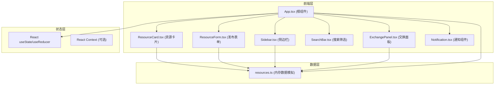
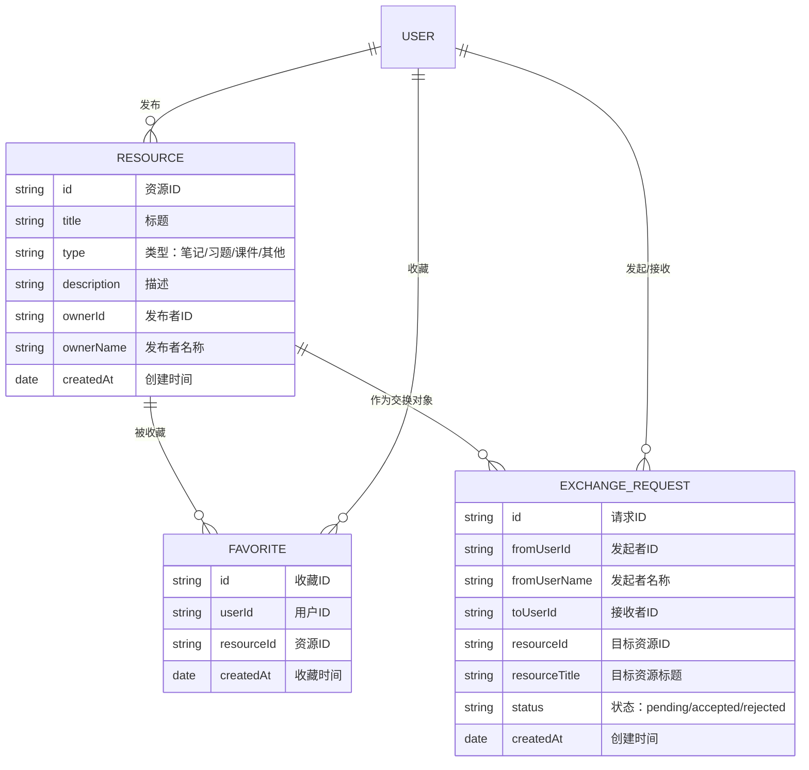

## 1. 架构设计



## 2. 技术描述

### 技术栈
- **前端框架**：React@18.2.0
- **类型系统**：TypeScript@5.3.3（严格模式）
- **构建工具**：Vite@5.0.8
- **React插件**：@vitejs/plugin-react@4.2.0
- **路由管理**：react-router-dom@6.21.1
- **工具库**：uuid@9.0.0（生成唯一ID）
- **样式方案**：原生CSS + CSS Modules（配合CSS变量）
- **后端**：无（纯前端内存模拟）
- **数据库**：内存数据存储（src/data/resources.ts）

### 初始化方式
使用Vite脚手架初始化React + TypeScript项目，手动配置所需依赖版本。

### 关键技术点
1. **状态管理**：使用React useState + useCallback管理全局状态，避免不必要的重渲染
2. **性能优化**：
   - 搜索防抖（300ms）使用useRef + setTimeout实现
   - 列表渲染使用React.memo优化
   - 大量数据下使用虚拟滚动（如需要）
3. **动画实现**：
   - CSS Transition/Transform实现基础动画
   - CSS Keyframes实现复杂动画（脉冲、晃动、旋转）
4. **响应式布局**：CSS Media Queries + Flexbox/Grid

## 3. 路由定义

| 路由 | 页面/组件 | 用途 |
|------|----------|------|
| `/` | App.tsx (主界面) | 资源浏览、搜索、收藏、交换 |

*注：由于是单页应用，主要功能通过组件切换和弹窗实现，无需多页面路由。*

## 4. 数据模型

### 4.1 数据模型定义



### 4.2 TypeScript 类型定义

```typescript
// 资源类型
type ResourceType = '笔记' | '习题' | '课件' | '其他';

interface Resource {
  id: string;
  title: string;
  type: ResourceType;
  description: string;
  ownerId: string;
  ownerName: string;
  createdAt: Date;
}

// 收藏记录
interface Favorite {
  id: string;
  userId: string;
  resourceId: string;
  createdAt: Date;
}

// 交换请求状态
type ExchangeStatus = 'pending' | 'accepted' | 'rejected';

interface ExchangeRequest {
  id: string;
  fromUserId: string;
  fromUserName: string;
  toUserId: string;
  resourceId: string;
  resourceTitle: string;
  status: ExchangeStatus;
  createdAt: Date;
}

// 通知类型
interface Notification {
  id: string;
  type: 'info' | 'success' | 'warning';
  message: string;
  createdAt: Date;
}

// 全局应用状态
interface AppState {
  resources: Resource[];
  favorites: Favorite[];
  exchangeRequests: ExchangeRequest[];
  notifications: Notification[];
  currentUser: {
    id: string;
    name: string;
  };
}
```

## 5. 文件结构与调用关系

```
src/
├── App.tsx              # 根组件，管理全局状态和路由
│   ├── 传入 props → ResourceCard
│   ├── 传入 props → ResourceForm
│   ├── 传入 props → Sidebar
│   ├── 传入 props → SearchBar
│   ├── 传入 props → ExchangePanel
│   └── 调用 → resources.ts (CRUD操作)
│
├── components/
│   ├── ResourceCard.tsx   # 资源卡片
│   │   ├── 接收 props: resource, isFavorite
│   │   ├── 事件回调: onFavorite, onExchange
│   │   └── 调用 → resources.ts (收藏/交换)
│   │
│   ├── ResourceForm.tsx   # 资源发布表单
│   │   ├── 接收 props: onSubmit, onCancel
│   │   └── 用户输入 → 回调 to App.tsx
│   │
│   ├── Sidebar.tsx        # 侧边栏（收藏列表）
│   │   ├── 接收 props: favorites, resources
│   │   └── 调用 → resources.ts (查询)
│   │
│   ├── SearchBar.tsx      # 搜索筛选栏
│   │   ├── 接收 props: onSearch, onFilter, activeFilter
│   │   └── 防抖搜索 → 回调 to App.tsx
│   │
│   ├── ExchangePanel.tsx  # 交换请求面板
│   │   ├── 接收 props: requests, currentUserId
│   │   ├── 事件回调: onAccept, onReject
│   │   └── 调用 → resources.ts (更新请求状态)
│   │
│   └── Notification.tsx   # 通知组件
│       └── 接收 props: notifications
│
├── data/
│   └── resources.ts       # 内存数据层
│       ├── resources[]    # 资源列表
│       ├── favorites[]    # 收藏记录
│       ├── exchangeRequests[] # 交换请求
│       ├── mockData()     # 生成100条模拟数据
│       └── CRUD函数       # 增删改查操作
│
├── hooks/
│   └── useDebounce.ts     # 防抖自定义Hook
│
├── types/
│   └── index.ts           # TypeScript类型定义
│
└── index.css              # 全局样式和CSS变量
```

### 数据流向图

```
用户操作 → 组件事件 → App.tsx 状态更新 → resources.ts 数据操作 → 
状态回流 → 组件重渲染 → UI更新
```

## 6. 性能优化策略

1. **防抖搜索**：使用自定义useDebounce Hook，延迟300ms执行搜索
2. **列表虚拟化**：100条数据可使用React.memo包裹ResourceCard避免不必要重渲染
3. **状态细粒度**：将搜索关键词、筛选类型等状态与资源列表状态分离
4. **CSS动画**：使用transform和opacity属性实现GPU加速动画
5. **内存数据**：所有数据操作在内存中完成，避免IO延迟
6. **懒加载**：弹窗组件按需渲染，减少初始DOM节点

## 7. 动画实现方案

| 动画效果 | 实现方式 | 性能影响 |
|---------|---------|----------|
| 弹窗中心放大 | CSS transform: scale() + transition | GPU加速，低影响 |
| 侧边栏滑入 | CSS transform: translateX() + transition | GPU加速，低影响 |
| 星星旋转 | CSS transform: rotate() + transition | GPU加速，低影响 |
| 卡片悬停 | CSS box-shadow + transform: translateY() | 低影响 |
| 按钮点击缩放 | CSS transform: scale() + transition | GPU加速，低影响 |
| 通知淡入 | CSS opacity + transition | 低影响 |
| 绿色脉冲 | CSS @keyframes (scale + box-shadow) | 中等影响 |
| 红色晃动 | CSS @keyframes (translateX) | 中等影响 |
| 筛选下划线 | CSS border-bottom + transition | 低影响 |
