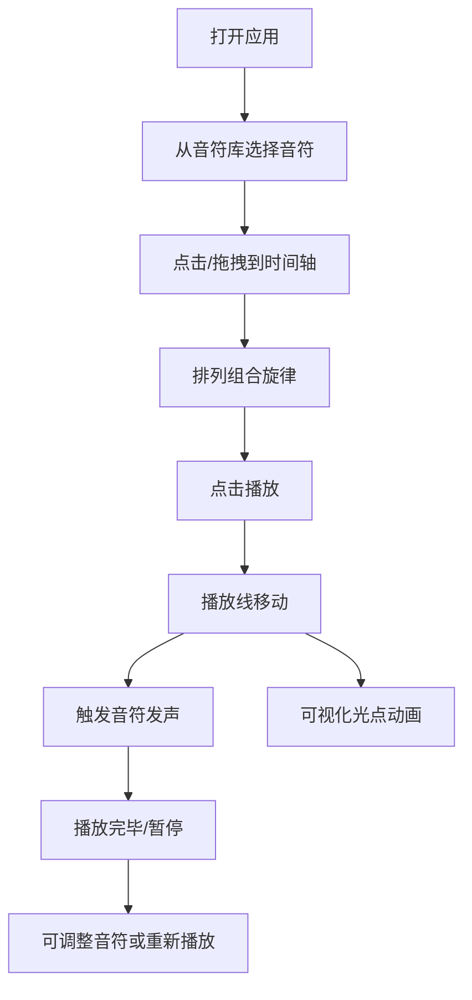

## 1. 产品概述
交互式音乐创作与实时可视化工具，让用户通过拖拽音符到时间轴创作旋律，并获得音高和节奏触发的实时视觉反馈。目标用户为音乐爱好者、学习者和创意工作者，提供直观有趣的音乐创作体验。

## 2. 核心功能

### 2.1 功能模块
1. **音符库面板**：24个音符按钮（C4-B5三个八度），支持点击添加到时间轴
2. **时间轴区域**：80拍横向时间轴，支持音符拖拽放置、选中、删除
3. **播放控制区**：播放/暂停、重置、速度调节
4. **实时可视化**：Canvas画布绘制光点动画，音高和节奏驱动视觉效果
5. **音频引擎**：Web Audio API生成对应频率的声音

### 2.3 页面详情
| 页面名称 | 模块名称 | 功能描述 |
|-----------|-------------|---------------------|
| 主界面 | 音符库面板 | 左侧固定，24个渐变圆形按钮，hover粒子效果，点击添加音符 |
| 主界面 | 时间轴区域 | 中央区域，80拍横向滚动，音符卡片拖拽放置，选中发光，Delete删除 |
| 主界面 | 播放控制区 | 时间轴下方，播放/暂停按钮旋转动画，重置动画，速度滑块 |
| 主界面 | 可视化画布 | 右侧区域，Canvas实时绘制光点动画，随音高节奏变化 |

## 3. 核心流程
用户从左侧音符库点击或拖拽音符到时间轴的对应拍子上，排列组合形成旋律。点击播放按钮后，红色播放线随时间移动，触发对应位置的音符发声，同时右侧画布亮起对应音高的光点。用户可调整播放速度、暂停、重置，或选中音符进行删除调整。

## 4. 用户界面设计

### 4.1 设计风格
- **主题配色**：深色主题背景#0F172A，靛蓝#4F46E5到紫罗兰#7C3AED渐变，金色#F59E0B选中高亮，红色播放指示线
- **按钮样式**：圆角6px圆形按钮（直径40px），渐变底色，hover缩放1.1倍带粒子效果
- **卡片样式**：矩形音符卡（宽30px，高60-120px随音高变化），低音偏蓝、高音偏紫，选中时5px金色外发光
- **发光边框**：所有卡片和按钮带#6366F1（30%不透明度）发光边框
- **字体**：现代无衬线字体，清晰易读

### 4.2 页面设计概述
| 页面名称 | 模块名称 | UI元素 |
|-----------|-------------|-------------|
| 主界面 | 音符库面板 | 24个渐变圆形按钮，hover粒子效果，点击反馈 |
| 主界面 | 时间轴区域 | 80拍网格，横向自定义滚动条，可拖拽音符卡，选中发光 |
| 主界面 | 播放控制区 | 圆形播放/暂停按钮（旋转动画），重置按钮，速度滑块（0.5x-2.0x） |
| 主界面 | 可视化画布 | Canvas光点动画，发光模糊效果，音高位置对应 |

### 4.3 响应式
- **桌面端**：三栏布局（1:2:1），左侧音符库、中央时间轴、右侧可视化
- **平板端（<768px）**：上下布局，音符库在上、时间轴居中、可视化在下
- **触摸优化**：按钮和可点击区域足够大，支持触摸拖拽

### 4.4 动画与交互
- 音符按钮hover：缩放1.1倍 + 圆形光点粒子（0.3秒消散）
- 播放按钮点击：旋转一圈 + 颜色过渡（0.3秒）
- 重置按钮：所有音符淡出再淡入（0.5秒）
- 播放线：0.1秒间隔更新，平滑动画
- 可视化光点：直径8-20px随音量变化，发光模糊，持续0.2秒
- 性能要求：播放刷新率≥30FPS，交互响应<100ms
