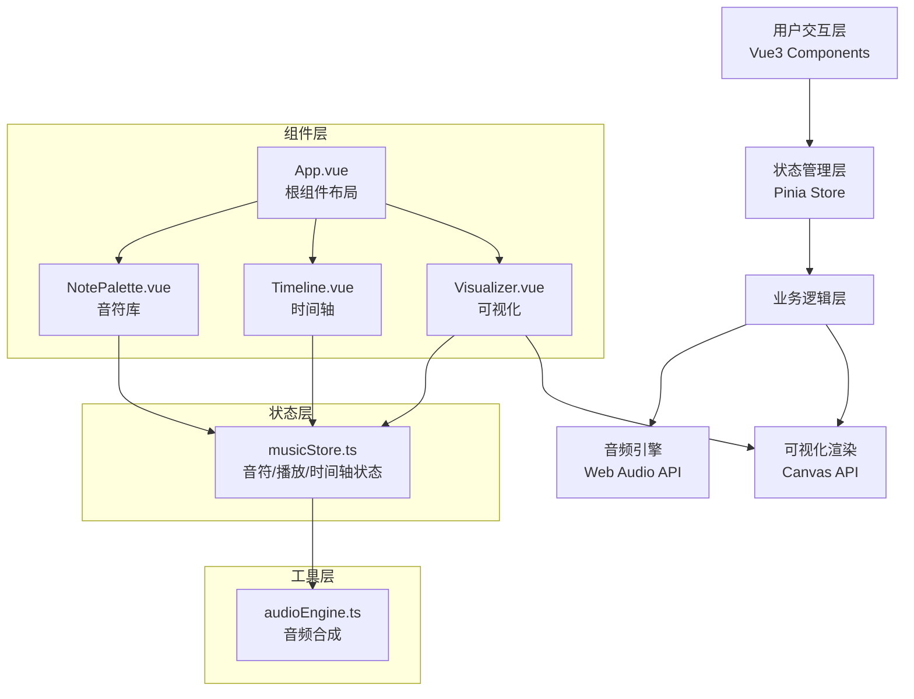

## 1. 架构设计



## 2. 技术描述

- **前端框架**：Vue@3.4.0 + TypeScript@5.3.3 + Composition API
- **构建工具**：Vite@5.0.8 + @vitejs/plugin-vue@5.0.0
- **状态管理**：Pinia@2.1.7
- **音频引擎**：Web Audio API（内置，无需额外依赖）
- **可视化**：Canvas 2D API（内置）
- **初始化工具**：vite-init

## 3. 项目结构

```
auto36/
├── package.json
├── index.html
├── tsconfig.json
├── vite.config.js
└── src/
    ├── App.vue              # 根组件，三栏布局+响应式
    ├── stores/
    │   └── musicStore.ts    # Pinia状态管理
    ├── components/
    │   ├── NotePalette.vue  # 左侧音符库（24个音符按钮）
    │   ├── Timeline.vue     # 中央时间轴（拖拽、播放控制）
    │   └── Visualizer.vue   # 右侧Canvas可视化
    └── utils/
        └── audioEngine.ts   # Web Audio API音频引擎
```

## 4. 数据模型

### 4.1 音符数据结构

```typescript
interface Note {
  id: string;           // 唯一标识
  name: string;         // 音名 (C4, D4, ..., B5)
  frequency: number;    // 频率 (Hz)
  octave: number;       // 八度 (4, 5)
  index: number;        // 音高索引 (0-23)
}

interface PlacedNote {
  id: string;           // 唯一标识
  noteId: string;       // 关联音符ID
  beat: number;         // 放置的拍子位置 (0-79)
  note: Note;           // 音符详情
}

interface MusicState {
  notes: Note[];                // 24个音符库
  placedNotes: PlacedNote[];    // 时间轴上的音符
  selectedNoteId: string | null; // 选中的音符ID
  isPlaying: boolean;           // 播放状态
  currentBeat: number;          // 当前播放位置
  tempo: number;                // 播放速度倍率 (0.5-2.0)
  totalBeats: number;           // 总拍数 (80)
  beatWidth: number;            // 每拍像素宽度 (40)
  activeNotes: Set<string>;     // 当前激活发声的音符
}
```

### 4.2 核心常量

```typescript
// 音名与频率映射（A4 = 440Hz基准）
const NOTE_FREQUENCIES: Record<string, number> = {
  'C4': 261.63, 'C#4': 277.18, 'D4': 293.66, 'D#4': 311.13,
  'E4': 329.63, 'F4': 349.23, 'F#4': 369.99, 'G4': 392.00,
  'G#4': 415.30, 'A4': 440.00, 'A#4': 466.16, 'B4': 493.88,
  'C5': 523.25, 'C#5': 554.37, 'D5': 587.33, 'D#5': 622.25,
  'E5': 659.25, 'F5': 698.46, 'F#5': 739.99, 'G5': 783.99,
  'G#5': 830.61, 'A5': 880.00, 'A#5': 932.33, 'B5': 987.77
};

// 颜色映射：低音偏蓝(#4F46E5) -> 高音偏紫(#7C3AED)
const getNoteColor = (index: number): string => {
  // index 0-23, 线性插值颜色
};
```

## 5. 核心模块说明

### 5.1 musicStore.ts (Pinia)
- `generateNotes()`: 生成24个音符数据
- `addNoteToTimeline(noteId, beat)`: 添加音符到时间轴
- `removeNoteFromTimeline(placedNoteId)`: 删除音符
- `selectNote(placedNoteId)`: 选中音符
- `togglePlay()`: 播放/暂停切换
- `resetPlayback()`: 重置播放位置
- `setTempo(tempo)`: 设置播放速度
- `updatePlayback()`: 播放循环（requestAnimationFrame）

### 5.2 audioEngine.ts
- `initAudioContext()`: 初始化AudioContext
- `playNote(frequency, duration)`: 播放指定频率的音符
- `stopNote()`: 停止所有声音
- 使用OscillatorNode + GainNode生成带ADSR包络的波形

### 5.3 NotePalette.vue
- 渲染24个圆形渐变按钮
- hover时的粒子动画效果（CSS动画）
- 点击/拖拽开始事件处理

### 5.4 Timeline.vue
- 80拍横向时间轴，自定义滚动条样式
- 播放控制按钮（播放/暂停、重置、速度滑块）
- 音符拖放逻辑（dragstart, dragover, drop）
- 红色播放线平滑动画
- 音符选中与Delete键删除
- 重置时的淡出淡入动画

### 5.5 Visualizer.vue
- Canvas绘制光点动画
- 监听store的activeNotes变化
- 每个激活音符在对应音高位置绘制发光圆点
- 直径随音量变化（8-20px），发光模糊效果

## 6. 性能优化策略

1. **播放循环**：使用requestAnimationFrame，60FPS驱动，0.1秒更新一次播放位置
2. **Canvas渲染**：分层绘制，只重绘变化区域，避免全画布清空重绘
3. **状态更新**：Pinia状态变更使用computed和watch减少不必要的重渲染
4. **事件防抖**：拖拽事件使用throttle限制触发频率
5. **对象池**：粒子和光点对象复用，避免频繁GC
6. **CSS优化**：使用transform和opacity实现动画，触发GPU加速
