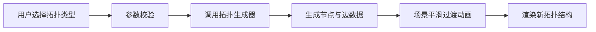
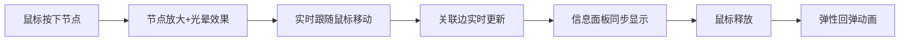
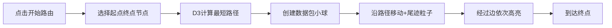

## 1. 产品概述

三维拓扑结构动态交互可视化应用，通过 Three.js 与 D3.js 实现网络拓扑结构的沉浸式交互展示。用户可通过拖拽节点、切换拓扑类型、调节参数等方式，实时观察不同网络结构的动态变化与数据包路由模拟过程。

- 核心价值：将抽象的网络拓扑概念转化为直观可交互的三维可视化体验，帮助用户理解网络结构与路由机制
- 目标用户：计算机网络学习者、网络工程师、技术教育工作者
- 市场定位：教育演示与技术展示工具

## 2. 核心功能

### 2.1 功能模块

1. **拓扑结构生成模块**：支持环型、星型、树型、网格型四种拓扑结构，可调节节点数量与连接概率
2. **三维场景渲染模块**：基于 Three.js 的低多边形风格节点与边渲染，包含光照、材质、网格辅助平面
3. **节点交互模块**：支持鼠标拖拽节点，实时更新关联边，显示节点信息面板
4. **路由模拟模块**：使用 D3.js 计算最短路径，数据包沿路径移动并带有高亮与尾迹效果
5. **控制面板模块**：右侧磨砂玻璃风格控制面板，包含拓扑选择、参数调节、路由控制

### 2.2 页面详情

| 页面名称 | 模块名称 | 功能描述 |
|---------|---------|---------|
| 主页面 | 三维场景区域 | 占据页面主要空间，展示拓扑结构三维可视化，支持旋转、缩放、拖拽交互 |
| 主页面 | 右侧控制面板 | 固定宽度280px，磨砂玻璃效果，包含拓扑选择下拉框、参数滑块、路由控制按钮组 |
| 主页面 | 节点信息面板 | 显示当前选中/拖拽节点的ID、坐标、连接数等信息 |
| 主页面 | 移动端适配栏 | 视口宽度小于768px时，控制面板折叠为顶部可展开横幅 |

## 3. 核心流程

### 3.1 拓扑切换流程

### 3.2 节点拖拽流程

### 3.3 路由模拟流程

## 4. 用户界面设计

### 4.1 设计风格

- **主色调**：深蓝到紫黑的径向渐变背景，节点采用青色到浅蓝渐变
- **强调色**：亮绿色（路径高亮）、红色发光（数据包）、靛蓝到紫罗兰（按钮渐变）
- **材质风格**：低多边形简约风格，节点为球体，边为细圆柱体
- **玻璃效果**：控制面板采用 backdrop-filter: blur(10px) 磨砂玻璃效果
- **字体**：现代无衬线字体，清晰易读

### 4.2 交互细节

- **按钮**：圆角6px，hover时颜色从靛蓝变为紫罗兰，轻微上浮效果
- **下拉框**：圆角8px，深灰背景，白色文字
- **滑块**：轨道渐变色从蓝到紫，圆形滑块
- **动画**：拓扑切换0.5秒淡入淡出，节点拖拽回弹0.3秒弹性动画，边高亮0.2秒，粒子尾迹0.5秒消散
- **相机**：初始视角从上方45度俯视拓扑中心

### 4.3 页面设计概览

| 页面区域 | 模块名称 | UI元素 |
|---------|---------|-------|
| 主场景 | 三维拓扑 | 球体节点（青色渐变）、圆柱边（深灰）、网格辅助平面、点光源 |
| 右侧面板 | 控制面板 | 磨砂玻璃背景、圆角控件、渐变按钮、滑动条 |
| 信息区 | 节点信息 | 实时更新的节点ID、坐标、连接数 |
| 顶部 | 移动端横幅 | 点击展开/折叠，0.3秒滑入动画 |

### 4.4 响应式设计

- 桌面端：主场景自适应宽度，右侧固定280px控制面板
- 移动端（<768px）：控制面板折叠为顶部横幅，点击展开图标从上方滑下，持续0.3秒
- 触摸优化：支持触摸拖拽节点，响应式触控目标大小

### 4.5 3D场景指导

- **环境与氛围**：深蓝到紫黑径向渐变背景，中心偏左，营造科技感沉浸氛围
- **光照设置**：柔和环境光 + 右上方点光源，产生自然阴影与高光
- **相机设置**：PerspectiveCamera，初始位置上方45度俯视，支持轨道控制器旋转缩放
- **构图**：拓扑结构位于场景中心，网格辅助平面在下方提供空间参考
- **交互**：节点拖拽、相机轨道控制、点击选中等
- **后处理**：发光效果（数据包、节点光晕），柔和抗锯齿
- **性能**：20节点内稳定50fps以上，拖拽响应延迟<30ms
