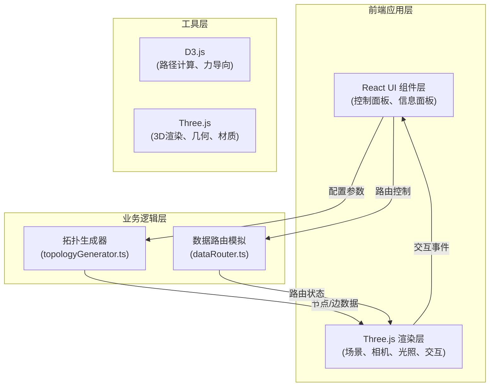

## 1. 架构设计



## 2. 技术描述

- **前端框架**：React@18 + TypeScript@5.3.3
- **构建工具**：Vite@5.0.8 + @vitejs/plugin-react@4.2.0
- **3D渲染**：Three.js@0.160.0 + @types/three@0.160.0
- **数据可视化**：D3.js@7.8.5 + @types/d3@7.4.3
- **样式方案**：原生 CSS + CSS Modules（或内联样式），实现磨砂玻璃、渐变等效果
- **状态管理**：React useState/useReducer，轻量状态管理

## 3. 文件结构

```
.
├── index.html                 # 入口HTML，深色渐变背景
├── package.json               # 依赖配置
├── tsconfig.json              # TypeScript严格模式配置
├── vite.config.js             # Vite配置
└── src/
    ├── main.ts                # 应用入口，初始化场景与UI
    ├── App.tsx                # React主组件
    ├── topologyGenerator.ts   # 拓扑结构生成器
    ├── renderer.ts            # Three.js渲染与交互
    ├── dataRouter.ts          # 数据包路由模拟
    ├── components/
    │   ├── ControlPanel.tsx   # 右侧控制面板
    │   ├── NodeInfo.tsx       # 节点信息面板
    │   └── MobileBanner.tsx   # 移动端横幅
    └── types/
        └── index.ts           # TypeScript类型定义
```

## 4. 核心模块说明

### 4.1 拓扑生成器 (topologyGenerator.ts)

**职责**：根据拓扑类型和参数生成节点坐标与边连接关系

**核心函数**：
- `generateTopology(type: TopologyType, params: TopologyParams): TopologyData`
- `generateRing(nodes: number): TopologyData` - 环型拓扑
- `generateStar(nodes: number): TopologyData` - 星型拓扑
- `generateTree(nodes: number): TopologyData` - 树型拓扑
- `generateMesh(nodes: number, probability: number): TopologyData` - 网格型拓扑

**数据结构**：
```typescript
interface TopologyNode {
  id: number;
  position: { x: number; y: number; z: number };
}

interface TopologyEdge {
  source: number;
  target: number;
}

interface TopologyData {
  nodes: TopologyNode[];
  edges: TopologyEdge[];
}
```

### 4.2 数据路由模拟 (dataRouter.ts)

**职责**：使用 D3.js 计算最短路径，管理数据包移动状态

**核心函数**：
- `calculateShortestPath(graph: TopologyData, start: number, end: number): number[]`
- `startRouting(startNode: number, endNode: number): void`
- `updateRouting(deltaTime: number): RoutingState`
- `getCurrentPacketPosition(): { x: number; y: number; z: number }`

**D3.js 应用**：
- 使用 d3-graph 或自定义算法构建图结构
- 使用 Dijkstra 或 BFS 算法计算最短路径
- 使用 d3-interpolate 进行路径插值动画

### 4.3 Three.js 渲染器 (renderer.ts)

**职责**：创建 Three.js 场景、相机、光照，处理节点拖拽、边更新、路由动画

**核心功能**：
- 场景初始化（Scene、Camera、Renderer、Lights）
- 节点创建与材质（SphereGeometry、渐变材质）
- 边创建与更新（CylinderGeometry、实时变换）
- 射线检测与节点拖拽（Raycaster）
- 过渡动画管理（淡入淡出、弹性动画）
- 尾迹粒子系统
- 渲染循环

### 4.4 控制面板组件 (ControlPanel.tsx)

**职责**：用户交互界面，拓扑选择、参数调节、路由控制

**UI元素**：
- 拓扑类型下拉选择框
- 节点数量滑块 (8-20)
- 连接概率滑块 (0.3-0.8)
- 路由速度选择（慢/中/快）
- 开始/停止路由按钮
- 磨砂玻璃效果背景

## 5. 性能优化策略

- **对象池复用**：节点和边的 Three.js 对象复用，避免频繁创建销毁
- **增量更新**：仅更新变化的边和节点，而非全量重绘
- **几何体简化**：使用低多边形球体和圆柱体
- **材质共享**：相同材质的节点共享材质实例
- **帧率控制**：使用 requestAnimationFrame，合理分配计算任务
- **粒子系统优化**：限制尾迹粒子数量，使用 Points 几何体批量渲染

## 6. 响应式实现

- CSS Media Query 检测视口宽度
- 桌面端：固定 280px 右侧面板，主场景自适应
- 移动端：顶部横幅 + 展开/折叠动画（0.3s 滑入）
- Three.js 画布自适应窗口大小变化
- 触摸事件支持与交互优化
