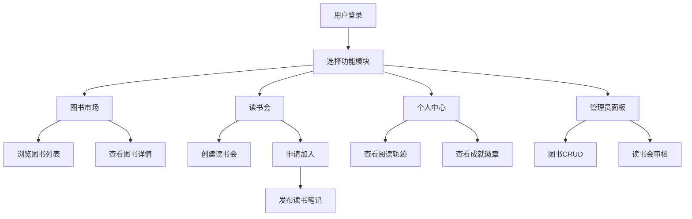

## 1. 产品概述

本产品是面向小型独立书店的库存管理与社区读书会平台，解决书店库存管理混乱和读者社群运营困难的问题。目标用户包括书店管理员（负责图书库存管理）和读者用户（参与读书会、记录阅读笔记）。产品旨在通过一体化的数字管理工具，提升书店运营效率，增强读者社区粘性。

## 2. 核心功能

### 2.1 用户角色

| 角色 | 注册方式 | 核心权限 |
|------|----------|----------|
| 管理员 | 后台账号登录 | 图书CRUD管理、读书会审核、用户管理 |
| 读者用户 | 注册登录 | 浏览图书、创建/加入读书会、发布笔记、查看个人中心 |

### 2.2 功能模块

1. **图书市场页**：图书列表展示、分类筛选、图书详情查看、库存状态显示
2. **读书会列表页**：读书会卡片展示、创建读书会、申请加入、读书会内部笔记
3. **个人中心页**：阅读轨迹、成就徽章、阅读进度展示
4. **管理员面板**：图书增删改查、模态框表单、借阅历史查看

### 2.3 页面详情

| 页面名称 | 模块名称 | 功能描述 |
|----------|----------|----------|
| 图书市场页 | 图书列表 | 分类展示图书卡片，支持点击查看详情，库存状态实时显示 |
| 图书市场页 | 新增图书模态框 | 管理员可通过圆角12px浅米色模态框新增图书，淡入放大动画 |
| 读书会列表页 | 读书会卡片 | 左侧圆形缩略图、右侧名称和状态，弹性弹出动画 |
| 读书会列表页 | 创建读书会 | 设置书名、起止时间、简介、最大人数，卡片弹性动画弹出 |
| 读书会详情页 | 读书笔记 | 按时间倒序排列，hover时背景变为浅橙色 |
| 个人中心页 | 阅读轨迹 | 按时间倒序展示最近读过的图书，带半透明进度条 |
| 个人中心页 | 成就徽章 | 40px圆形图标，hover时弹出浮动提示框 |
| 管理员面板 | 图书管理 | 添加/编辑/删除图书，查看借阅历史 |

## 3. 核心流程

### 3.1 图书管理流程
管理员登录后进入管理员面板，点击新增图书按钮，弹出浅米色圆角模态框，填写图书信息后提交，图书卡片以缩放动画插入到对应分类中。

### 3.2 读书会参与流程
读者登录后浏览读书会列表，点击创建读书会按钮，填写信息后读书会卡片以弹性动画弹出。读者可申请加入读书会，经管理员审核通过后，可在读书会内发布读书笔记。

### 3.3 阅读成就流程
读者在读书会内发布笔记记录阅读进度，系统自动计算阅读轨迹和成就，在个人主页展示阅读进度条和成就徽章。

## 4. 用户界面设计

### 4.1 设计风格
- **主色调**：驼色 #D4A373
- **辅助色**：暖白 #F5E6CC
- **警示色**：砖红 #C35B4A
- **按钮风格**：圆角设计，hover时有0.2秒缓动动画，点击时0.1秒缩放0.95
- **字体**：使用优雅的衬线体与无衬线体搭配，营造书店温暖氛围
- **布局风格**：卡片式布局，顶部固定导航栏
- **图标风格**：简约线性图标，与暖色调风格统一

### 4.2 页面设计概览

| 页面名称 | 模块名称 | UI元素 |
|----------|----------|--------|
| 图书市场页 | 导航栏 | 固定顶部60px，半透明毛玻璃效果，滚动时透明度变化 |
| 图书市场页 | 图书卡片 | 固定宽度220px，8px圆角，0.2秒阴影过渡，缩放插入动画 |
| 图书市场页 | 新增模态框 | 圆角12px浅米色，0.25秒淡入放大，60%透明度灰黑遮罩 |
| 读书会列表页 | 读书会卡片 | 左侧圆形缩略图，右侧名称状态，0.4秒弹性弹出动画 |
| 读书会详情页 | 笔记卡片 | 时间倒序排列，hover时浅橙色背景，0.2秒过渡 |
| 个人中心页 | 进度条 | 半透明，青绿到浅蓝渐变 |
| 个人中心页 | 成就徽章 | 40px圆形，hover浮动提示框，延迟0.1秒出现 |
| 全局 | 粒子装饰 | 底部5-8个半透明书形，缓慢旋转和上下浮动 |

### 4.3 响应式
采用桌面端优先设计，适配主流桌面分辨率，同时支持平板和移动端的基本浏览体验。

### 4.4 动效设计
- 模态框：0.25秒淡入放大
- 卡片插入：缩放动画
- 读书会卡片弹出：0.4秒弹性动画（0.8到1.0缩放）
- 按钮hover：0.2秒缓动
- 按钮点击：0.1秒缩放0.95
- 笔记卡片hover：0.2秒背景过渡
- 导航栏滚动：透明度平滑变化
- 底部粒子：缓慢旋转和上下浮动
