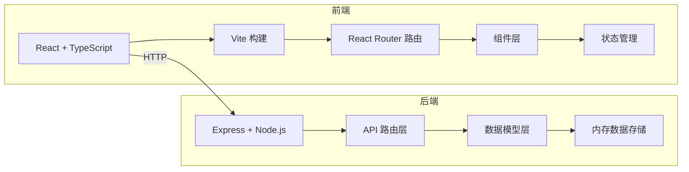
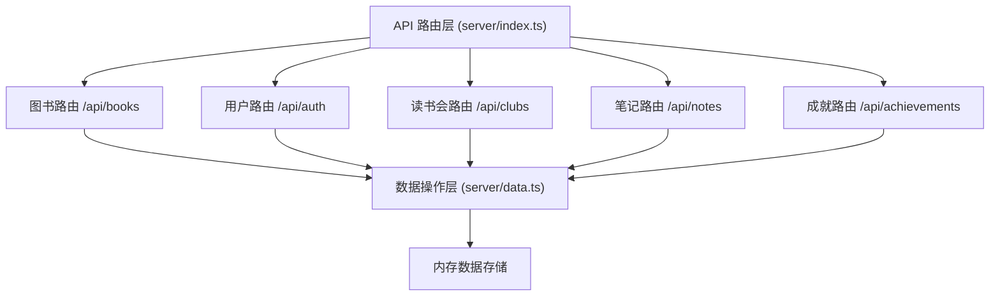
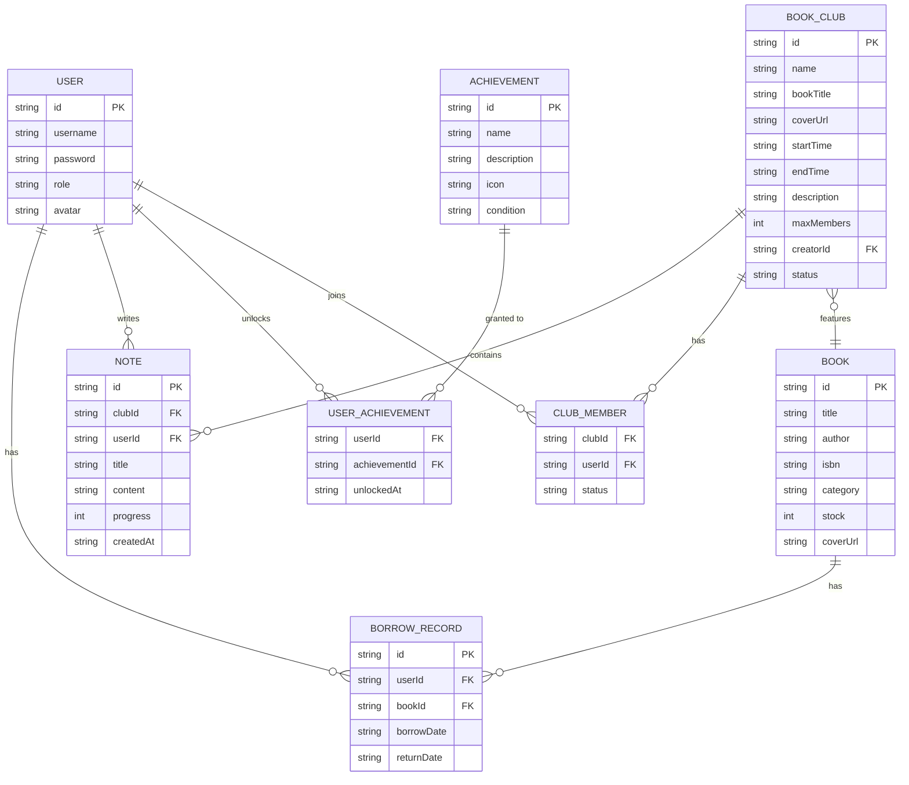

## 1. 架构设计



## 2. 技术描述

- **前端**：React@18.2.0 + TypeScript@5.3.3 + Vite@5.0.8 + @vitejs/plugin-react@4.2.0
- **构建工具**：Vite@5.0.8
- **路由**：React Router v6
- **后端**：Express@4.18.2 + Node.js
- **数据存储**：内存存储（server/data.ts）
- **样式方案**：CSS Modules + 全局CSS（src/styles/global.css）
- **启动端口**：前端Vite开发服务器，后端运行在3001端口

## 3. 路由定义

| 路由路径 | 页面/组件 | 功能说明 |
|----------|-----------|----------|
| /books | 图书市场页 | 展示所有图书，支持分类筛选和查看详情 |
| /books/:id | 图书详情页 | 显示图书详细信息、库存状态、借阅历史 |
| /clubs | 读书会列表页 | 展示所有读书会，支持创建和加入 |
| /clubs/:id | 读书会详情页 | 读书会信息、成员列表、读书笔记 |
| /profile | 个人中心页 | 阅读轨迹、成就徽章、阅读统计 |
| /admin | 管理员面板 | 图书CRUD、读书会审核 |
| /login | 登录页 | 用户登录 |
| /register | 注册页 | 用户注册 |

## 4. API 定义

### 4.1 图书相关

```typescript
// 图书数据模型
interface Book {
  id: string;
  title: string;
  author: string;
  isbn: string;
  category: string;
  stock: number;
  coverUrl: string;
  borrowHistory: BorrowRecord[];
}

interface BorrowRecord {
  id: string;
  userId: string;
  bookId: string;
  borrowDate: string;
  returnDate?: string;
}
```

| 方法 | 路径 | 功能 | 请求体 | 响应 |
|------|------|------|--------|------|
| GET | /api/books | 获取图书列表 | - | Book[] |
| GET | /api/books/:id | 获取图书详情 | - | Book |
| POST | /api/books | 新增图书 | Omit<Book, 'id' \| 'borrowHistory'> | Book |
| PUT | /api/books/:id | 更新图书 | Partial<Book> | Book |
| DELETE | /api/books/:id | 删除图书 | - | { success: boolean } |

### 4.2 用户相关

```typescript
interface User {
  id: string;
  username: string;
  password: string;
  role: 'admin' | 'reader';
  avatar?: string;
}
```

| 方法 | 路径 | 功能 | 请求体 | 响应 |
|------|------|------|--------|------|
| POST | /api/auth/login | 用户登录 | { username, password } | { user, token } |
| POST | /api/auth/register | 用户注册 | { username, password } | { user, token } |
| GET | /api/users/:id | 获取用户信息 | - | User |

### 4.3 读书会相关

```typescript
interface BookClub {
  id: string;
  name: string;
  bookTitle: string;
  coverUrl: string;
  startTime: string;
  endTime: string;
  description: string;
  maxMembers: number;
  creatorId: string;
  status: 'recruiting' | 'ongoing' | 'ended';
  members: string[];
  pendingMembers: string[];
}
```

| 方法 | 路径 | 功能 | 请求体 | 响应 |
|------|------|------|--------|------|
| GET | /api/clubs | 获取读书会列表 | - | BookClub[] |
| GET | /api/clubs/:id | 获取读书会详情 | - | BookClub |
| POST | /api/clubs | 创建读书会 | Omit<BookClub, 'id' \| 'members' \| 'pendingMembers' \| 'status'> | BookClub |
| POST | /api/clubs/:id/join | 申请加入 | { userId } | { success: boolean } |
| POST | /api/clubs/:id/approve | 审核通过 | { userId } | { success: boolean } |

### 4.4 笔记相关

```typescript
interface Note {
  id: string;
  clubId: string;
  userId: string;
  title: string;
  content: string;
  progress: number;
  createdAt: string;
}
```

| 方法 | 路径 | 功能 | 请求体 | 响应 |
|------|------|------|--------|------|
| GET | /api/clubs/:clubId/notes | 获取读书会笔记 | - | Note[] |
| POST | /api/clubs/:clubId/notes | 发布笔记 | { userId, title, content, progress } | Note |

### 4.5 成就相关

```typescript
interface Achievement {
  id: string;
  name: string;
  description: string;
  icon: string;
  condition: string;
}

interface UserAchievement {
  achievementId: string;
  unlockedAt: string;
}
```

| 方法 | 路径 | 功能 | 请求体 | 响应 |
|------|------|------|--------|------|
| GET | /api/users/:id/achievements | 获取用户成就 | - | UserAchievement[] |
| GET | /api/achievements | 获取所有成就规则 | - | Achievement[] |

## 5. 服务端架构图



## 6. 数据模型

### 6.1 数据模型ER图



### 6.2 初始化数据

- 图书列表：10-15本示例图书，涵盖文学、科技、历史、艺术等分类
- 用户列表：1个管理员账号，2-3个读者账号
- 读书会列表：3-5个示例读书会
- 笔记列表：若干示例读书笔记
- 成就规则：5-8个成就徽章定义

## 7. 项目文件结构

```
.
├── package.json
├── index.html
├── tsconfig.json
├── vite.config.js
├── server/
│   ├── index.ts          # 后端入口，API路由
│   └── data.ts           # 内存数据模型和CRUD函数
└── src/
    ├── main.tsx          # 前端入口
    ├── App.tsx           # 主应用组件，路由配置
    ├── components/
    │   ├── BookCard.tsx  # 图书卡片组件
    │   └── BookClubCard.tsx  # 读书会卡片组件
    ├── pages/            # 页面组件
    ├── styles/
    │   └── global.css    # 全局样式
    └── utils/            # 工具函数
```

## 8. 性能指标

- 图书列表初始化加载时间：≤ 0.8秒
- 页面切换响应时间：≤ 0.3秒
- 动画帧率：≥ 60fps
