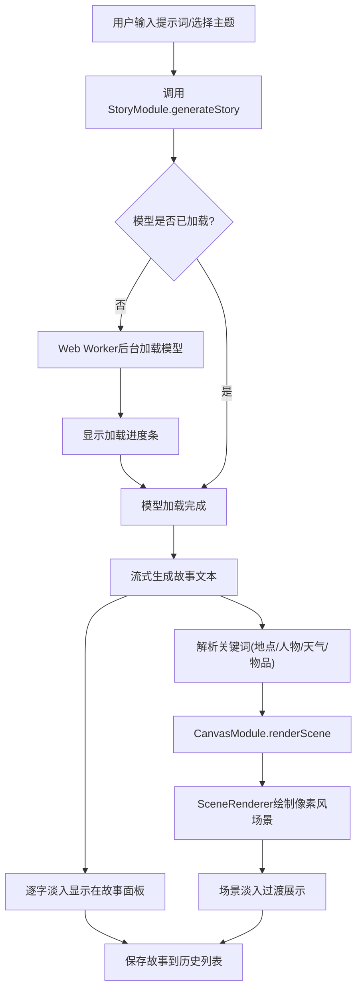

## 1. 产品概述

基于浏览器端Transformer模型的交互式故事生成与可视化应用。用户输入提示词或选择预设主题，应用调用Xenova Transformers模型实时生成故事文本，并通过Canvas绘制像素风格场景插画，营造沉浸式阅读体验。面向创意写作者、故事爱好者和像素艺术爱好者。

## 2. 核心功能

### 2.1 用户角色

| 角色 | 注册方式 | 核心权限 |
|------|----------|----------|
| 普通用户 | 无需注册 | 浏览、生成故事、查看历史 |

### 2.2 功能模块

1. **主页面**：故事生成面板、Canvas场景插画、主题选择器、输入控制区、粒子背景、历史侧边栏

### 2.3 页面详情

| 页面名称 | 模块名称 | 功能描述 |
|----------|----------|----------|
| 主页面 | 主题选择区 | 展示6个预设主题卡片（科幻、奇幻、冒险、校园、悬疑、古风），hover放大1.08倍+光晕描边，点击触发故事生成 |
| 主页面 | 故事面板 | 流式逐字显示生成的故事文本，每个字淡入0.05s，毛玻璃背景，圆角12px，可滚动，选中文字弹出浮动工具栏 |
| 主页面 | Canvas画布 | 800x400像素风场景插画，解析故事关键词绘制地形/建筑/天气，场景淡入淡出过渡0.5s，2px发光边框 |
| 主页面 | 输入控制区 | 圆角8px输入框+生成按钮，输入框边框渐变动画0.2s，生成按钮旋转环形进度，进度条蓝紫渐变 |
| 主页面 | 历史侧边栏 | 最近5条故事记录，显示标题和生成时间，点击可重新加载 |
| 主页面 | 粒子背景 | 150个浅蓝到淡紫粒子漂移，鼠标偏移效果，梦幻星空氛围 |
| 主页面 | 浮动工具栏 | 选中文字时弹出，圆角6px毛玻璃效果，包含复制和朗读按钮，TTS朗读高亮 |

## 3. 核心流程

用户打开应用 → 浏览预设主题或输入自定义提示词 → 点击主题卡片或生成按钮 → 模型后台加载（Web Worker）→ 进度条显示加载进度 → 故事逐字流式输出 → 自动解析关键词 → Canvas绘制像素风场景 → 场景淡入展示 → 故事保存到历史列表

## 4. 用户界面设计

### 4.1 设计风格

- 主色调：深色背景#0f0f23，主文字#e0e0ff，强调色#6c63ff
- 按钮风格：圆角8px，hover渐变效果，生成中显示旋转环形进度
- 字体：标题使用霓虹蓝紫渐变+0.5s呼吸动画，正文使用系统字体
- 布局：上中下三段式，中部左55%故事面板+右40%Canvas画布
- 图标：使用lucide-react图标库
- 装饰：粒子星空背景，毛玻璃效果面板

### 4.2 页面设计概览

| 页面名称 | 模块名称 | UI元素 |
|----------|----------|--------|
| 主页面 | 顶部标题区 | 霓虹蓝紫渐变标题文字，0.5s呼吸动画，6张主题卡片横向排列 |
| 主页面 | 中部故事面板 | 占宽55%，毛玻璃背景，圆角12px，可滚动，文字淡入动画 |
| 主页面 | 中部Canvas画布 | 占宽40%，宽高比2:1，2px发光边框，像素风场景 |
| 主页面 | 底部输入区 | 居中，输入框60%宽，圆角8px深灰背景白色文字，边框渐变0.2s，生成按钮旋转进度 |
| 主页面 | 右侧历史栏 | 最近5条，标题+时间，点击重载 |
| 主页面 | 全局粒子背景 | 150粒子，浅蓝到淡紫渐变，鼠标偏移，梦幻星空 |

### 4.3 响应式

- 桌面优先设计，移动端所有区域垂直排列
- Canvas画布移动端自适应宽度，保持2:1比例
- 输入框移动端占满宽度
- 主题卡片移动端横向滚动

### 4.4 动画规格

- 文字淡入：0.05s/字
- 场景过渡：淡出0.5s + 淡入0.5s
- 主题卡片hover：放大1.08倍 + 光晕，过渡0.2s
- 主题卡片切换：旧卡片左缩消失 + 新卡片右放大滑入，0.3s
- 输入框边框：暗蓝到亮蓝渐变，0.2s
- 生成按钮进度：旋转环形0.5s/圈
- 进度条：蓝紫渐变，线性增长
- 标题呼吸：0.5s周期
- 粒子漂移：0.3-1.5px/帧
