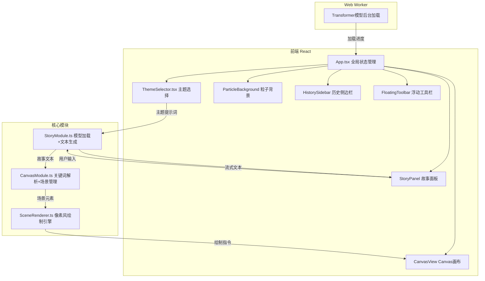
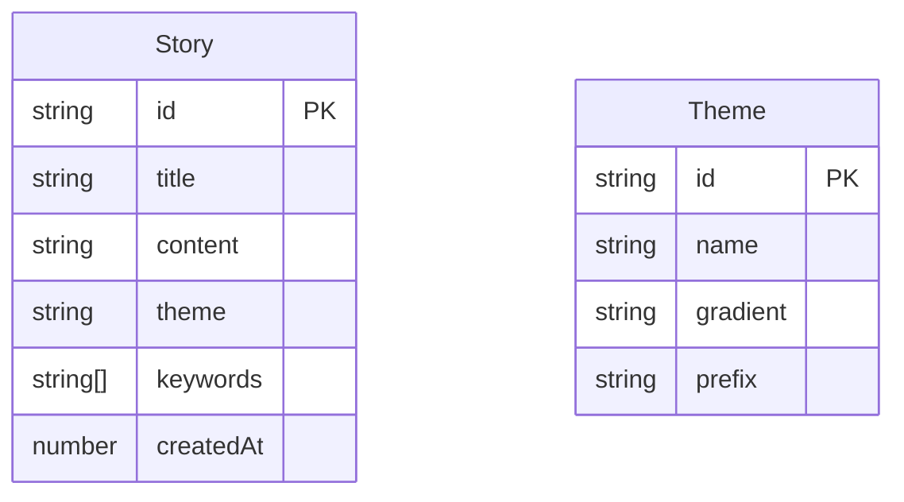

## 1. 架构设计

## 2. 技术说明

- 前端：React@18.2.0 + TypeScript@5.3.3 + Vite@5.0.8
- 初始化工具：vite-init（react-ts模板）
- 模型推理：@xenova/transformers@2.14.0（浏览器端Transformer模型）
- 后端：无（纯前端应用）
- 数据库：无（历史记录存储在localStorage）
- 状态管理：React useState/useRef（组件内状态）+ zustand（全局状态）

## 3. 路由定义

| 路由 | 用途 |
|------|------|
| / | 主页面，包含所有功能模块 |

## 4. 数据模型

### 4.1 数据模型定义

### 4.2 数据存储

- 故事历史：localStorage，键名`story_history`，最多保存5条
- 模型缓存：浏览器Cache API（Xenova Transformers自动管理）

## 5. 关键技术实现

### 5.1 故事生成（StoryModule.ts）

- 使用@xenova/transformers加载轻量级文本生成模型（如Xenova/gpt2或类似模型）
- Web Worker后台加载，通过postMessage传递加载进度
- generateStory方法：接收提示词字符串，返回AsyncGenerator实现流式输出
- 主题前缀拼接：将主题名作为提示词前缀（如"科幻：" + 用户输入）

### 5.2 场景绘制（CanvasModule.ts + SceneRenderer.ts）

- CanvasModule解析故事文本，提取关键词映射为场景元素
- 关键词映射表：地点→地形、人物→角色、天气→天气效果、物品→建筑
- SceneRenderer实现像素风绘制：
  - 地形：草地（绿色像素行）、河流（蓝色像素流）、山脉（三角形像素堆叠）
  - 建筑：小屋（方形+三角屋顶）、城堡（多层方形+旗帜）、塔楼（窄高方形+尖顶）
  - 天气：雨滴（蓝色短线段下坠）、雪花（白色圆点飘落）、阳光（黄色射线从角落射出）
- 场景过渡：通过Canvas globalAlpha实现淡出0.5s+淡入0.5s

### 5.3 粒子系统

- 150个粒子，每个粒子：x, y, vx, vy, size, color, opacity
- 颜色范围：#87CEEB到#DDA0DD线性插值
- 速度范围：0.3-1.5px/帧
- 鼠标偏移：计算鼠标位置与粒子方向向量，最大偏移20px，平滑过渡
- requestAnimationFrame驱动，目标FPS≥45

### 5.4 性能优化

- 模型加载：Web Worker避免阻塞主线程
- Canvas绘制：离屏Canvas缓存静态元素，仅重绘动态部分
- 粒子系统：使用对象池避免GC，批量绘制
- 流式输出：AsyncGenerator逐字yield，配合requestAnimationFrame调度渲染
- 所有动画统一使用requestAnimationFrame驱动
