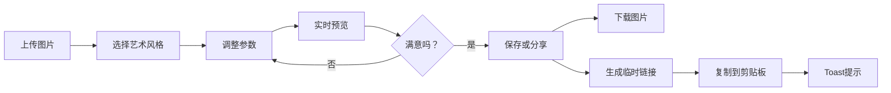

## 1. 产品概述

AI风格化图像转换应用是一款基于浏览器的创意工具，让用户可以轻松将普通照片转换为多种艺术风格。通过直观的界面和实时预览，用户可以上传图片、选择艺术风格、调整参数，并保存或分享创作结果。

- 主要用途：为普通用户提供简单易用的图片艺术化处理工具
- 解决的问题：无需专业图像处理软件即可实现创意风格转换
- 目标用户：摄影爱好者、设计师、社交媒体用户
- 市场价值：降低创意图像处理门槛，满足用户个性化表达需求

## 2. 核心功能

### 2.1 用户角色

| 角色 | 注册方式 | 核心权限 |
|------|----------|----------|
| 普通用户 | 无需注册，直接使用 | 图片上传、风格转换、参数调整、保存下载、生成分享链接 |

### 2.2 功能模块

1. **主页**：图片上传区域、风格选择面板、参数调节控制面板、实时预览区域、保存分享按钮组

### 2.3 页面详情

| 页面名称 | 模块名称 | 功能描述 |
|-----------|-------------|---------------------|
| 主页 | 图片上传模块 | 支持点击或拖拽上传图片，虚线框设计，拖入时有闪烁动画和背景渐变，上传后居中预览 |
| 主页 | 风格选择面板 | 横向滚动卡片组，5种艺术风格（水彩、油画、素描、像素风、印象派），选中时有金色边框和粒子效果 |
| 桌面端 | 参数调节面板 | 右侧浮动毛玻璃面板，包含强度、对比度、细节保留三个滑块，实时调整预览效果 |
| 移动端 | 参数调节面板 | 底部横向布局毛玻璃面板，参数滑块横向排列 |
| 主页 | 实时预览模块 | 上传后显示原图，调整参数后300ms内更新预览，带淡入过渡动画 |
| 主页 | 保存分享模块 | 保存按钮触发下载，分享按钮生成5分钟有效临时链接并复制到剪贴板，toast提示 |

## 3. 核心流程

用户上传图片 → 选择艺术风格 → 调整参数（强度/对比度/细节保留）→ 实时预览效果 → 保存图片或生成分享链接

## 4. 用户界面设计

### 4.1 设计风格

- **主色调**：深灰背景 #1E1E1E，浅蓝 #4A90D9，金色 #FFD700
- **按钮风格**：圆角8px，保存按钮蓝色渐变(#4A90D9到#357ABD)，分享按钮绿色渐变(#2ECC71到#27AE60)
- **卡片风格**：毛玻璃效果(blur(10px))，背景rgba(255,255,255,0.05)，圆角16px
- **字体**：白色 #FFFFFF，使用现代无衬线字体
- **布局风格**：居中布局，卡片式设计，桌面端右侧浮动控制面板
- **交互效果**：悬停上移2px+阴影加深，过渡动画0.2s ease

### 4.2 页面设计概述

| 页面名称 | 模块名称 | UI元素 |
|-----------|-------------|-------------|
| 主页 | 上传区域 | 圆角12px虚线框(2px白色虚线)，拖入时边框变实线闪烁两次，背景从#2D2D2D渐变到#4A90D9，最大宽度500px |
| 主页 | 风格卡片 | 80x80px圆角8px，背景为风格缩略图，底部白色小号字体名称，选中时金色边框放大1.1倍，金色粒子爆射 |
| 主页 | 控制面板 | 毛玻璃(blur(12px))圆角16px，滑块圆形16px浅蓝#4A90D9，实时显示数值 |
| 主页 | 进度指示器 | 圆形旋转动画，处理时显示 |
| 主页 | Toast提示 | 从底部滑入，圆角8px深色背景，持续2秒 |
| 主页 | 滚动条 | 自定义横向滚动条，宽4px，颜色#4A90D9 |

### 4.3 响应性

- 桌面优先设计，自适应移动端
- 宽度<768px时：控制面板从右侧浮动变为固定底部横向布局，风格卡片缩小为60x60px
- 触摸优化：按钮最小尺寸44x44px，手势支持

### 4.4 性能要求

- 图片上传预览响应时间 ≤ 200ms
- 风格转换处理时间（≤2MB图片） ≤ 2秒
- 滑动条调整预览更新延迟 ≤ 300ms（防抖处理）
- 首屏渲染时间 ≤ 1秒
