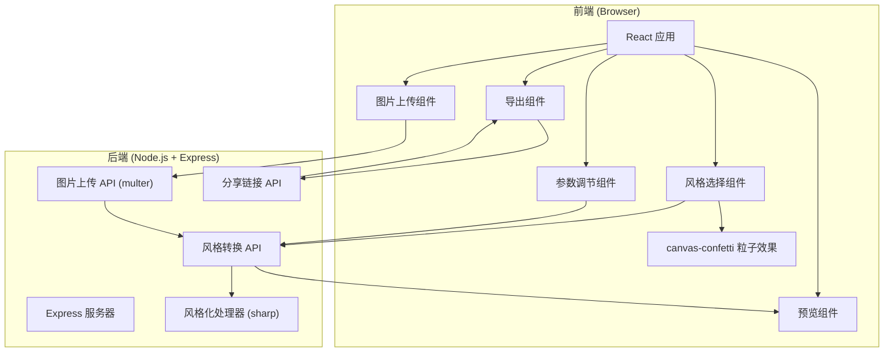
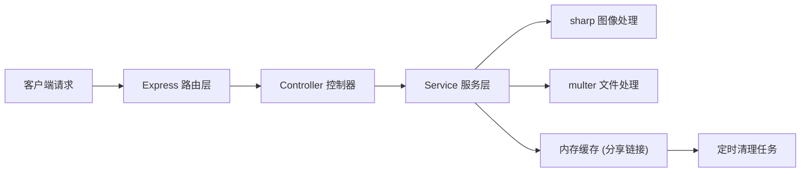

## 1. 架构设计



## 2. 技术描述

- **前端**：React@18.2.0 + TypeScript@5.3.3 + Vite@5.0.8
- **构建工具**：Vite@5.0.8 + @vitejs/plugin-react@4.2.0
- **后端**：Express@4.18.2 + Node.js
- **图像处理**：sharp@0.33.2
- **文件上传**：multer@1.4.5-lts.1
- **动画效果**：canvas-confetti@1.9.2
- **样式方案**：CSS Modules + 自定义CSS变量

## 3. 路由定义

| 路由 | 用途 |
|-------|---------|
| / | 主页，应用主界面 |
| /api/upload | 图片上传接口 |
| /api/style | 风格转换接口 |
| /api/share | 生成分享链接接口 |
| /api/share/:id | 访问分享图片接口 |

## 4. API 定义

### 4.1 类型定义

```typescript
// 风格类型
type StyleType = 'watercolor' | 'oil' | 'sketch' | 'pixel' | 'impressionism';

// 风格参数
interface StyleParams {
  style: StyleType;
  intensity: number;      // 0-100
  contrast: number;       // -50 to 50
  detailLevel: number;    // 50-150
}

// 上传响应
interface UploadResponse {
  success: boolean;
  imageId: string;
  originalUrl: string;
}

// 风格转换响应
interface StyleResponse {
  success: boolean;
  processedImage: string;  // base64
}

// 分享响应
interface ShareResponse {
  success: boolean;
  shareUrl: string;
  expiresAt: number;
}
```

### 4.2 接口详情

**POST /api/upload**
- 请求：multipart/form-data，包含image字段
- 响应：`{ success: boolean, imageId: string, originalUrl: string }`

**POST /api/style**
- 请求：`{ imageId: string, params: StyleParams }`
- 响应：`{ success: boolean, processedImage: string }` (base64图片)

**POST /api/share**
- 请求：`{ imageData: string }` (base64图片)
- 响应：`{ success: boolean, shareUrl: string, expiresAt: number }`

**GET /api/share/:id**
- 响应：返回图片文件，有效期5分钟

## 5. 服务器架构图



## 6. 项目文件结构

```
├── package.json
├── index.html
├── tsconfig.json
├── vite.config.js
├── server/
│   ├── index.ts           # Express 服务器入口
│   ├── controllers/
│   │   ├── uploadController.ts
│   │   ├── styleController.ts
│   │   └── shareController.ts
│   ├── services/
│   │   └── styleProcessor.ts  # 风格化处理服务
│   ├── middleware/
│   │   └── upload.ts      # multer 配置
│   ├── types/
│   │   └── index.ts       # 共享类型定义
│   └── utils/
│       └── cache.ts       # 分享链接缓存
└── src/
    ├── main.tsx
    ├── App.tsx
    ├── components/
    │   ├── ImageUploader.tsx
    │   ├── StyleSelector.tsx
    │   ├── ControlPanel.tsx
    │   ├── ImagePreview.tsx
    │   ├── ExportActions.tsx
    │   └── Toast.tsx
    ├── services/
    │   └── api.ts         # API 调用封装
    ├── hooks/
    │   ├── useDebounce.ts
    │   └── useToast.ts
    ├── types/
    │   └── index.ts
    ├── utils/
    │   └── confetti.ts    # 粒子效果封装
    └── styles/
        ├── variables.css
        └── global.css
```

## 7. 核心技术实现要点

### 7.1 风格化算法

- **水彩风格**：降低饱和度 + 高斯模糊 + 颜色扩散
- **油画风格**：增强对比度 + 中值模糊 + 纹理叠加
- **素描风格**：边缘检测(Sobel) + 灰度转换 + 纸纹效果
- **像素风**：降采样到低分辨率 + 最近邻放大
- **印象派**：短笔触模拟 + 色彩抖动

### 7.2 性能优化

- 参数调整使用300ms防抖
- 后端使用sharp进行高性能图像处理
- 分享链接使用内存缓存，5分钟后自动清理
- 前端图片预览使用base64，减少网络请求

### 7.3 动画实现

- 拖拽上传：CSS动画实现边框闪烁和背景渐变
- 风格选择：canvas-confetti实现金色粒子爆射
- 预览更新：CSS transition实现淡入效果
- Toast提示：transform动画实现底部滑入
