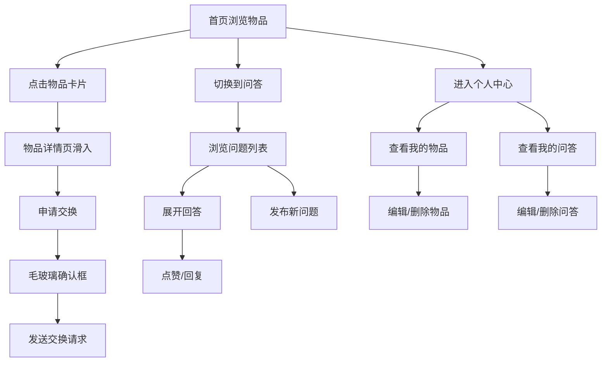

## 1. 产品概述

闲邻——小区邻居闲置物品交换与社区问答一体化平台，让邻里之间免费交换闲置物品，同时通过社区问答板块互相帮忙解决生活问题。

- 解决小区居民闲置物品堆积与邻里社交断裂的痛点
- 目标用户为城市社区居民，通过物品交换建立信任，通过问答加深联系

## 2. 核心功能

### 2.1 用户角色

| 角色 | 注册方式 | 核心权限 |
|------|----------|----------|
| 普通用户 | 默认用户（无需注册） | 浏览物品、发布物品、申请交换、提问、回答、管理个人内容 |

### 2.2 功能模块

1. **首页**：瀑布流物品展示、导航栏、搜索入口
2. **物品详情页**：物品图片、描述信息、申请交换按钮
3. **问答列表页**：问题列表、标签筛选
4. **提问页**：发布新问题
5. **个人中心**：头像信息、我的物品、我的问答管理

### 2.3 页面详情

| 页面名称 | 模块名称 | 功能描述 |
|----------|----------|----------|
| 首页 | 导航栏 | Logo、物品交换/社区问答/个人中心三个导航Tab |
| 首页 | 瀑布流物品区 | 固定220px宽度卡片、暖白背景、悬停上浮动画、无限滚动加载 |
| 物品详情页 | 图片展示区 | 物品大图展示 |
| 物品详情页 | 物品信息区 | 描述、新旧程度、发布者信息 |
| 物品详情页 | 申请交换 | 渐变橙黄按钮、悬停放大光晕、点击弹出毛玻璃确认框 |
| 问答列表页 | 问题列表 | 按最新时间排序、蓝色竖条标识、标签胶囊筛选 |
| 问答列表页 | 问答交互 | 嵌套折叠回答、点赞动画、回复淡入动画 |
| 提问页 | 问题发布 | 标题、内容、标签输入 |
| 个人中心 | 用户信息 | 圆形头像、用户名展示 |
| 个人中心 | Tab切换 | 我的物品/我的问答、下划线展开动画 |
| 个人中心 | 内容管理 | 编辑按钮（悬停填充）、删除按钮（卡片缩小旋转消失动画） |

## 3. 核心流程

用户进入首页浏览物品瀑布流 → 点击物品卡片 → 详情页从底部滑入 → 点击申请交换 → 毛玻璃确认框 → 发送交换请求；

用户进入问答列表 → 浏览问题 → 展开回答 → 点赞/回复 → 或发布新问题；

用户进入个人中心 → 切换Tab查看我的物品/问答 → 编辑或删除内容。

## 4. 用户界面设计

### 4.1 设计风格

- 主色：暖橙（#FF9F43）和柔蓝（#4A90D9），辅以浅米色背景（#FFF9F0）
- 按钮：圆角8px，渐变按钮用于主要操作，边框按钮用于次要操作
- 字体：系统默认无衬线体（-apple-system, BlinkMacSystemFont, "Segoe UI", sans-serif）
- 布局：卡片式布局，瀑布流网格展示物品
- 图标：使用 lucide-react 图标库，线性风格

### 4.2 页面设计概览

| 页面名称 | 模块名称 | UI元素 |
|----------|----------|--------|
| 首页 | 瀑布流区 | 固定220px宽卡片、暖白#FDF6EC背景、圆角12px、图片占60%高度、悬停上浮6px加深阴影0.25s过渡 |
| 物品详情页 | 交换按钮 | 渐变#FF9F43→#FF6B35、圆角8px、悬停1.05倍+径向光晕 |
| 物品详情页 | 确认框 | 圆角16px、毛玻璃8px模糊、半透明遮罩 |
| 问答列表页 | 问题卡片 | 宽100%、圆角8px、浅灰#F4F6F8背景、左侧3px蓝色竖条 |
| 问答列表页 | 标签胶囊 | 背景#E3F2FD、文字#1565C0、悬停深蓝背景白色文字 |
| 问答列表页 | 点赞动画 | 爱心图标缩放弹跳0.3s |
| 问答列表页 | 回复框 | 淡入动画0.2s |
| 个人中心 | 头像 | 圆形直径80px、边框2px实线#F97316 |
| 个人中心 | Tab下划线 | 从中间向两边展开0.2s |
| 个人中心 | 编辑按钮 | 圆角6px、透明背景、1px #F97316边框、悬停填充橙色 |
| 个人中心 | 删除按钮 | 圆角6px、#FF4444背景、悬停变暗10% |
| 个人中心 | 删除动画 | 卡片缩小旋转90°消失0.3s |

### 4.3 响应式设计

- 桌面端优先设计，瀑布流列数根据视口宽度自适应（4-6列）
- 页面切换统一从右滑入动画0.3s
- 所有交互响应时间控制在100ms以内
- 瀑布流滚动帧率不低于45fps
