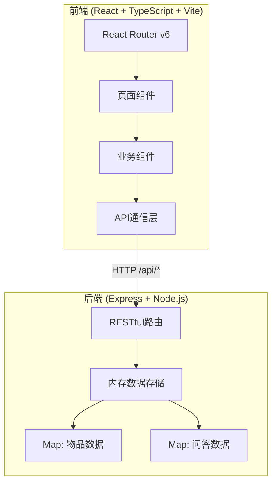
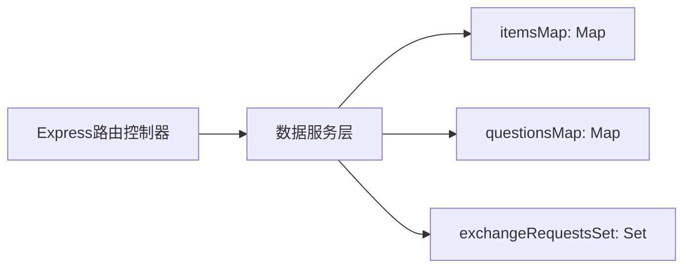
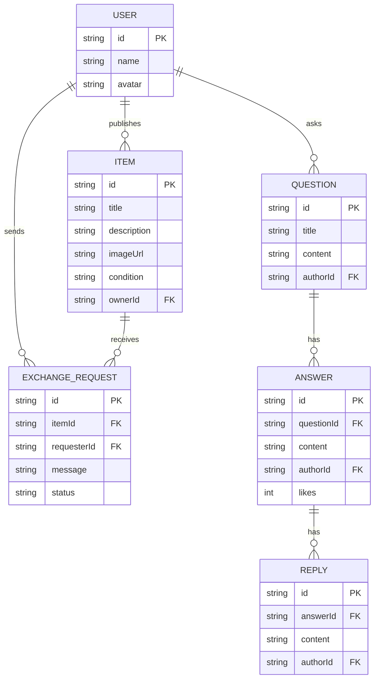

## 1. 架构设计



## 2. 技术说明

- 前端：React@18.2.0 + TypeScript@5.3.3 + Vite@5.0.8
- 初始化工具：vite-init（react-express-ts模板）
- 后端：Express@4.18.2 + TypeScript
- 数据库：内存存储（Map + Set 模拟关系型数据）
- 路由：React Router v6
- 图标：lucide-react

## 3. 路由定义

| 路由 | 用途 |
|------|------|
| / | 首页，瀑布流展示所有物品 |
| /item/:id | 物品详情页，从底部滑入 |
| /qa | 社区问答列表页 |
| /ask | 提问页 |
| /profile/:userId | 个人中心页 |

## 4. API定义

### 4.1 物品相关API

```typescript
interface Item {
  id: string;
  title: string;
  description: string;
  imageUrl: string;
  condition: "全新" | "几乎全新" | "轻微使用痕迹" | "明显使用痕迹";
  ownerId: string;
  ownerName: string;
  exchangeRequests: ExchangeRequest[];
  createdAt: string;
}

interface ExchangeRequest {
  id: string;
  requesterId: string;
  requesterName: string;
  message: string;
  status: "pending" | "accepted" | "rejected";
  createdAt: string;
}

GET    /api/items          → Item[]
GET    /api/items/:id      → Item
POST   /api/items          → Item（body: Omit<Item, "id" | "exchangeRequests" | "createdAt">）
DELETE /api/items/:id      → { success: boolean }
POST   /api/items/:id/exchange → ExchangeRequest（body: { requesterId, requesterName, message }）
```

### 4.2 问答相关API

```typescript
interface Question {
  id: string;
  title: string;
  content: string;
  tags: string[];
  authorId: string;
  authorName: string;
  answers: Answer[];
  createdAt: string;
}

interface Answer {
  id: string;
  content: string;
  authorId: string;
  authorName: string;
  likes: number;
  replies: Reply[];
  createdAt: string;
}

interface Reply {
  id: string;
  content: string;
  authorId: string;
  authorName: string;
  createdAt: string;
}

GET    /api/questions              → Question[]
POST   /api/questions              → Question（body: Omit<Question, "id" | "answers" | "createdAt">）
POST   /api/questions/:id/answers  → Answer（body: { content, authorId, authorName }）
POST   /api/answers/:id/like       → { likes: number }
POST   /api/answers/:id/reply      → Reply（body: { content, authorId, authorName }）
```

## 5. 服务端架构图



## 6. 数据模型

### 6.1 数据模型定义



### 6.2 数据初始化

内存中预置示例数据：
- 3个用户（邻居小明、邻居小红、邻居老王）
- 8-10个物品（含不同新旧程度标签）
- 5-6个问答（含回答和回复）
