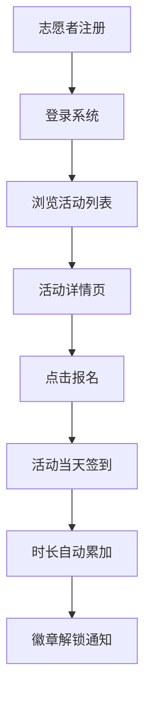

## 1. 产品概述
志愿者管理系统是为小型社区志愿者团队设计的活动管理平台，解决传统手工记录和微信群接龙导致的信息分散、统计困难问题。系统实现志愿者注册、活动发布、报名签到、时长统计全流程数字化管理。

## 2. 核心特性

### 2.1 用户角色
| 角色 | 注册方式 | 核心权限 |
|------|----------|----------|
| 志愿者 | 表单注册（昵称、邮箱、技能、服务时段） | 浏览活动、报名签到、查看个人时长、查看排行榜 |
| 管理员 | 后台登录 | 发布活动、管理活动、查看所有志愿者数据 |

### 2.2 功能模块
1. **首页/活动列表页**：导航栏、活动卡片列表、活动筛选
2. **个人主页**：头像展示、服务时长进度环、已报名活动、服务历史标签页
3. **活动详情页**：活动信息展示、报名按钮、签到按钮
4. **服务排行榜**：志愿者时长排名、奖杯图标展示
5. **活动发布页（管理员）**：活动发布表单

### 2.3 页面详情
| 页面名称 | 模块名称 | 功能描述 |
|---------|----------|----------|
| 首页 | 导航栏 | 固定顶部56px，毛玻璃效果，悬停下划线动画 |
| 首页 | 活动卡片 | 300px宽，圆角10px，左侧彩色状态条，悬停上浮效果 |
| 个人主页 | 头部区域 | 圆形头像（认证等级渐变色边框）、圆角进度环（6px厚度，时长填充动画） |
| 个人主页 | 标签页 | 已报名活动/服务历史切换，水平滑动动画 |
| 活动详情页 | 操作按钮 | 渐变色报名按钮（点击缩放动画）、绿色脉冲签到按钮 |
| 排行榜 | 排名列表 | 前三名金银铜奖杯，40px图标，放大淡入动画 |

## 3. 核心流程

### 志愿者报名流程
志愿者注册登录 → 浏览活动列表 → 进入活动详情 → 点击报名 → 活动当天签到 → 服务时长自动累加 → 时长达标触发徽章解锁

### 管理员活动发布流程
管理员登录 → 进入后台 → 填写活动表单 → 发布活动 → 活动展示在列表页 → 志愿者可报名

## 4. 用户界面设计

### 4.1 设计风格
- 主色调：橙黄 #F59E0B、米白 #FFF7ED
- 强调色：天蓝 #3B82F6
- 按钮风格：圆角8px，报名按钮渐变蓝 #4F46E5 → #7C3AED
- 字体：采用温暖友好的无衬线字体，标题加粗，正文清晰易读
- 布局风格：卡片式布局，多层次柔和阴影，统一圆角8px/10px
- 图标风格：线性简约图标，徽章使用徽章图标，排名使用奖杯图标

### 4.2 页面设计概览
| 页面名称 | 模块名称 | UI 元素 |
|---------|----------|---------|
| 首页 | 活动卡片 | 300px宽卡片，左上角色彩状态条（绿/黄/红），悬停上浮5px+阴影增强，过渡0.2秒 |
| 个人主页 | 进度环 | 圆角进度环，厚度6px，从底部填充，0.5秒动画 |
| 个人主页 | 头像 | 圆形，2px边框，认证等级从绿到紫渐变 |
| 活动详情 | 签到按钮 | 绿色脉冲动画，1秒循环 |
| 排行榜 | 奖杯图标 | 40px，0.5秒放大淡入动画 |
| 全站 | 徽章弹窗 | 从顶部滑入，0.3秒动画 |
| 全站 | 页面加载 | 内容从底部向上淡入，0.3秒，每项间隔0.05秒 |
| 表单 | 输入框 | 聚焦时天蓝边框+光晕扩散，0.25秒 |

### 4.3 响应式设计
- 桌面端（≥768px）：卡片多列排列，完整导航栏
- 移动端（<768px）：卡片单列排列，汉堡菜单，左侧滑出80%宽度毛玻璃菜单面板
- 触摸优化：按钮最小44px可点击区域，交互反馈即时

### 4.4 性能要求
- 页面首次加载渲染 < 800ms
- 交互响应延迟 ≤ 100ms
- 所有动画流畅60fps
