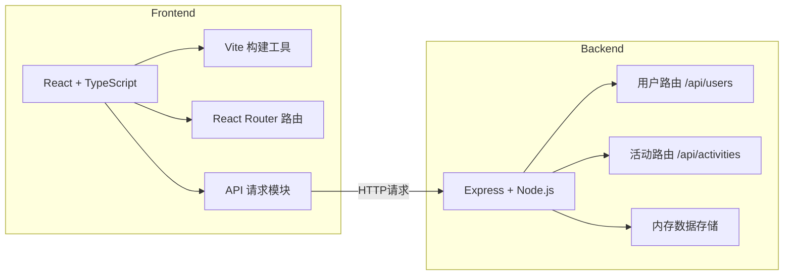
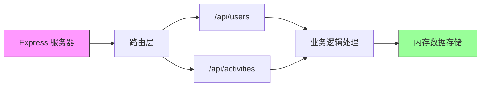
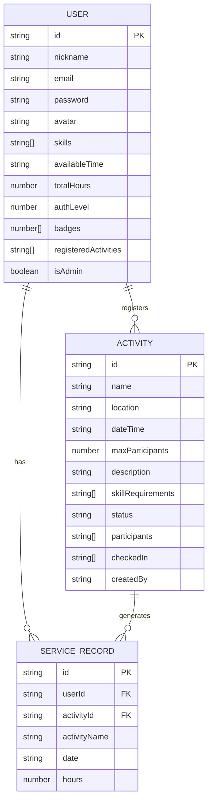

## 1. 架构设计



## 2. 技术说明
- 前端：React@18.2.0 + TypeScript@5.3.3 + Vite@5.0.8
- 路由：react-router-dom@6.20.0
- 后端：Express@4.18.2 + Node.js
- 类型定义：@types/react@18.2.42、@types/express@4.17.21
- 数据存储：内存存储（无需数据库）
- 构建工具：Vite + @vitejs/plugin-react@4.2.0

## 3. 路由定义

### 前端路由
| 路由 | 页面 | 用途 |
|------|------|------|
| / | HomePage | 首页，活动列表展示 |
| /profile | ProfilePage | 个人主页，展示时长和活动历史 |
| /activity/:id | ActivityDetailPage | 活动详情页，报名签到 |
| /ranking | RankingPage | 服务时长排行榜 |
| /register | RegisterPage | 志愿者注册 |
| /login | LoginPage | 登录页面 |
| /admin/activity | AdminActivityPage | 管理员发布活动 |

### 后端API路由
| 方法 | 路由 | 用途 |
|------|------|------|
| POST | /api/users/register | 志愿者注册 |
| POST | /api/users/login | 登录 |
| GET | /api/users/profile | 获取个人资料 |
| GET | /api/users/ranking | 获取服务时长排名 |
| POST | /api/activities | 发布活动（管理员） |
| GET | /api/activities | 获取活动列表 |
| GET | /api/activities/:id | 获取活动详情 |
| POST | /api/activities/:id/register | 报名活动 |
| POST | /api/activities/:id/checkin | 活动签到 |

## 4. API 定义

### 数据类型定义

```typescript
// 用户类型
interface User {
  id: string;
  nickname: string;
  email: string;
  password: string;
  avatar: string;
  skills: string[];
  availableTime: string;
  totalHours: number;
  authLevel: number; // 1-5, 决定头像边框颜色
  badges: number[]; // 已解锁徽章 [10, 50]
  registeredActivities: string[];
  serviceHistory: ServiceRecord[];
  isAdmin: boolean;
}

interface ServiceRecord {
  activityId: string;
  activityName: string;
  date: string;
  hours: number;
}

// 活动类型
interface Activity {
  id: string;
  name: string;
  location: string;
  dateTime: string;
  maxParticipants: number;
  description: string;
  skillRequirements: string[];
  status: 'recruiting' | 'upcoming' | 'ended';
  participants: string[];
  checkedIn: string[];
  createdBy: string;
}

// 徽章类型
interface Badge {
  hours: number;
  name: string;
  icon: string;
  color: string;
}
```

### 请求/响应示例

**POST /api/users/register**
请求体：
```json
{
  "nickname": "张三",
  "email": "zhangsan@example.com",
  "password": "123456",
  "skills": ["陪护", "搬运"],
  "availableTime": "周末"
}
```
响应：
```json
{
  "success": true,
  "data": { "id": "1", "nickname": "张三", "totalHours": 0, "authLevel": 1 }
}
```

**POST /api/activities/:id/register**
响应：
```json
{
  "success": true,
  "message": "报名成功"
}
```

## 5. 服务端架构图



## 6. 数据模型

### 6.1 数据模型定义



### 6.2 初始数据

内存存储初始化数据：

```typescript
// 初始用户数据
const initialUsers: User[] = [
  {
    id: '1',
    nickname: '管理员',
    email: 'admin@example.com',
    password: 'admin123',
    avatar: 'https://api.dicebear.com/7.x/avataaars/svg?seed=admin',
    skills: [],
    availableTime: '',
    totalHours: 120,
    authLevel: 5,
    badges: [10, 50, 100],
    registeredActivities: [],
    serviceHistory: [],
    isAdmin: true
  },
  {
    id: '2',
    nickname: '李志愿者',
    email: 'liziyuan@example.com',
    password: '123456',
    avatar: 'https://api.dicebear.com/7.x/avataaars/svg?seed=lizy',
    skills: ['陪护', '教学'],
    availableTime: '周末全天',
    totalHours: 65,
    authLevel: 3,
    badges: [10, 50],
    registeredActivities: ['1'],
    serviceHistory: [
      { activityId: '0', activityName: '敬老院慰问', date: '2026-06-01', hours: 3 }
    ],
    isAdmin: false
  }
];

// 初始活动数据
const initialActivities: Activity[] = [
  {
    id: '1',
    name: '社区图书馆整理',
    location: '阳光社区图书馆',
    dateTime: '2026-06-25 09:00',
    maxParticipants: 10,
    description: '整理社区图书馆书籍，分类上架，为居民创造良好阅读环境。',
    skillRequirements: ['细心', '分类能力'],
    status: 'recruiting',
    participants: ['2'],
    checkedIn: [],
    createdBy: '1'
  },
  {
    id: '2',
    name: '敬老院探望活动',
    location: '幸福敬老院',
    dateTime: '2026-06-22 14:00',
    maxParticipants: 8,
    description: '陪伴老人聊天，表演节目，送去温暖和关怀。',
    skillRequirements: ['沟通能力', '耐心'],
    status: 'upcoming',
    participants: [],
    checkedIn: [],
    createdBy: '1'
  }
];
```

## 7. 项目文件结构

```
e:\solo\SoloAutoDemo\tasks\auto47\
├── package.json
├── index.html
├── tsconfig.json
├── vite.config.js
└── src/
    ├── client/
    │   ├── App.tsx
    │   ├── api.ts
    │   └── pages/
    │       ├── HomePage.tsx
    │       ├── ProfilePage.tsx
    │       ├── ActivityDetailPage.tsx
    │       ├── RankingPage.tsx
    │       ├── RegisterPage.tsx
    │       ├── LoginPage.tsx
    │       └── AdminActivityPage.tsx
    └── server/
        ├── index.ts
        └── routes/
            ├── users.ts
            └── activities.ts
```
