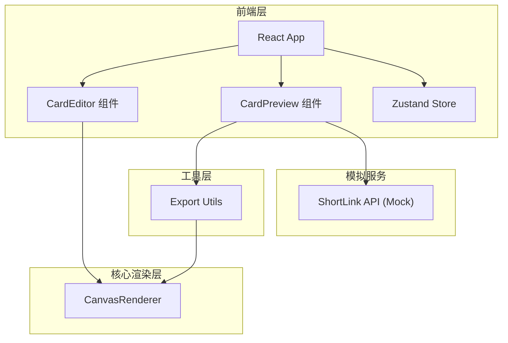
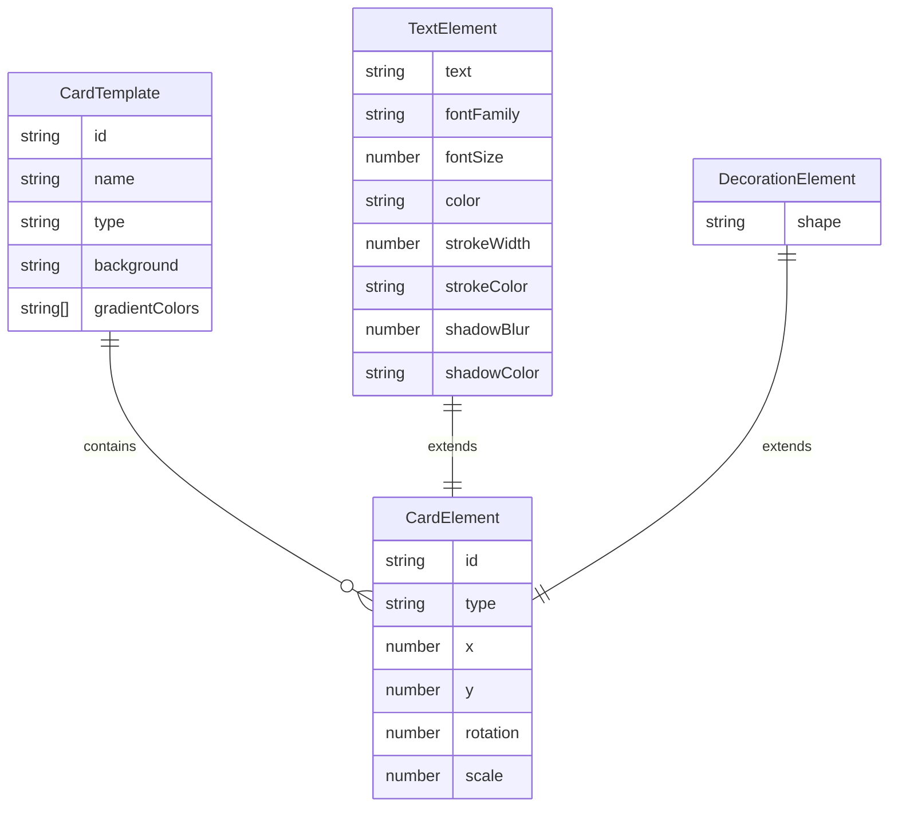

## 1. 架构设计



## 2. 技术说明
- 前端：React@18.2.0 + TypeScript@5.3.3 + Vite@5.0.8
- 初始化工具：vite-init（react-ts模板）
- 状态管理：Zustand
- 样式方案：Tailwind CSS
- 后端：无（纯前端应用）
- 数据库：无（模拟数据）

## 3. 路由定义
| 路由 | 用途 |
|------|------|
| / | 首页，模板选择 |
| /editor | 贺卡编辑器（画布+工具面板） |
| /preview | 贺卡动态预览与导出分享 |

## 4. API定义（模拟）
```typescript
interface ShortLinkResponse {
  shortUrl: string;
  originalData: string;
  expiresIn: number;
}

// 模拟短链接API
function generateShortLink(cardData: string): Promise<ShortLinkResponse>;
```

## 5. 数据模型

### 5.1 数据模型定义



### 5.2 核心类型定义
```typescript
type TemplateType = 'birthday' | 'holiday' | 'thankyou' | 'wedding' | 'encouragement';

interface CardTemplate {
  id: string;
  name: string;
  type: TemplateType;
  background: string;
  gradientColors: [string, string];
  defaultElements: CardElement[];
}

interface CardElement {
  id: string;
  type: 'text' | 'decoration';
  x: number;
  y: number;
  rotation: number;
  scale: number;
}

interface TextElement extends CardElement {
  type: 'text';
  text: string;
  fontFamily: string;
  fontSize: number;
  color: string;
  strokeWidth: number;
  strokeColor: string;
  shadowBlur: number;
  shadowColor: string;
}

interface DecorationElement extends CardElement {
  type: 'decoration';
  shape: 'flower' | 'star' | 'heart';
}

interface CardState {
  elements: (TextElement | DecorationElement)[];
  background: string;
  backgroundType: 'gradient' | 'image';
  selectedElementId: string | null;
}
```
