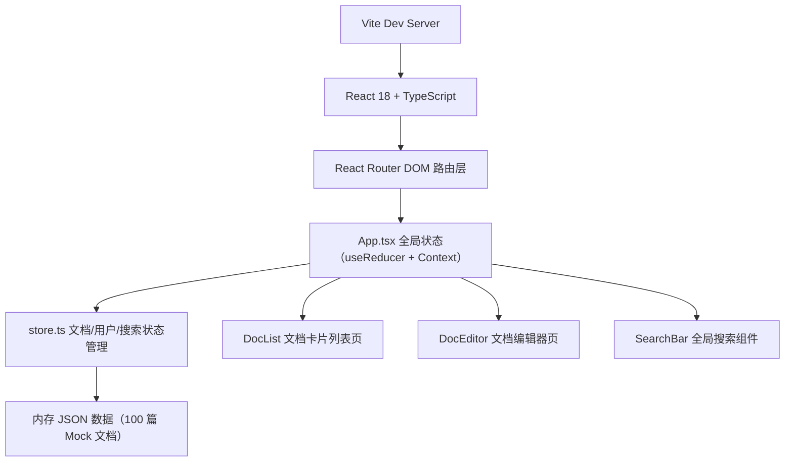
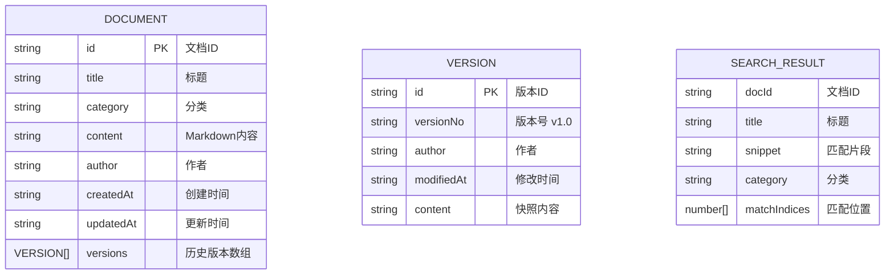

## 1. 架构设计



## 2. 技术描述
- 前端框架：React@18.2.0 + react-dom@18.2.0
- 语言：TypeScript@5.3.3（strict 模式，target ES2020）
- 构建工具：Vite@5.0.8 + @vitejs/plugin-react@4.2.0
- 路由：react-router-dom@6.21.0
- UUID 生成：uuid@9.0.0
- 样式方案：原生 CSS（全局 CSS 变量 + 模块化 class，不使用 Tailwind，保持用户要求的纯净实现）
- 状态管理：React useReducer + Context（按用户要求，不使用 zustand）
- 数据存储：内存中的 JSON Mock 数据

## 3. 路由定义
| 路由 | 用途 |
|-------|---------|
| / | 首页（文档卡片列表 + 文档树导航 + 搜索框） |
| /doc/:id | 文档详情/编辑页（Markdown 渲染 + 浮动操作面板 + 版本对比） |

## 4. 数据模型

### 4.1 数据模型定义


### 4.2 分类预设色
```
#EF4444（红） #F59E0B（琥珀） #10B981（翡翠绿） #3B82F6（蓝） #8B5CF6（紫）
```

## 5. 目录结构
```
auto50/
├── package.json
├── tsconfig.json
├── vite.config.js
├── index.html
└── src/
    ├── main.tsx        # ReactDOM.render 入口
    ├── App.tsx         # Router + Context Provider + 全局布局
    ├── data/
    │   └── store.ts    # useReducer 状态管理 + Mock 数据 + CRUD
    └── components/
        ├── DocList.tsx     # 文档卡片列表 + 文档树
        ├── DocEditor.tsx   # Markdown 编辑器 + 浮动面板 + 对比视图
        └── SearchBar.tsx   # 顶部搜索框 + 下拉结果面板
```

## 6. 关键实现要点

### 6.1 Markdown 渲染
- 手写轻量 Markdown 解析（支持标题、粗体、斜体、列表、链接、代码块）
- 代码块：深色 `#1E293B` 背景 + 每行行号 + 语法高亮占位
- 安全：文本转义后再注入 DOM，防 XSS

### 6.2 搜索算法
- 预处理：将文档标题+内容+分类转为小写索引
- 触发：useRef + setTimeout 实现 200ms debounce
- 匹配：遍历 100 篇文档，使用多关键字 split + includes 匹配，截取前后 40 字符片段
- 高亮：将匹配关键字用 `<mark style="background:#FCD34D">` 包裹

### 6.3 动画实现
- 路由过渡：React Router + `key` + CSS `@keyframes slideInLeft`（0.3s）
- 卡片悬停：`transform: translateY(-4px)` + `box-shadow` 过渡（0.2s）
- 历史面板滑入：`transform: translateY(100%) → translateY(0)`（0.3s ease-out）
- 搜索面板关闭：`max-height` + `opacity` 过渡（0.25s）
- 保存按钮：CSS `@keyframes spin` 1.5s 后切换勾号 SVG

### 6.4 浮动面板拖动
- 监听 `mousedown/touchstart` 在面板顶部手柄
- `mousemove/touchmove` 中更新 `left/top`（限制在视口内）
- `mouseup/touchend` 解除监听

### 6.5 版本对比
- 逐行 diff：按 `\n` 拆分两个版本为数组
- 行级对比：相同行→白色，不同行→`#FEF3C7` 浅黄背景
- 行内 diff：对非相同行按字符 diff，删除用红色删除线，新增用绿色下划线
