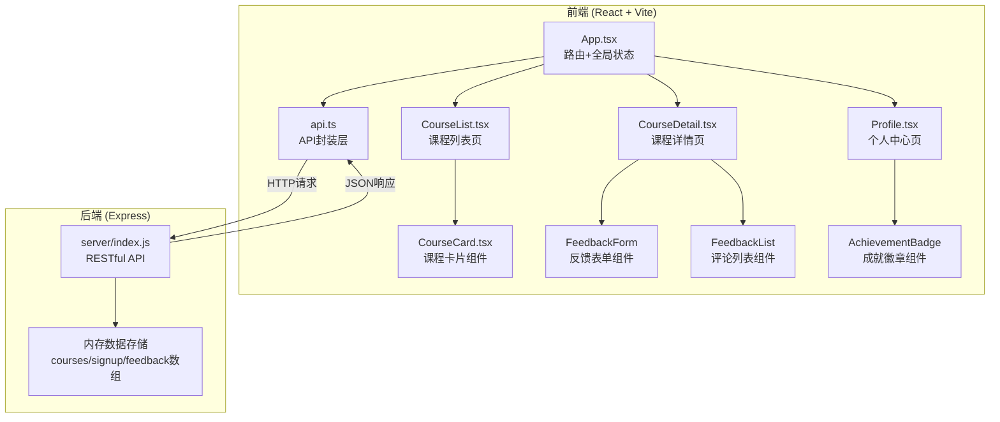
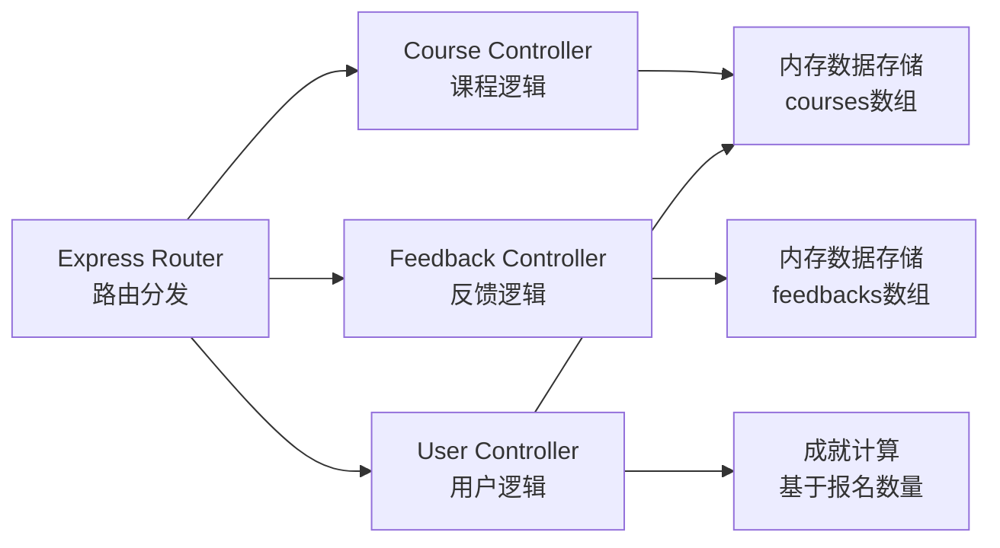
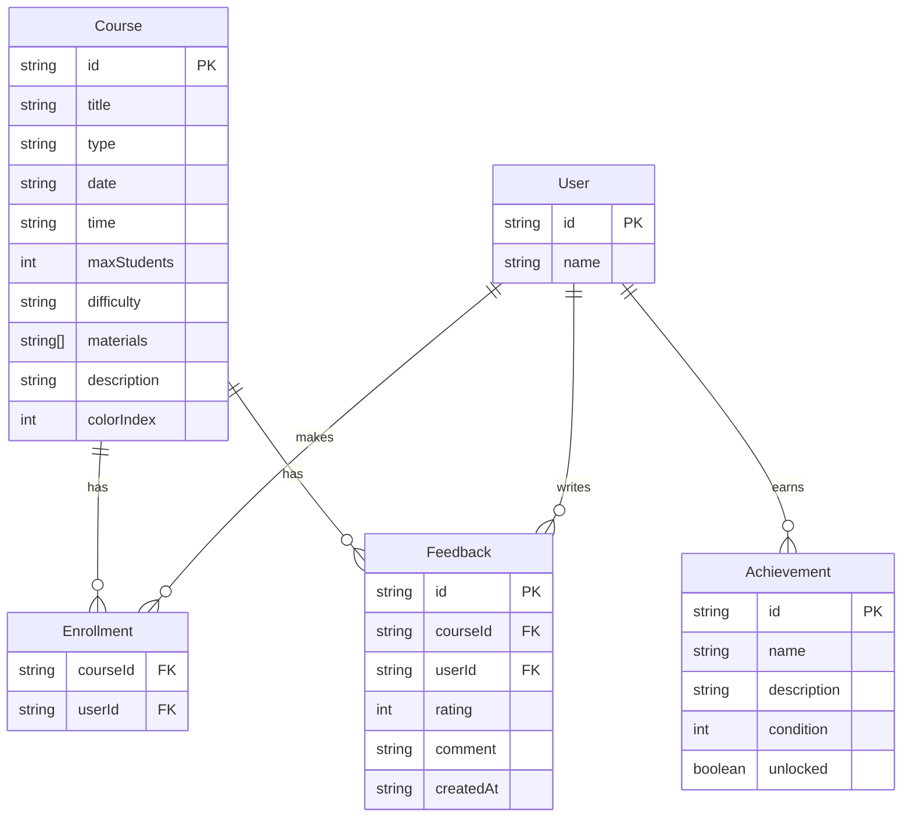

## 1. 架构设计



## 2. 技术说明

- **前端**：React@18.2.0 + TypeScript@5.3.3 + Vite@5.0.8 + TailwindCSS + Zustand
- **构建工具**：Vite@5.0.8 + @vitejs/plugin-react@4.2.0
- **后端**：Express@4.18.2 + Node.js
- **数据库**：内存数组存储（无需外部数据库）
- **路由**：react-router-dom（客户端路由）
- **图标**：lucide-react

## 3. 路由定义

| 路由 | 用途 |
|------|------|
| `/` | 课程列表页，展示所有课程卡片 |
| `/course/:id` | 课程详情页，展示课程信息、报名操作和反馈区 |
| `/profile` | 个人中心页，展示已报名课程历史和成就徽章 |

## 4. API 定义

### 4.1 课程相关

| 方法 | 路径 | 描述 | 请求体 | 响应 |
|------|------|------|--------|------|
| GET | `/api/courses` | 获取所有课程列表 | - | `Course[]` |
| GET | `/api/courses/:id` | 获取单个课程详情 | - | `Course` |

### 4.2 报名相关

| 方法 | 路径 | 描述 | 请求体 | 响应 |
|------|------|------|--------|------|
| POST | `/api/courses/:id/signup` | 报名课程 | `{ userId: string }` | `{ success: boolean }` |
| DELETE | `/api/courses/:id/signup` | 取消报名 | `{ userId: string }` | `{ success: boolean }` |

### 4.3 反馈相关

| 方法 | 路径 | 描述 | 请求体 | 响应 |
|------|------|------|--------|------|
| POST | `/api/courses/:id/feedback` | 提交反馈 | `{ userId: string, rating: number, comment: string }` | `{ success: boolean }` |
| GET | `/api/courses/:id/feedback` | 获取课程反馈 | - | `Feedback[]` |

### 4.4 用户相关

| 方法 | 路径 | 描述 | 请求体 | 响应 |
|------|------|------|--------|------|
| GET | `/api/user/:id/courses` | 获取用户已报名课程 | - | `Course[]` |
| GET | `/api/user/:id/achievements` | 获取用户成就 | - | `Achievement[]` |

### 4.5 TypeScript 类型定义

```typescript
interface Course {
  id: string;
  title: string;
  type: string;
  date: string;
  time: string;
  maxStudents: number;
  enrolledStudents: string[];
  difficulty: "beginner" | "intermediate" | "advanced";
  materials: string[];
  description: string;
  colorIndex: number;
}

interface Feedback {
  id: string;
  courseId: string;
  userId: string;
  rating: number;
  comment: string;
  createdAt: string;
}

interface Achievement {
  id: string;
  name: string;
  description: string;
  icon: string;
  unlocked: boolean;
  condition: number;
}
```

## 5. 服务端架构



## 6. 数据模型

### 6.1 数据模型定义



### 6.2 初始数据

后端启动时将在内存中预设6门不同类型的手工艺课程（陶艺、编织、扎染、木工、皮具、花艺），每门课程包含完整的标题、类型、日期时间、人数上限、难度和材料清单数据。
