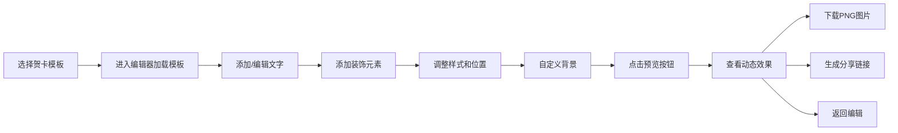

## 1. 产品概述

基于Canvas的电子贺卡设计与分享应用，让用户可以选择模板、自定义文字和装饰元素，生成可分享的动态贺卡。目标是为用户提供简单易用、视觉精美的贺卡创作工具，满足生日、节日、感谢等多种场景的情感表达需求。

- **主要用途**：在线设计和生成个性化电子贺卡
- **目标用户**：需要快速制作精美贺卡的普通用户
- **市场价值**：提供比传统纸质贺卡更环保、更具互动性的祝福方式

## 2. 核心功能

### 2.1 用户角色

| 角色 | 注册方式 | 核心权限 |
|------|----------|----------|
| 普通用户 | 无需注册 | 浏览模板、编辑贺卡、导出图片、生成分享链接 |

### 2.2 功能模块

1. **模板选择页面**：展示5种预设贺卡模板供用户选择
2. **贺卡编辑器**：Canvas画布编辑、文字添加、装饰元素添加、背景自定义
3. **贺卡预览页**：动态效果展示、下载PNG、生成分享链接

### 2.3 页面详情

| 页面名称 | 模块名称 | 功能描述 |
|----------|----------|----------|
| 模板选择页 | 模板展示区 | 展示5种200px圆形模板卡片，悬停缩放1.1倍并添加阴影，点击进入编辑器 |
| 贺卡编辑器 | 左侧工具面板 | 半透明毛玻璃效果，包含文字输入、装饰物选择、背景设置、样式调整 |
| 贺卡编辑器 | 中央画布区 | 800x600 Canvas画布，支持元素拖拽、缩放、旋转、删除 |
| 贺卡编辑器 | 顶部操作栏 | 撤销、重做、预览按钮 |
| 贺卡预览页 | 动态预览区 | 全屏动态效果（粒子飘落、文字淡入、弹性动画） |
| 贺卡预览页 | 操作按钮区 | 下载PNG图片、生成短链接、返回编辑 |

## 3. 核心流程

用户选择模板 → 进入编辑器加载模板 → 添加/编辑文字内容 → 添加装饰元素 → 调整样式（字体、颜色、大小、旋转）→ 自定义背景 → 点击预览 → 查看动态效果 → 下载图片或生成分享链接

## 4. 用户界面设计

### 4.1 设计风格

- **主色调**：柔和粉蓝渐变（#A8D8EA到#AA96DA）
- **毛玻璃效果**：半透明面板，背景模糊8px，圆角12px
- **按钮样式**：圆角8px，渐变背景（#A8D8EA到#AA96DA），悬停时颜色加深并上移2px（过渡0.2秒）
- **字体**：标题使用优雅的衬线字体，正文使用清晰易读的无衬线字体
- **图标风格**：柔和圆润的线性图标，配合主题色调

### 4.2 页面设计概述

| 页面名称 | 模块名称 | UI元素 |
|----------|----------|--------|
| 模板选择页 | 模板展示区 | 200px圆形卡片，边框2px实线，悬停缩放1.1倍+阴影（过渡0.2秒），网格布局 |
| 贺卡编辑器 | 左侧工具面板 | 半透明毛玻璃，圆角12px，分类Tab（文字、装饰、背景、样式），表单控件 |
| 贺卡编辑器 | 中央画布区 | 800x600 Canvas，浅米色默认背景，选中元素虚线边框+缩放控制点 |
| 贺卡预览页 | 动态预览区 | 全屏展示，粒子飘落背景动画，文字淡入，装饰物弹性放大 |

### 4.3 响应式设计

- **桌面端（768px以上）**：左侧工具面板 + 右侧画布区域的双栏布局
- **平板/移动端（768px以下）**：工具面板折叠为顶部菜单，画布自适应宽度
- **触摸优化**：拖拽区域适当放大，按钮最小尺寸44x44px

### 4.4 动效设计

- **所有交互反馈**：0.15-0.3秒过渡动画
- **模板卡片**：悬停缩放1.1倍 + 阴影扩散（0.2秒）
- **按钮**：悬停上移2px + 颜色加深（0.2秒）
- **画布元素**：拖拽时光标变为移动形状，选中时虚线边框动画
- **预览页面**：粒子飘落持续动画，文字淡入（0.8秒），装饰物弹性放大（0.6秒）
