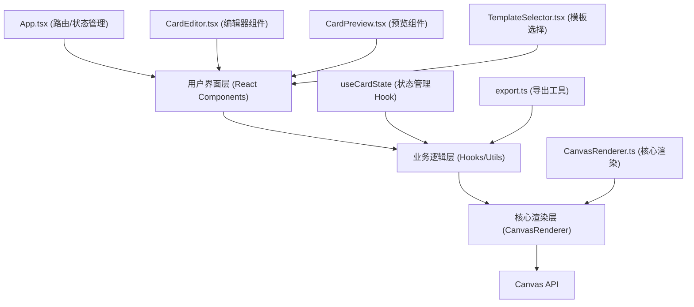

## 1. 架构设计



## 2. 技术描述

- **前端框架**：React@18.2.0 + ReactDOM@18.2.0
- **语言**：TypeScript@5.3.3（严格模式，target ES2020）
- **构建工具**：Vite@5.0.8 + @vitejs/plugin-react@4.2.0
- **样式方案**：原生CSS + CSS变量（毛玻璃效果、渐变、动画）
- **渲染核心**：HTML5 Canvas 2D API
- **状态管理**：React Hooks (useState, useReducer, useRef)
- **无后端依赖**：短链接生成通过模拟API实现

## 3. 目录结构

```
e:\solo\SoloAutoDemo\tasks\auto56\
├── package.json
├── index.html
├── tsconfig.json
├── vite.config.js
└── src\
    ├── main.tsx          # React入口，挂载根组件
    ├── App.tsx           # 主应用组件，路由和状态管理
    ├── components\
    │   ├── CardEditor.tsx      # 贺卡编辑模块
    │   ├── CardPreview.tsx     # 贺卡预览模块
    │   └── TemplateSelector.tsx # 模板选择组件
    ├── core\
    │   └── CanvasRenderer.ts   # 核心Canvas渲染模块
    └── utils\
        └── export.ts           # 导出模块
```

## 4. 路由定义

| 路由 | 页面/组件 | 用途 |
|------|----------|------|
| / | TemplateSelector | 模板选择首页 |
| /editor/:templateId | CardEditor | 贺卡编辑器 |
| /preview | CardPreview | 贺卡动态预览与分享 |

## 5. 数据模型

### 5.1 核心类型定义

```typescript
// 模板类型
interface CardTemplate {
  id: string;
  name: string;
  category: 'birthday' | 'festival' | 'thanks' | 'wedding' | 'encouragement';
  background: BackgroundConfig;
  defaultTexts: TextElement[];
  defaultDecorations: DecorationElement[];
  previewColor: string;
}

// 背景配置
interface BackgroundConfig {
  type: 'solid' | 'gradient' | 'image';
  color?: string;
  gradient?: {
    type: 'linear' | 'radial';
    colors: string[];
    angle?: number;
  };
  imageUrl?: string;
}

// 文字元素
interface TextElement {
  id: string;
  type: 'text';
  content: string;
  x: number;
  y: number;
  fontSize: number;
  fontFamily: string;
  color: string;
  strokeWidth: number;
  strokeColor: string;
  shadowBlur: number;
  shadowColor: string;
  rotation: number;
}

// 装饰元素
interface DecorationElement {
  id: string;
  type: 'decoration';
  shape: 'flower' | 'star' | 'heart' | 'balloon' | 'confetti';
  x: number;
  y: number;
  scale: number;
  rotation: number;
  color: string;
}

// 贺卡状态
interface CardState {
  background: BackgroundConfig;
  elements: (TextElement | DecorationElement)[];
  selectedElementId: string | null;
}
```

### 5.2 预设模板数据

```typescript
const TEMPLATES: CardTemplate[] = [
  {
    id: 'birthday',
    name: '生日祝福',
    category: 'birthday',
    background: { type: 'gradient', gradient: { type: 'linear', colors: ['#FFE5E5', '#FFB6C1'], angle: 135 } },
    previewColor: '#FFB6C1',
    defaultTexts: [...],
    defaultDecorations: [...]
  },
  // ... 其他4种模板
];
```

### 5.3 预设渐变背景

```typescript
const GRADIENT_BACKGROUNDS = [
  { id: 'sunrise', name: '日出橙粉', colors: ['#FF9A9E', '#FECFEF'], angle: 135 },
  { id: 'ocean', name: '海洋蓝绿', colors: ['#A8D8EA', '#88D8B0'], angle: 135 },
  { id: 'forest', name: '森林翠绿', colors: ['#56AB2F', '#A8E063'], angle: 135 },
  { id: 'starry', name: '星空深蓝', colors: ['#0F0C29', '#302B63', '#24243E'], angle: 135 },
  { id: 'sunset', name: '日落紫红', colors: ['#FC466B', '#3F5EFB'], angle: 135 },
];
```

## 6. 核心模块设计

### 6.1 CanvasRenderer.ts 核心渲染模块

**主要职责**：
- 管理Canvas上下文和渲染循环
- 提供绘制API（背景、文字、装饰元素）
- 处理元素选中、拖拽、缩放交互
- 保持30fps以上渲染帧率

**核心方法**：
```typescript
class CanvasRenderer {
  constructor(canvas: HTMLCanvasElement);
  setBackground(config: BackgroundConfig): void;
  addTextElement(element: TextElement): void;
  addDecorationElement(element: DecorationElement): void;
  updateElement(id: string, updates: Partial<TextElement | DecorationElement>): void;
  deleteElement(id: string): void;
  selectElementAtPosition(x: number, y: number): string | null;
  startDrag(x: number, y: number): void;
  updateDrag(x: number, y: number): void;
  endDrag(): void;
  render(): void;
  getCanvasDataURL(): string;
}
```

### 6.2 CardEditor.tsx 编辑器组件

**主要职责**：
- 左侧工具面板UI（文字、装饰、背景、样式Tab）
- 中央Canvas画布区域
- 元素属性编辑表单
- 与CanvasRenderer交互

### 6.3 export.ts 导出模块

**主要职责**：
- `exportAsPNG(canvas: HTMLCanvasElement): Promise<string>` - 导出PNG图片
- `generateShareLink(): Promise<string>` - 模拟生成短链接

## 7. 性能优化策略

1. **Canvas渲染优化**：
   - 使用requestAnimationFrame实现渲染循环
   - 脏矩形渲染：仅重绘变化区域
   - 离屏Canvas预渲染复杂装饰元素

2. **拖拽性能优化**：
   - 使用useRef存储拖拽状态，避免重渲染
   - 指针事件（Pointer Events）统一处理鼠标/触摸
   - 防抖处理高频事件

3. **React渲染优化**：
   - 使用React.memo包装纯展示组件
   - 使用useCallback缓存事件处理函数
   - 合理拆分状态，避免不必要的重渲染

## 8. 动画实现

### 8.1 预览页面动态效果

1. **粒子飘落动画**：
   - Canvas绘制50-100个粒子
   - 粒子随机大小、速度、透明度
   - 循环下落，超出画布后重置

2. **文字淡入动画**：
   - CSS opacity从0到1（0.8秒 ease-out）
   - transform: translateY(20px) 到 translateY(0)

3. **装饰物弹性放大**：
   - CSS transform: scale(0) 到 scale(1)
   - 使用cubic-bezier(0.68, -0.55, 0.265, 1.55)实现弹性效果
