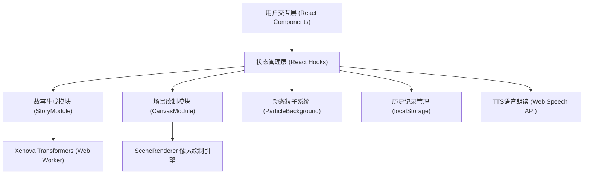

## 1. 架构设计



## 2. 技术说明

- **前端框架**: React@18.2.0 + TypeScript@5.3.3
- **构建工具**: Vite@5.0.8 + @vitejs/plugin-react@4.2.0
- **AI模型**: @xenova/transformers@2.14.0 (浏览器端Transformer模型)
- **状态管理**: React useState/useRef/useEffect (轻量场景无需额外库)
- **Canvas渲染**: 原生Canvas 2D API + requestAnimationFrame
- **粒子系统**: 独立Canvas层 + requestAnimationFrame驱动
- **数据持久化**: localStorage存储最近5条历史记录
- **语音合成**: 浏览器原生Web Speech API (SpeechSynthesis)

## 3. 目录结构定义

| 路径 | 用途 |
|------|------|
| `package.json` | 项目依赖配置 |
| `index.html` | 入口HTML页面(深色渐变背景) |
| `tsconfig.json` | TypeScript严格模式配置(target ES2020) |
| `vite.config.js` | Vite构建配置 |
| `src/main.tsx` | React入口，渲染App组件 |
| `src/App.tsx` | 主组件，全局状态与数据流协调 |
| `src/story/StoryModule.ts` | 模型加载与文本生成封装 |
| `src/story/ThemeSelector.tsx` | 预设主题卡片选择组件 |
| `src/canvas/CanvasModule.ts` | 关键词解析与场景协调 |
| `src/canvas/SceneRenderer.ts` | 像素风元素绘制引擎 |

## 4. 核心类型定义

```typescript
// 主题类型
interface Theme {
  id: string;
  name: string;
  gradient: string;
  icon: string;
  prefix: string;
}

// 故事记录类型
interface StoryRecord {
  id: string;
  title: string;
  content: string;
  theme: string;
  timestamp: number;
}

// 场景元素类型
type TerrainType = 'grass' | 'river' | 'mountain';
type BuildingType = 'cottage' | 'castle' | 'tower';
type WeatherType = 'rain' | 'snow' | 'sunny' | 'cloudy';

interface SceneData {
  terrain: TerrainType[];
  buildings: BuildingType[];
  weather: WeatherType;
  keywords: string[];
}

// 粒子类型
interface Particle {
  x: number;
  y: number;
  vx: number;
  vy: number;
  size: number;
  color: string;
  baseX: number;
  baseY: number;
}
```

## 5. 模块职责与数据流

### 5.1 StoryModule (src/story/StoryModule.ts)
- 封装@xenova/transformers模型加载(pipeline)
- Web Worker后台加载，加载进度回调
- `generateStory(prompt: string, onProgress?: (partial: string) => void): Promise<string>`
- 流式输出回调(onToken)

### 5.2 ThemeSelector (src/story/ThemeSelector.tsx)
- 6个预设主题卡片渲染
- hover动画（上浮、光晕、放大）
- 卡片切换动画（左出右入）
- `onSelect(theme: Theme)` 回调

### 5.3 CanvasModule (src/canvas/CanvasModule.ts)
- 故事文本关键词提取（正则匹配：地点/人物/天气/物品）
- 关键词映射到场景元素类型
- `renderScene(canvas: HTMLCanvasElement, text: string): Promise<void>`
- 场景过渡动画控制（opacity淡入淡出）

### 5.4 SceneRenderer (src/canvas/SceneRenderer.ts)
- 像素风地形绘制：drawGrass/drawRiver/drawMountain
- 建筑绘制：drawCottage/drawCastle/drawTower
- 天气粒子系统：drawRain/drawSnow/drawSunbeams
- 元素随机合理布局算法
- `render(ctx: CanvasRenderingContext2D, scene: SceneData, width: number, height: number): void`

### 5.5 App.tsx (src/App.tsx)
- 全局状态：当前故事文本、生成中状态、生成进度、历史记录、当前主题、模型加载状态
- 协调StoryModule与CanvasModule：故事片段→触发场景更新
- 粒子背景组件集成
- 选中文本浮动工具栏：getSelection()+getBoundingClientRect()定位
- TTS朗读：SpeechSynthesisUtterance + onboundary事件高亮
- 历史记录CRUD：localStorage读写，最近5条限制
- 响应式布局判断：window.innerWidth监听

## 6. 性能优化策略

| 模块 | 优化手段 | 目标指标 |
|------|---------|---------|
| 模型加载 | Web Worker后台加载 + IndexedDB缓存模型文件 | ≤2s |
| 故事生成 | 流式Token输出(onToken回调) + 防抖刷新UI | ≤3s响应 |
| Canvas绘制 | 离屏Canvas预渲染静态元素 + requestAnimationFrame | ≥30fps |
| 粒子系统 | 独立Canvas层 + 分层渲染 + 粒子池复用 | ≥45fps |
| UI渲染 | React.memo避免不必要重渲染 + CSS transforms代替layout | 60fps动画 |
| 内存管理 | 生成完成及时释放模型pipeline引用 + 取消未完成请求 | 无泄漏 |

## 7. 事件流定义

1. 模型加载: `loadModel()` → `onProgress(percent)` → `onReady()`
2. 故事生成: `generateStory(prompt)` → `onToken(partialText)` → `onComplete(fullText)`
3. 场景更新: `useEffect([storyText])` → `parseKeywords()` → `sceneRenderer.render()`
4. 文本选中: `document.onselectionchange` → `getSelection()` → 显示浮动工具栏
5. TTS朗读: `speechSynthesis.speak()` → `onboundary` → 高亮对应文字范围
