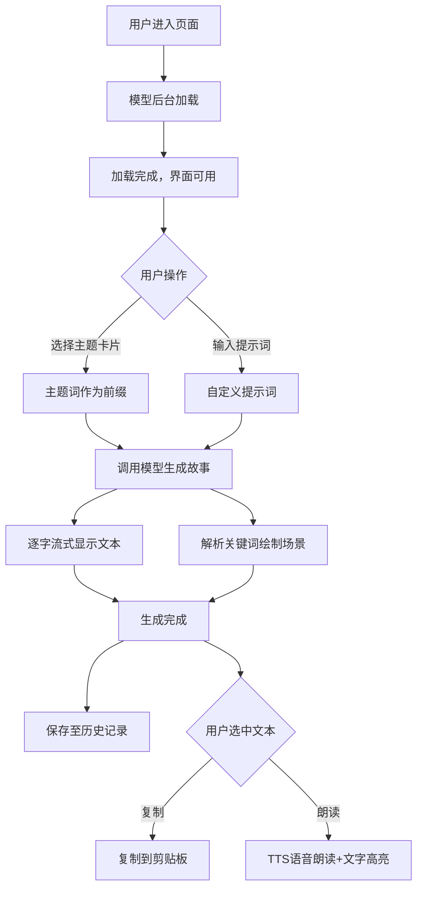

## 1. 产品概述

基于浏览器语言模型API的交互式故事生成与可视化应用，让用户通过输入提示词或选择预设主题，实时生成故事文本并配合像素风格场景插画。目标用户为创意写作爱好者、教育工作者及AI技术探索者，产品核心价值在于"文本+视觉"的沉浸式故事创作体验。

## 2. 核心功能

### 2.1 功能模块
1. **主页面**: 标题区、主题选择区、故事面板、Canvas画布、输入控制区、历史记录侧边栏、动态粒子背景

### 2.2 页面详情
| 页面名称 | 模块名称 | 功能描述 |
|-----------|-------------|---------------------|
| 主页面 | 标题区 | 霓虹蓝紫渐变文字标题，带0.5s呼吸动画 |
| 主页面 | 主题选择区 | 6个预设主题卡片（科幻/奇幻/冒险/校园/悬疑/古风），hover放大+光晕效果，点击触发故事生成 |
| 主页面 | 故事面板 | 逐字流式显示故事文本，选中文字弹出浮动工具栏（复制/朗读），毛玻璃背景 |
| 主页面 | Canvas画布 | 800x400像素风场景绘制，地形/建筑/天气元素，平滑淡入淡出过渡 |
| 主页面 | 输入控制区 | 圆角输入框（焦点蓝边渐变），生成按钮带环形进度指示，进度条蓝紫渐变 |
| 主页面 | 历史记录侧边栏 | 最近5条故事记录，显示标题+时间，点击重新加载 |
| 主页面 | 动态粒子背景 | 150个蓝紫渐变粒子，随机漂移，鼠标吸引效果，FPS≥45 |

## 3. 核心流程

用户进入应用→加载模型（Web Worker后台加载，显示缓存进度）→用户选择主题卡片或输入提示词→点击生成按钮→触发Xenova Transformers模型生成故事→文本逐字流式显示+进度条动画→同步解析关键词生成Canvas像素场景→生成完成保存至历史记录→用户可选中文本进行复制/朗读操作。

## 4. 用户界面设计

### 4.1 设计风格
- **主色调**: 深色背景#0f0f23，主文字#e0e0ff，强调色#6c63ff
- **主题色渐变**: 科幻(蓝紫)、奇幻(绿金)、冒险(橙红)、校园(青蓝)、悬疑(深灰紫)、古风(朱红金)
- **按钮风格**: 圆角8px，hover微放大，过渡0.2s，生成期半透明禁用
- **字体**: 现代无衬线字体，标题用霓虹渐变+呼吸动画
- **布局风格**: 上(标题+主题)中(故事55%+Canvas40%)下(输入控制)三段式，侧边历史栏
- **图标**: Emoji风格主题卡片图标

### 4.2 页面设计概览
| 页面名称 | 模块名称 | UI元素 |
|-----------|-------------|-------------|
| 主页面 | 标题区 | 霓虹渐变文字、呼吸动画、居中布局 |
| 主页面 | 主题选择区 | 6张140px宽卡片网格、主题色渐变背景、hover放大1.08倍+光晕描边、交换动画 |
| 主页面 | 故事面板 | 55%宽度、毛玻璃背景、圆角12px、滚动条、逐字淡入(0.05s/字) |
| 主页面 | Canvas画布 | 40%宽度、800x400固定尺寸、2px发光边框、淡入淡出过渡(0.5s) |
| 主页面 | 输入控制区 | 60%宽度输入框、圆角8px、深灰背景、焦点边框渐变、生成按钮环形进度 |
| 主页面 | 历史记录栏 | 右侧垂直列表、最近5条、标题+时间戳、悬停高亮 |
| 主页面 | 粒子背景 | 全屏覆盖、150粒子、蓝紫渐变、鼠标吸引、平滑动画 |

### 4.3 响应式设计
- **桌面端**: 三段式布局，故事面板+Canvas左右排列
- **移动端(<768px)**: 所有区域垂直排列，Canvas宽度100%，高度自适应
- **触摸优化**: 卡片点击区域增大，按钮最小44px高度

### 4.4 微动画规范
| 动画元素 | 动画效果 | 时长 |
|---------|---------|------|
| 文字逐字出现 | 淡入opacity:0→1 | 0.05s/字 |
| 场景过渡 | 旧淡出→新淡入 | 各0.5s |
| 卡片hover | translateY(-2px)+光晕+scale(1.08) | 0.2s |
| 输入框焦点 | 边框暗蓝→亮蓝渐变 | 0.2s |
| 标题呼吸 | 透明度0.85↔1脉冲 | 0.5s循环 |
| 生成按钮 | 蓝色环形旋转 | 0.5s/圈 |
| 卡片切换 | 旧左缩小消失→新右放大滑入 | 0.3s |
| 浮动工具栏 | 毛玻璃背景、圆角6px、淡入 | 0.15s |
| 文字高亮朗读 | 黄色背景淡入淡出 | 与语音同步 |
