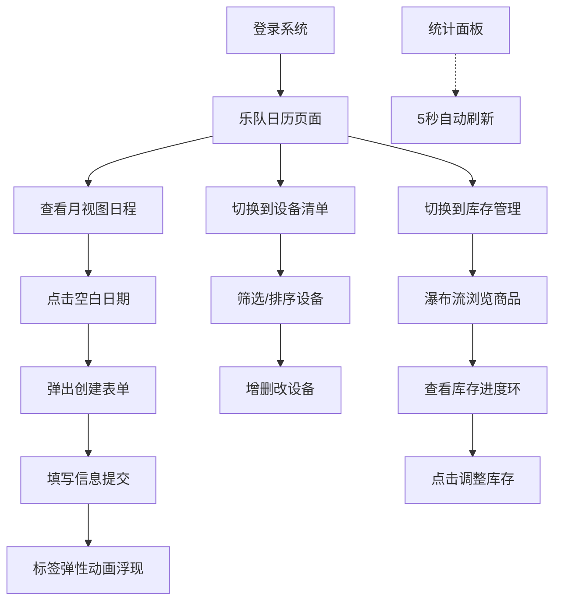

## 1. 产品概述

乐队巡演管理应用是一款专为小型独立乐队设计的巡演综合管理工具，解决巡演过程中日程冲突、设备遗漏和库存数据分散难以实时更新的痛点问题。

- 主要目的：帮助乐队成员高效管理巡演日程、设备清单及周边商品库存
- 目标用户：小型独立乐队成员（吉他手、贝斯手、鼓手、主唱等）
- 市场价值：填补独立乐队巡演管理细分领域空白，提升巡演组织效率

## 2. 核心功能

### 2.1 用户角色
| 角色 | 注册方式 | 核心权限 |
|------|----------|----------|
| 乐队成员 | 系统登录 | 查看和管理所有模块数据 |

### 2.2 功能模块
1. **乐队日历页面**：月视图日历、日程标签展示、创建日程弹窗、月份切换
2. **设备清单页面**：设备卡片列表、类型筛选、品牌/年份排序、增删改操作
3. **库存管理页面**：瀑布流商品展示、库存进度环、低库存警示、详情编辑
4. **统计面板**：年度演出场次圆环图、设备总数统计、低库存商品列表

### 2.3 页面详情
| 页面名称 | 模块名称 | 功能描述 |
|-----------|-------------|---------------------|
| 乐队日历 | 月视图网格 | 按月显示日期，彩色标签标记演出日 |
| 乐队日历 | 创建日程表单 | 日期、城市、场馆、时间、人数、备注字段 |
| 乐队日历 | 标签动画 | 弹性动画浮现，0.5倍→1.0倍放大 |
| 设备清单 | 设备卡片 | 固定宽度220px，圆角10px，hover上移效果 |
| 设备清单 | 使用频次进度条 | 0-100灰绿渐变进度条 |
| 设备清单 | 筛选排序 | 按设备类型筛选，按品牌/年份排序 |
| 库存管理 | 瀑布流卡片 | 宽200px圆角卡片，4px内阴影 |
| 库存管理 | 库存进度环 | 圆形百分比环，低于10%红色闪烁 |
| 统计面板 | 圆环图 | 本年度已演出场次统计 |
| 统计面板 | 设备总数 | 数字加图标展示 |
| 统计面板 | 低库存列表 | 库存最低5件商品，红点标记 |

## 3. 核心流程

用户登录系统后，默认进入乐队日历页面，可查看当月所有演出日程。点击空白日期可快速创建新的演出日程，填写日期、城市、场馆等信息后提交，日程标签以弹性动画出现在日历上。

切换到设备清单页面可查看所有设备卡片，通过顶部筛选器选择设备类型（吉他、贝斯、鼓等），或按品牌/年份进行排序。支持添加新设备、编辑现有设备信息或删除条目。

在库存管理页面以瀑布流形式展示所有周边商品，卡片底部的进度环实时显示库存状态。当某商品库存低于10%时，进度环变为红色并每秒闪烁一次提醒。点击商品卡片可进入详情页调整库存数量。

页面右侧始终固定显示统计面板，包含本年度演出场次圆环图、设备总数统计和库存最低的5件商品列表，数据每5秒自动刷新。

## 4. 用户界面设计

### 4.1 设计风格
- **主色调**：深色主题，背景 #1a1a2e，卡片区域 #16213e，导航栏 #0f3460
- **强调色**：5种预设标签色 #FF6B6B、#4ECDC4、#45B7D1、#96CEB4、#FFEAA7
- **文字主色**：#e0e0e0
- **选中导航色**：#533483
- **按钮风格**：圆角6px，悬停亮度提升20%
- **布局风格**：左侧固定导航（220px）+ 右侧内容区 + 悬浮统计面板（320px）
- **图标风格**：简约线性图标，居中显示在导航文字上方

### 4.2 页面设计概述
| 页面名称 | 模块名称 | UI元素 |
|-----------|-------------|----------|
| 乐队日历 | 月视图 | 7列网格、彩色圆角标签（6px）、月份切换按钮 |
| 乐队日历 | 弹窗表单 | 中心放大淡入、60%遮罩、12px圆角卡片 |
| 设备清单 | 卡片列表 | 220px卡片、10px圆角、2px边框、4px阴影 |
| 设备清单 | 进度条 | 底部灰绿渐变进度条、hover上移3px加深阴影 |
| 库存管理 | 瀑布流 | 200px卡片、8px圆角、4px内阴影 |
| 库存管理 | 进度环 | 圆形百分比环、低库存红色1秒闪烁 |
| 统计面板 | 毛玻璃 | 320px固定宽、白色半透明、5px模糊 |
| 导航栏 | 侧边栏 | 220px固定宽、图标文字上下居中、4px发光竖条 |

### 4.3 响应式设计
- **桌面端（≥768px）**：左侧垂直导航栏 + 右侧内容区布局
- **移动端（<768px）**：导航栏变为顶部水平条，日历切换为列表视图
- **卡片响应式**：屏幕小于768px时所有卡片宽度调整为100%
- **触摸优化**：移动端按钮点击区域增大，滑动手势支持月份切换

### 4.4 动画规范
- **页面切换**：水平滑入（从左到右，0.25秒）
- **弹窗遮罩**：淡入淡出（0.2秒）
- **日程标签**：弹性放大（0.5→1.0倍，0.3秒下坠弹性）
- **筛选更新**：淡入动画
- **导航悬停**：背景过渡（0.2秒）
- **卡片hover**：上移3px加深阴影
