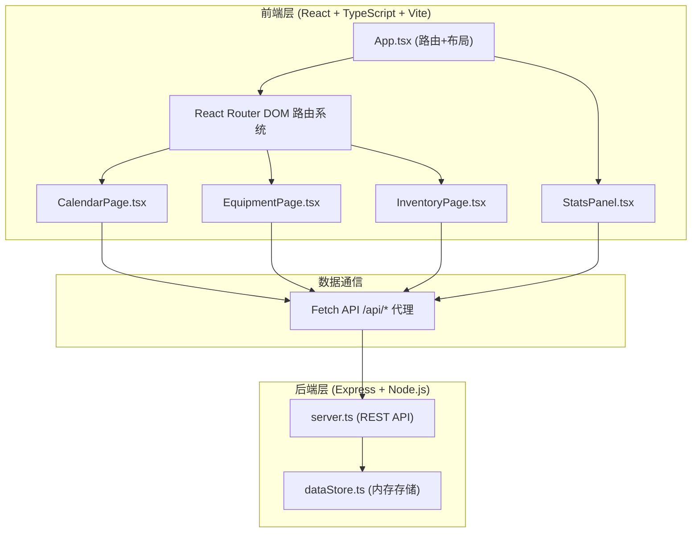
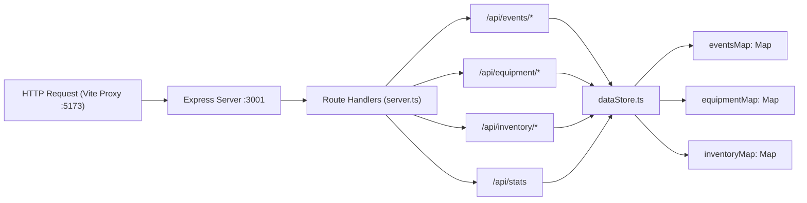
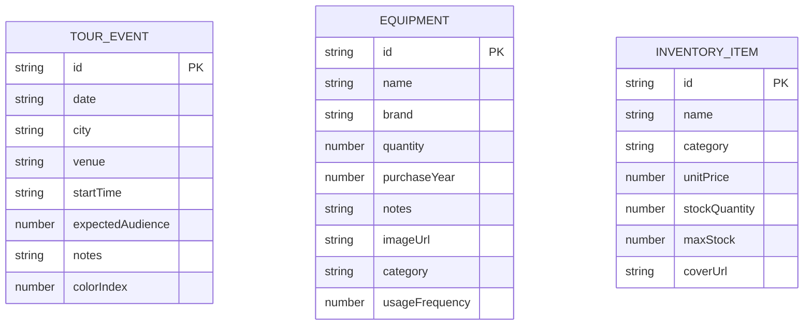

## 1. 架构设计



## 2. 技术描述

- **前端框架**：React@18.2.0 + React DOM@18.2.0
- **前端路由**：React Router DOM@6.21.0
- **构建工具**：Vite@5.0.8 + @vitejs/plugin-react@4.2.0
- **语言**：TypeScript@5.3.3（strict模式，target ES2020）
- **后端框架**：Express@4.18.2
- **ID生成**：uuid@9.0.0
- **数据存储**：内存Map结构（dataStore.ts）
- **端口配置**：前端Vite 5173，后端Express 3001
- **代理配置**：package.json中proxy字段将/api代理到后端3001端口

## 3. 路由定义

| 路由 | 用途 |
|-------|---------|
| /calendar | 乐队日历页面（默认首页） |
| /equipment | 设备清单管理页面 |
| /inventory | 周边商品库存管理页面 |
| * | 重定向到/calendar |

## 4. API 定义

### 4.1 数据类型定义

```typescript
// 巡演日程
interface TourEvent {
  id: string;
  date: string;          // YYYY-MM-DD
  city: string;
  venue: string;
  startTime: string;     // HH:mm
  expectedAudience: number;
  notes: string;
  colorIndex: number;    // 0-4 对应5种预设色
}

// 设备清单
interface Equipment {
  id: string;
  name: string;
  brand: string;
  quantity: number;
  purchaseYear: number;
  notes: string;
  imageUrl: string;
  category: 'guitar' | 'bass' | 'drums' | 'keyboard' | 'audio' | 'other';
  usageFrequency: number;  // 0-100
}

// 库存商品
interface InventoryItem {
  id: string;
  name: string;
  category: string;
  unitPrice: number;
  stockQuantity: number;
  maxStock: number;       // 用于计算百分比
  coverUrl: string;
}

// 统计数据
interface StatsData {
  yearPerformances: {
    total: number;
    completed: number;
    byMonth: { month: string; count: number }[];
  };
  totalEquipment: number;
  lowStockItems: (InventoryItem & { stockPercent: number })[];
}
```

### 4.2 REST API 接口

| 方法 | 路径 | 描述 | 请求体 | 响应 |
|------|------|------|--------|------|
| GET | /api/events | 获取所有巡演日程 | - | TourEvent[] |
| POST | /api/events | 创建新日程 | Omit<TourEvent, 'id' \| 'colorIndex'> | TourEvent |
| GET | /api/equipment | 获取所有设备 | - | Equipment[] |
| POST | /api/equipment | 创建设备 | Omit<Equipment, 'id'> | Equipment |
| PUT | /api/equipment/:id | 更新设备 | Partial<Equipment> | Equipment \| 404 |
| DELETE | /api/equipment/:id | 删除设备 | - | 200 \| 404 |
| GET | /api/inventory | 获取所有库存 | - | InventoryItem[] |
| PUT | /api/inventory/:id | 更新库存 | Partial<InventoryItem> | InventoryItem \| 404 |
| GET | /api/stats | 获取统计数据 | - | StatsData |

## 5. 服务端架构图



## 6. 数据模型

### 6.1 数据模型实体关系



### 6.2 初始化示例数据

应用启动时dataStore会注入以下Mock数据：

**巡演日程（TourEvent）**：
- 2026-06-15 北京 · 愚公移山 Livehouse
- 2026-06-22 上海 · MAO Livehouse
- 2026-07-05 广州 · SD Livehouse

**设备清单（Equipment）**：
- Fender Stratocaster 吉他 ×1（2019年）
- MusicMan StingRay 贝斯 ×1（2020年）
- DW Collector's 套鼓 ×1（2018年）
- Yamaha MOXF8 键盘 ×1（2021年）
- Shure SM58 麦克风 ×4（2020年）

**库存商品（InventoryItem）**：
- 巡演T恤（黑色）× 150件 / ¥128
- 巡演T恤（白色）× 8件 / ¥128（低库存）
- 实体专辑CD × 200件 / ¥68
- 乐队徽章 × 500件 / ¥25
- 限定海报 × 3件 / ¥88（低库存）
