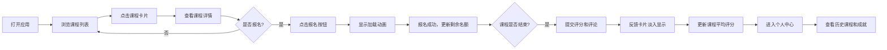

## 1. 产品概述

本产品是一款手工艺工坊课程管理与反馈收集应用，旨在解决小型手工艺工作室在课程管理、学员报名、物资准备和反馈收集等方面的人工统计效率低下问题。通过数字化管理，实现课程发布、在线报名、实时名额更新、课后反馈和学习历程展示的一体化解决方案。

- **主要目的**：提升手工艺工作室的运营效率，减少人工统计错误，改善学员体验
- **解决问题**：课程排期混乱、物资采购出错、反馈收集不及时、学员学习历程无记录
- **目标用户**：手工艺工作室运营者和学员
- **市场价值**：为小型手工作坊提供轻量化的课程管理工具，降低运营成本，提升客户满意度

## 2. 核心功能

### 2.1 用户角色
| 角色 | 注册方式 | 核心权限 |
|------|----------|----------|
| 学员用户 | 默认登录 | 浏览课程、报名/取消课程、提交反馈、查看个人学习历程 |

### 2.2 功能模块
1. **课程列表页**：课程网格展示、卡片悬停动效、路由跳转
2. **课程详情页**：课程信息展示、报名/取消操作、反馈提交、评论展示
3. **个人中心页**：已报名课程列表、成就徽章展示、反馈状态标记
4. **导航栏**：毛玻璃效果、路由导航、响应式汉堡菜单

### 2.3 页面详情
| 页面名称 | 模块名称 | 功能描述 |
|----------|----------|----------|
| 课程列表页 | 课程卡片网格 | 响应式网格布局，卡片固定宽度300px，悬停上移5px加深阴影，点击跳转详情页 |
| 课程列表页 | 页面过渡动画 | 从右向左滑入动画，持续0.3s |
| 课程详情页 | 课程信息展示 | 标题、日期时间、人数进度条（剩余<20%变橙色）、材料清单 |
| 课程详情页 | 报名操作 | 报名按钮加载动画0.3s，取消报名二次确认弹窗 |
| 课程详情页 | 反馈表单 | 1-5星评分（CSS绘制星星，hover放大1.1倍），150字评论（字数计数器，超界抖动） |
| 课程详情页 | 评论区 | 反馈卡片淡入动画，平均评分实时更新 |
| 个人中心页 | 历史课程列表 | 按时间倒序排列，显示反馈提交状态 |
| 个人中心页 | 成就徽章 | 3门课获"新手手工艺人"，5门课获"熟手工匠"，hover显示说明 |
| 导航栏 | 顶部导航 | 毛玻璃效果，激活状态渐变下划线，移动端汉堡菜单 |

## 3. 核心流程

用户打开应用 → 浏览课程列表 → 点击感兴趣的课程 → 查看课程详情 → 报名课程 → 课程结束后提交反馈 → 查看个人学习历程和成就徽章

## 4. 用户界面设计

### 4.1 设计风格
- **主色调**：陶土橙（#D2691E）、浅米色（#F5F0E1）
- **辅助色**：橄榄绿（#6B8E23）、深褐色（#8B4513）
- **背景纹理**：细腻网格纹理（CSS repeating-linear-gradient）
- **卡片风格**：圆角12px，浅米色到白色渐变，左侧4px彩色竖条
- **按钮风格**：圆角8-12px，hover时背景加深并上移1px，transition 0.2s
- **字体**：温暖手工艺风格，标题使用衬线字体，正文使用无衬线字体
- **图标风格**：Lucide React图标库，统一线性风格

### 4.2 页面设计概述
| 页面名称 | 模块名称 | UI元素 |
|----------|----------|----------|
| 课程列表页 | 课程卡片 | 渐变背景、彩色竖条、悬停上移动效、阴影过渡 |
| 课程列表页 | 网格布局 | 桌面端多列、平板端2列、移动端单列，最大宽度1200px居中 |
| 课程详情页 | 进度条 | 绿色正常状态、橙色预警状态（<20%） |
| 课程详情页 | 星星评分 | CSS绘制五角星，hover填充黄色放大1.1倍，选中锁定 |
| 课程详情页 | 评论输入 | 字数实时计数，超界边框变红+抖动动画0.2s |
| 个人中心页 | 成就徽章 | 彩色圆形图标，hover显示文字说明 |
| 导航栏 | 毛玻璃效果 | rgba(255,255,255,0.8)背景，backdrop-filter: blur(10px) |
| 导航栏 | 激活状态 | 2px高渐变下划线（橙黄到粉红），过渡0.2s |

### 4.3 响应式设计
- **桌面端**（>1024px）：内容最大宽度1200px居中，课程网格多列布局
- **平板端**（768-1023px）：课程网格调整为2列，导航栏保持完整
- **移动端**（<768px）：课程网格单列布局，导航栏变为汉堡菜单，按钮尺寸适配触摸操作

### 4.4 动效设计
- 页面切换：从右向左滑入，0.3s ease-out
- 卡片悬停：上移5px，阴影加深，0.2s过渡
- 按钮交互：背景加深，上移1px，0.2s过渡
- 星星评分：hover填充黄色，放大1.1倍，0.15s过渡
- 输入框抖动：超界时水平抖动0.2s
- 反馈卡片：淡入动画，0.3s ease-in
- 加载动画：报名按钮转圈0.3s

## 5. 性能约束
- 课程列表页首次加载时间 ≤ 800ms
- 报名/取消操作响应时间 < 200ms
- 页面切换动画帧率稳定在60fps
- 所有动画使用CSS transform和opacity属性，避免重排重绘
