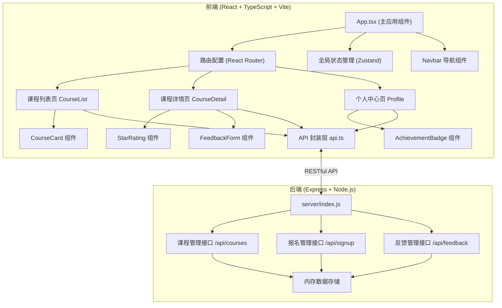
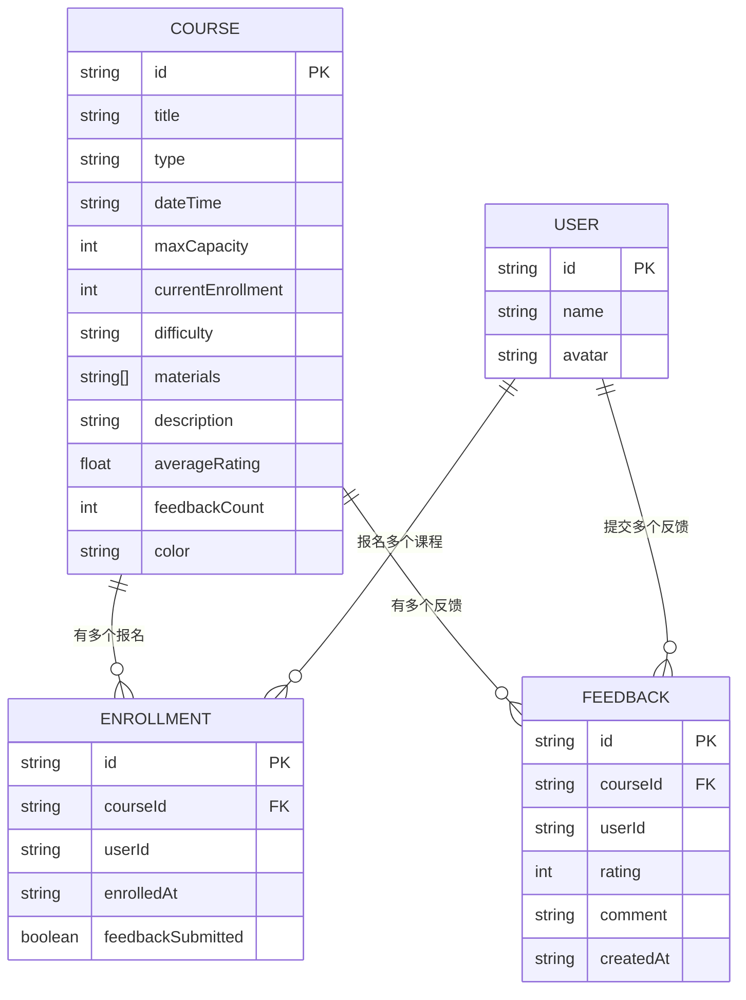

## 1. 架构设计



## 2. 技术描述

### 2.1 技术栈
- **前端**：React@18.2.0 + TypeScript@5.3.3 + Vite@5.0.8 + React Router DOM@6
- **后端**：Express@4.18.2 + Node.js
- **状态管理**：Zustand
- **图标库**：Lucide React
- **数据存储**：内存数组（后端）
- **构建工具**：Vite@5.0.8

### 2.2 项目初始化
- 使用 `npm init vite-init@latest . -- --template react-express-ts --force` 初始化项目
- 按用户要求调整依赖版本
- 配置 TypeScript 严格模式，target ES2020

## 3. 文件结构与调用关系

```
项目根目录/
├── package.json                 # 项目配置和依赖
├── index.html                   # 入口HTML（浅灰背景）
├── vite.config.js               # Vite配置
├── tsconfig.json                # TypeScript配置（严格模式）
├── server/
│   └── index.js                 # Express后端服务
└── src/
    ├── App.tsx                  # 主应用组件（路由+全局状态）
    │   ├── 初始化时调用 fetchCourses
    │   ├── 向下传递 courses 数据给页面组件
    │   └── 集成路由和导航栏
    ├── api.ts                   # API封装层
    │   ├── fetchCourses()       # 获取课程列表
    │   ├── signUp(courseId)     # 报名课程
    │   ├── cancelSignUp(courseId) # 取消报名
    │   └── submitFeedback(courseId, data) # 提交反馈
    ├── types/
    │   └── index.ts             # TypeScript类型定义
    ├── store/
    │   └── useStore.ts          # Zustand全局状态
    ├── pages/
    │   ├── CourseList.tsx       # 课程列表页
    │   │   ├── 接收 App 传入的 courses 数据
    │   │   ├── 渲染 CourseCard 网格
    │   │   └── 点击卡片触发路由跳转
    │   ├── CourseDetail.tsx     # 课程详情页
    │   │   ├── 调用 signUp / cancelSignUp / submitFeedback
    │   │   ├── 渲染进度条、材料清单、反馈表单
    │   │   └── 展示评论列表
    │   └── Profile.tsx          # 个人中心页
    │       ├── 展示已报名课程列表
    │       └── 渲染成就徽章
    ├── components/
    │   ├── CourseCard.tsx       # 课程卡片组件
    │   │   ├── 接收 course 对象作为 props
    │   │   └── 点击触发路由跳转
    │   ├── Navbar.tsx           # 导航栏组件
    │   ├── StarRating.tsx       # 星星评分组件
    │   ├── FeedbackCard.tsx     # 反馈卡片组件
    │   ├── AchievementBadge.tsx # 成就徽章组件
    │   └── Modal.tsx            # 确认弹窗组件
    └── styles/
        └── global.css           # 全局样式
```

## 4. 数据流向

```
1. 初始化：
   App.tsx → useEffect → api.fetchCourses() → server GET /api/courses
   → 返回课程数据 → 更新 Zustand store → 传递给 CourseList.tsx

2. 报名流程：
   CourseDetail.tsx → 点击报名 → api.signUp(courseId) 
   → server POST /api/signup → 更新内存数据
   → 返回成功 → 更新 store 中课程数据 → 刷新页面状态

3. 反馈提交：
   CourseDetail.tsx → 填写评分+评论 → api.submitFeedback(courseId, data)
   → server POST /api/feedback → 更新反馈数据
   → 返回成功 → 更新课程反馈列表 → 重新计算平均评分
   → 新反馈卡片淡入显示

4. 个人中心：
   Profile.tsx → 从 store 获取用户已报名课程
   → 按时间倒序排列 → 统计完成课程数量 → 计算成就徽章
   → 渲染历史课程列表和徽章
```

## 5. 路由定义

| 路由路径 | 页面组件 | 功能说明 |
|----------|----------|----------|
| `/` | CourseList | 课程列表首页 |
| `/course/:id` | CourseDetail | 课程详情页 |
| `/profile` | Profile | 个人中心页 |
| `*` | CourseList | 404重定向到首页 |

## 6. API 定义

### 6.1 TypeScript 类型定义

```typescript
// 课程类型
type CourseType = 'pottery' | 'weaving' | 'embroidery' | 'woodcarving' | 'painting' | 'jewelry';

// 难度等级
type DifficultyLevel = 'beginner' | 'intermediate' | 'advanced';

// 课程接口
interface Course {
  id: string;
  title: string;
  type: CourseType;
  dateTime: string;
  maxCapacity: number;
  currentEnrollment: number;
  difficulty: DifficultyLevel;
  materials: string[];
  description: string;
  averageRating: number;
  feedbackCount: number;
  color: string;
}

// 反馈接口
interface Feedback {
  id: string;
  courseId: string;
  userId: string;
  rating: number;
  comment: string;
  createdAt: string;
}

// 用户报名记录
interface Enrollment {
  id: string;
  courseId: string;
  userId: string;
  enrolledAt: string;
  feedbackSubmitted: boolean;
}

// 成就徽章
interface Achievement {
  id: string;
  name: string;
  description: string;
  icon: string;
  color: string;
  requirement: number;
}
```

### 6.2 接口定义

| 方法 | 路径 | 描述 | 请求体 | 响应 |
|------|------|------|--------|------|
| GET | `/api/courses` | 获取所有课程列表 | - | `{ courses: Course[] }` |
| GET | `/api/courses/:id` | 获取单门课程详情 | - | `{ course: Course }` |
| POST | `/api/signup` | 报名课程 | `{ courseId: string, userId: string }` | `{ success: boolean, enrollment: Enrollment }` |
| DELETE | `/api/signup/:courseId` | 取消报名 | - | `{ success: boolean }` |
| GET | `/api/enrollments` | 获取用户报名列表 | `?userId=string` | `{ enrollments: Enrollment[] }` |
| POST | `/api/feedback` | 提交反馈 | `{ courseId: string, userId: string, rating: number, comment: string }` | `{ success: boolean, feedback: Feedback }` |
| GET | `/api/feedback/:courseId` | 获取课程反馈列表 | - | `{ feedback: Feedback[] }` |

## 7. 数据模型



## 8. 性能优化策略

1. **首次加载优化**
   - 组件按需渲染
   - 使用 React.memo 优化 CourseCard 等纯组件
   - 数据请求使用 Promise 封装，避免阻塞

2. **动画性能**
   - 所有动画使用 `transform` 和 `opacity` 属性
   - 使用 `will-change` 提示浏览器优化
   - 避免在动画期间触发重排重绘

3. **状态管理**
   - 使用 Zustand 轻量级状态管理
   - 组件只订阅需要的状态片段
   - 避免不必要的重渲染

4. **API 响应**
   - 后端内存操作，响应时间 < 200ms
   - 前端使用乐观更新，提升感知速度
   - 防抖处理输入框等频繁操作

## 9. 后端内存数据结构

```javascript
// 内存数据存储
const data = {
  courses: [/* 课程数据 */],
  enrollments: [/* 报名记录 */],
  feedback: [/* 反馈记录 */],
  users: [/* 用户数据 */]
};

// 预设课程类型颜色
const courseColors = {
  pottery: '#D2691E',
  weaving: '#6B8E23',
  embroidery: '#FF69B4',
  woodcarving: '#8B4513',
  painting: '#4169E1',
  jewelry: '#FFD700'
};

// 成就徽章配置
const achievements = [
  { id: 'beginner', name: '新手手工艺人', description: '完成3门课程获得', requirement: 3, color: '#4CAF50' },
  { id: 'skilled', name: '熟手工匠', description: '完成5门课程获得', requirement: 5, color: '#FF9800' }
];
```
