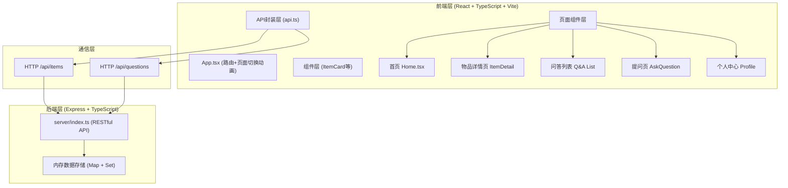
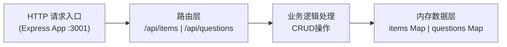
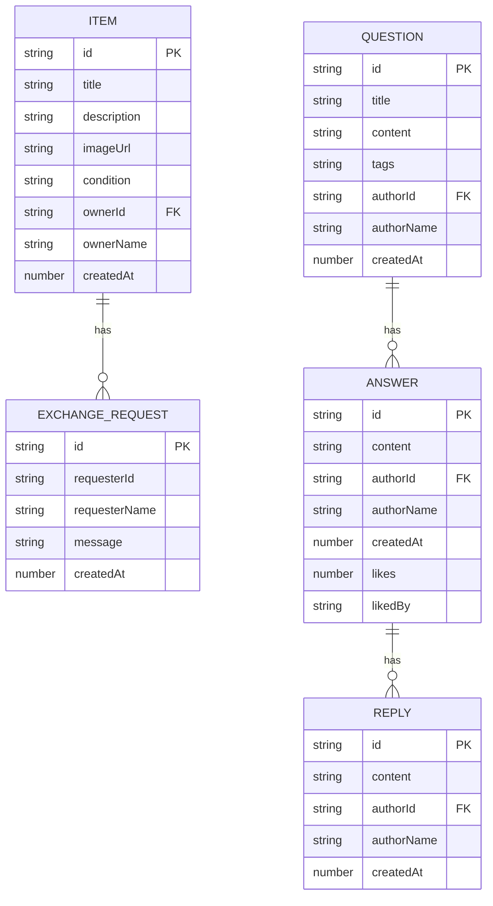

## 1. 架构设计



## 2. 技术描述
- **前端框架**：React@18.2.0 + React-DOM@18.2.0
- **前端路由**：React Router v6
- **构建工具**：Vite@5.0.8 + @vitejs/plugin-react@4.2.0
- **语言**：TypeScript@5.3.3（严格模式）
- **后端框架**：Express@4.18.2
- **跨域处理**：cors@2.8.5
- **数据存储**：内存存储（Map+Set模拟关系型数据）
- **启动脚本**：npm run dev（同时启动前端Vite和后端Express）

## 3. 路由定义
| 路由路径 | 页面用途 |
|-------|---------|
| / | 首页 - 物品瀑布流列表 |
| /item/:id | 物品详情页 |
| /qa | 社区问答列表页 |
| /qa/ask | 发布新问题页 |
| /profile/:userId | 个人中心页 |

## 4. API 定义

### 4.1 物品相关接口

```typescript
// 物品数据类型
interface Item {
  id: string;
  title: string;
  description: string;
  imageUrl: string;
  condition: '全新' | '几乎全新' | '轻微使用' | '有使用痕迹' | '破损';
  ownerId: string;
  ownerName: string;
  createdAt: number;
  exchangeRequests: ExchangeRequest[];
}

interface ExchangeRequest {
  id: string;
  requesterId: string;
  requesterName: string;
  message: string;
  createdAt: number;
}

// GET /api/items?page=1&limit=12
interface FetchItemsResponse {
  items: Item[];
  total: number;
  hasMore: boolean;
}

// GET /api/items/:id
type FetchItemResponse = Item;

// POST /api/items
interface PostItemRequest {
  title: string;
  description: string;
  imageUrl: string;
  condition: string;
  ownerId: string;
  ownerName: string;
}
type PostItemResponse = Item;

// DELETE /api/items/:id
interface DeleteItemResponse {
  success: boolean;
}

// POST /api/items/:id/request
interface ExchangeRequestRequest {
  requesterId: string;
  requesterName: string;
  message?: string;
}
interface ExchangeRequestResponse {
  success: boolean;
  request: ExchangeRequest;
}
```

### 4.2 问答相关接口

```typescript
// 问答数据类型
interface Question {
  id: string;
  title: string;
  content: string;
  tags: string[];
  authorId: string;
  authorName: string;
  createdAt: number;
  answers: Answer[];
}

interface Answer {
  id: string;
  content: string;
  authorId: string;
  authorName: string;
  createdAt: number;
  likes: number;
  likedBy: Set<string>;
  replies: Reply[];
}

interface Reply {
  id: string;
  content: string;
  authorId: string;
  authorName: string;
  createdAt: number;
}

// GET /api/questions?sort=newest
type FetchQuestionsResponse = Question[];

// POST /api/questions
interface PostQuestionRequest {
  title: string;
  content: string;
  tags: string[];
  authorId: string;
  authorName: string;
}
type PostQuestionResponse = Question;

// POST /api/questions/:id/answers
interface PostAnswerRequest {
  content: string;
  authorId: string;
  authorName: string;
}
type PostAnswerResponse = Answer;

// POST /api/questions/:qid/answers/:aid/like
interface LikeAnswerRequest {
  userId: string;
}
interface LikeAnswerResponse {
  liked: boolean;
  likes: number;
}

// POST /api/questions/:qid/answers/:aid/replies
interface PostReplyRequest {
  content: string;
  authorId: string;
  authorName: string;
}
type PostReplyResponse = Reply;
```

## 5. 服务端架构



服务端采用单层架构，Express直接处理路由和业务逻辑，数据存储在两个Map对象中：
- `itemsMap: Map<string, Item>` 存储所有物品数据
- `questionsMap: Map<string, Question>` 存储所有问答数据

## 6. 数据模型

### 6.1 数据模型关系



### 6.2 初始化Mock数据
服务端启动时自动生成一批演示数据：
- 15-20个闲置物品（含不同新旧程度标签）
- 5-8个社区问题（每个问题带1-3个回答）
- 默认用户ID: "user_001", 用户名: "小明邻居"
