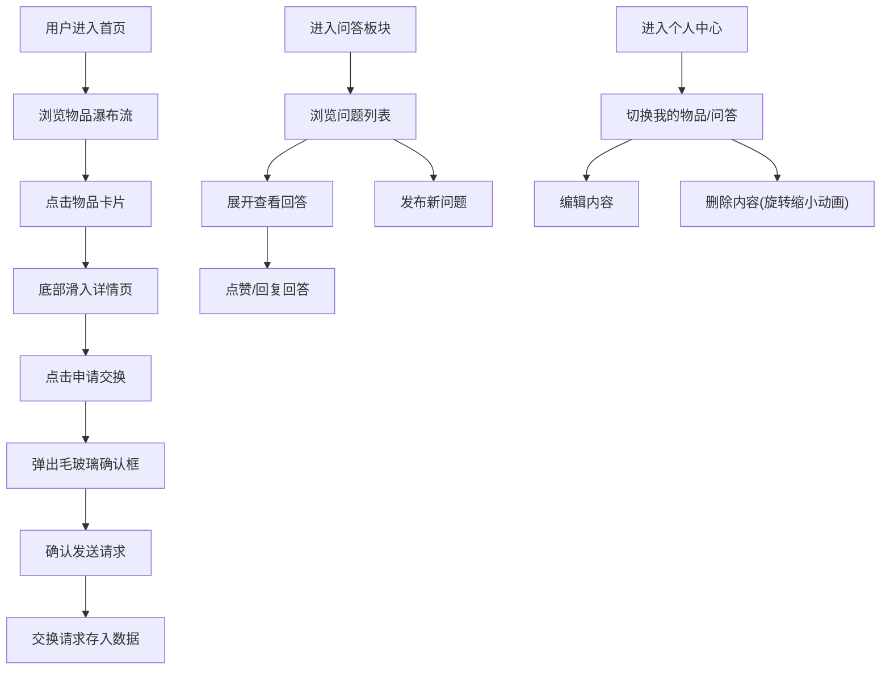

## 1. 产品概述
邻里二手物品交换与社区问答一体化平台，让小区邻居之间可以免费交换闲置物品，并在社区问答板块互相帮忙解决生活问题。
- 目标用户：同一小区或社区的居民，有闲置物品需要处理或有生活问题需要求助的人群
- 产品价值：减少资源浪费、促进邻里互动、构建和谐社区生态

## 2. 核心功能

### 2.1 用户角色
| 角色 | 注册方式 | 核心权限 |
|------|----------|----------|
| 普通用户 | 默认用户（演示用固定用户ID） | 发布物品、申请交换、发布问题、回答问题、管理个人内容 |

### 2.2 功能模块
1. **首页/物品列表**：瀑布流展示所有闲置物品卡片，支持分页加载
2. **物品详情页**：展示物品详细信息，提供"申请交换"功能
3. **社区问答列表**：按时间倒序展示所有问题卡片
4. **提问页**：用户发布新问题（标题+内容+标签）
5. **个人中心**：Tab切换展示"我的物品"和"我的问答"，支持编辑和删除

### 2.3 页面详情
| 页面名称 | 模块名称 | 功能描述 |
|-----------|-------------|---------------------|
| 首页 | 瀑布流卡片 | 固定宽度220px，圆角12px，暖白色背景#FDF6EC，悬停上浮6px，0.25s过渡 |
| 首页 | 分页加载 | 每页12张卡片，滚动到底部自动加载下一页，旋转加载动画 |
| 物品详情页 | 页面动画 | 从底部滑入，持续0.3秒 |
| 物品详情页 | 交换按钮 | 橙黄到橙色渐变(#FF9F43→#FF6B35)，圆角8px，悬停放大1.05倍+径向光晕 |
| 物品详情页 | 确认框 | 半透明遮罩+毛玻璃效果(8px模糊)，圆角16px |
| 问答列表 | 问题卡片 | 宽100%，圆角8px，浅灰背景#F4F6F8，左侧3px蓝色竖条#4A90D9 |
| 问答列表 | 标签胶囊 | 背景#E3F2FD，文字#1565C0，悬停深蓝背景白文字 |
| 问答列表 | 回答区域 | 嵌套折叠设计，爱心点赞(缩放→弹跳0.3s)，回复框淡入(0.2s) |
| 个人中心 | 顶部区域 | 圆形头像(直径80px，边框2px #F97316)，用户名 |
| 个人中心 | Tab切换 | 下划线从中间向两边展开(0.2s) |
| 个人中心 | 操作按钮 | 编辑(透明底+橙边框，悬停填橙)，删除(红底#FF4444，悬停暗10%) |
| 个人中心 | 删除动画 | 缩小+旋转90度消失(0.3s) |

## 3. 核心流程
用户进入首页浏览闲置物品 → 点击物品卡片进入详情页 → 点击"申请交换"按钮 → 确认发送请求 → 交换请求存储并通知发布者
用户浏览问答板块 → 点击问题查看回答 → 点赞回答或回复回答 → 或点击"提问"发布新问题
用户进入个人中心 → 切换Tab查看我的物品/我的问答 → 编辑或删除已发布内容

## 4. 用户界面设计

### 4.1 设计风格
- **主色调**：暖橙 #FF9F43（物品交换主题色）、柔蓝 #4A90D9（问答主题色）
- **背景色**：浅米色 #FFF9F0
- **卡片背景**：暖白色 #FDF6EC（物品卡）、浅灰 #F4F6F8（问答卡）
- **按钮风格**：渐变圆角按钮，悬停放大+光晕效果
- **字体**：系统默认无衬线体（font-family: system-ui, -apple-system, sans-serif）
- **布局风格**：卡片式布局、顶部导航栏、响应式设计
- **动效风格**：流畅缓动动画，过渡时间0.2-0.3s，微交互增强体验

### 4.2 页面设计概览
| 页面名称 | 模块名称 | UI元素 |
|-----------|-------------|----------|
| 首页 | 顶部导航 | 暖橙色Logo + 导航链接（首页/问答/个人中心），右对齐 |
| 首页 | 瀑布流容器 | 多列网格，固定卡片宽度220px，间距16px |
| 首页 | 物品卡片 | 图片区(60%高度) + 文字区(4px内边距) + 新旧标签 |
| 物品详情 | 图片区 | 上半部分大图片，圆角 |
| 物品详情 | 详情区 | 标题/描述/标签/发布者 + 底部固定交换按钮 |
| 问答列表 | 问题卡片 | 左侧蓝色竖条 + 标题 + 标签胶囊组 + 回答折叠区 |
| 个人中心 | 头部 | 头像圆形(80px) + 用户名大字展示 |
| 个人中心 | Tab栏 | 两个Tab等宽排列，选中动画下划线 |

### 4.3 响应式设计
- 桌面端优先设计，适配不同屏幕宽度
- 瀑布流列数根据屏幕宽度自适应（4列/3列/2列）
- 移动端触控优化：增大点击区域，适当调整卡片间距

### 4.4 性能指标
- 所有交互事件响应时间 ≤ 100ms
- 瀑布流滚动帧率 ≥ 45fps
- 页面切换动画帧率 ≥ 60fps
