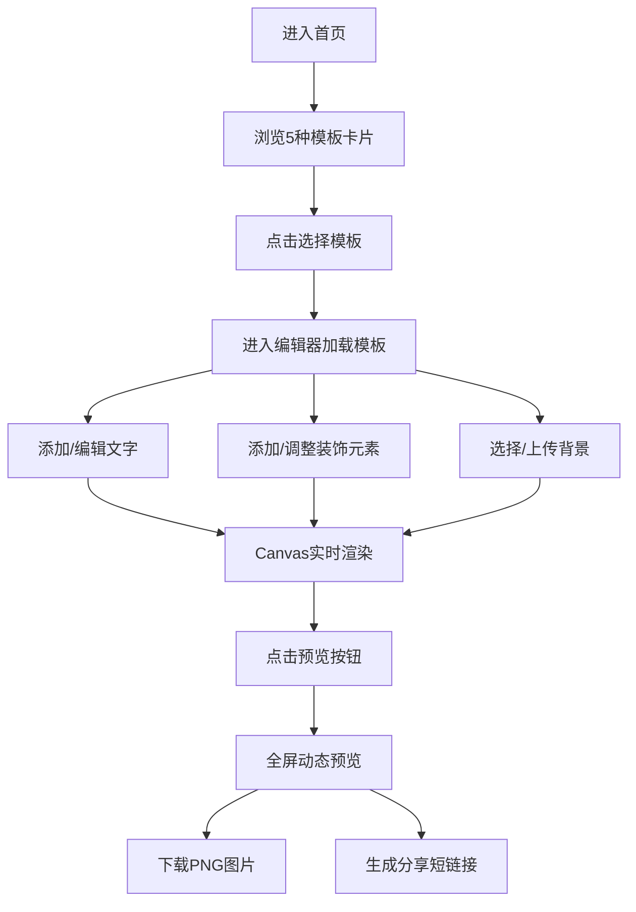

## 1. 产品概述

基于Canvas的电子贺卡设计与分享应用，用户可以选择精美模板、自定义文字和装饰元素，快速生成富有创意的动态贺卡，并通过图片下载或短链接方式分享给亲友。

- 主要目的：提供简单易用的贺卡创作工具，让用户无需设计基础也能制作个性化贺卡
- 目标用户：需要在节日、生日、纪念日等场合发送电子贺卡的普通用户
- 产品价值：降低贺卡设计门槛，提供丰富模板和装饰，支持动态预览和便捷分享

## 2. 核心功能

### 2.1 用户角色

| 角色 | 注册方式 | 核心权限 |
|------|----------|----------|
| 普通用户 | 无需注册 | 浏览模板、编辑贺卡、预览动画、下载图片、生成分享链接 |

### 2.2 功能模块

1. **首页（模板选择页）**：模板展示区、分类导航、应用标题
2. **贺卡编辑器**：Canvas画布、工具面板（文字/装饰/背景）、属性调整面板、预览/分享操作区
3. **预览分享页**：全屏动态预览、背景粒子动画、文字淡入效果、装饰物弹性动画、下载按钮、短链接生成

### 2.3 页面详情

| 页面名称 | 模块名称 | 功能描述 |
|----------|----------|----------|
| 首页 | 模板展示区 | 展示5种预设模板卡片（生日、节日、感谢、结婚、鼓励），圆形200px，悬停缩放1.1倍，点击进入编辑器 |
| 编辑器 | Canvas画布 | 800x600画布区域，支持元素拖拽、缩放、旋转、选中删除 |
| 编辑器 | 文字工具 | 添加文字，支持字体、字号12-72px、颜色、描边1-4px、阴影3-8px、位置拖拽 |
| 编辑器 | 装饰元素 | 预设花朵、星星、心形等装饰，支持大小0.5-2倍、旋转0-360度（步进15度） |
| 编辑器 | 背景设置 | 5种渐变背景选择、自定义图片URL上传、自动适应画布 |
| 编辑器 | 操作区 | 预览按钮、重置按钮 |
| 预览页 | 动态效果 | 背景粒子飘落、文字淡入、装饰物弹性放大动画 |
| 预览页 | 分享功能 | 下载PNG图片（≤500ms）、生成短链接（模拟API） |

## 3. 核心流程

用户从首页选择心仪的贺卡模板，进入编辑器后可自定义文字内容、样式、装饰元素和背景，所有修改实时渲染在Canvas上。编辑完成后点击预览按钮，进入全屏动态预览页面，欣赏带粒子动画的贺卡效果，最后可下载为PNG图片或生成短链接分享给他人。

## 4. 用户界面设计

### 4.1 设计风格

- **主色调**：柔和粉蓝渐变，从浅蓝 #A8D8EA 到淡紫 #AA96DA
- **背景效果**：毛玻璃设计（backdrop-filter: blur(8px)），半透明白色面板
- **按钮风格**：圆角8px渐变背景，悬停时颜色加深并上移2px，过渡0.2秒
- **面板样式**：圆角12px，半透明毛玻璃效果，背景模糊8px
- **字体**：标题使用优雅衬线字体，正文使用现代无衬线字体
- **图标风格**：简约线条图标，配合柔和色彩
- **动画风格**：所有交互反馈0.15-0.3秒过渡动画，自然流畅

### 4.2 页面设计概述

| 页面名称 | 模块名称 | UI元素 |
|----------|----------|--------|
| 首页 | 模板展示区 | 渐变色背景、5个圆形模板卡片网格布局、卡片悬停缩放阴影动画、页面标题渐变文字 |
| 编辑器 | 左侧工具面板 | 毛玻璃面板、工具分类Tab、文字输入框、字体/字号/颜色选择器、装饰元素网格、背景预设列表、渐变按钮 |
| 编辑器 | 中央画布区 | 800x600 Canvas（浅米色默认背景）、元素选中虚线边框、缩放控制点、拖拽时移动光标 |
| 编辑器 | 底部操作区 | 渐变按钮组（预览、重置）、过渡动画 |
| 预览页 | 动态画布 | 全屏展示、粒子飘落动画背景、文字依次淡入、装饰物弹性缩放入场 |
| 预览页 | 分享操作 | 底部浮动毛玻璃工具栏、下载按钮、短链接输入框+复制按钮 |

### 4.3 响应式

采用桌面优先设计，自适应平板设备：
- **桌面端（≥768px）**：左侧工具面板 + 右侧画布完整布局，全功能展示
- **平板/移动端（<768px）**：工具面板折叠为顶部可展开菜单，Canvas自适应缩小显示，操作按钮优化为触控友好尺寸
- **触控优化**：拖拽区域最小44x44px，按钮增加触控反馈

### 4.4 动效设计指引

- **模板卡片**：悬停时scale(1.1) + 阴影扩散，transition 0.2s ease
- **按钮交互**：悬停translateY(-2px) + 渐变色加深，transition 0.2s
- **Canvas元素**：拖拽移动实时渲染，选中虚线边框动画
- **预览入场**：文字opacity从0→1（stagger延迟），装饰物scale(0)→scale(1)弹性动画
- **背景粒子**：requestAnimationFrame驱动，30fps以上，随机飘落轨迹
